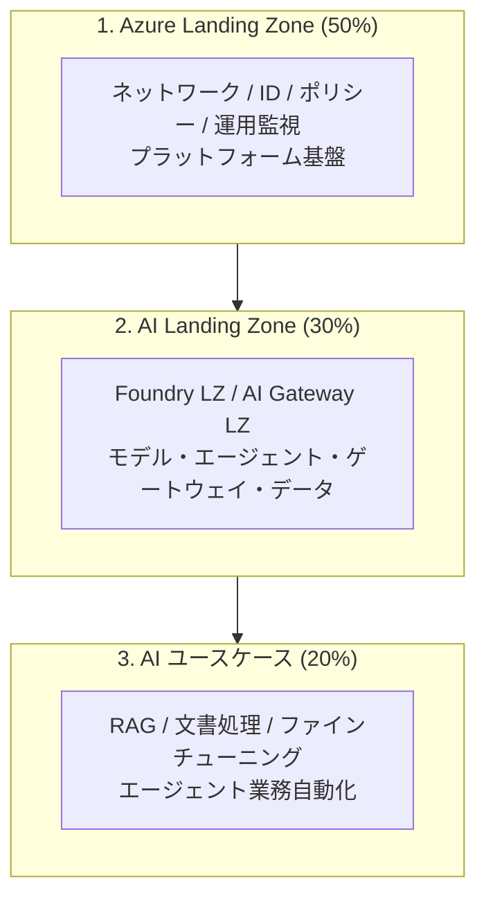

# Azure AI Landing Zones リファレンス（日本語）

> **PoC は動く。しかし本番には出せない。** — この壁を越えるための、Microsoft Foundry を中心とした
> エンタープライズ AI 基盤のリファレンスアーキテクチャと実装です。

このリポジトリは、Microsoft の公式ウェビナー **「Azure AI Landing Zones for Production at Scale」**
（Bilal Amjad / Nadeem Shkir, Microsoft Global AI Cloud Solution Architects）の内容を日本語で書き起こし・
再構成し、**プロフェッショナル開発者・アーキテクトがそのまま本番設計と社内説明に使える形**にまとめたものです。

公式実装（[Azure/bicep-ptn-aiml-landing-zone](https://github.com/Azure/bicep-ptn-aiml-landing-zone) v2.4.1）を
同梱しており、`azd up` で実際に Azure へデプロイできます。

---

## なぜこのリポジトリが必要か

| | AI を本番化できている企業 | できていない企業 |
|---|---|---|
| PoC → 本番までの期間 | **約 12 週間** | **最大 12 か月** |
| ROI 実現 | 12 週間以内に開始 | 未実現のまま |

**2/3 以上の企業が PoC の壁を越えられていません。** 理由はモデルの性能ではなく、
**インフラ・スキル・オペレーティングモデルの不足**です。

AI Landing Zones はこのギャップを、**設計フレームワーク × リファレンスアーキテクチャ × デプロイ可能な実装**
の 3 点セットで埋めます。



> **本番 AI アプリの実現に必要な作業の約 80% は、AI ユースケースそのものではなく基盤側にあります。**
> Azure Landing Zone と AI Landing Zone は、この 80% を再利用可能な形で提供します。

---

## ドキュメント構成

| ドキュメント | 内容 | 想定読者 |
|---|---|---|
| **[01. ウェビナー書き起こし](docs/01-webinar-transcript.md)** | 元資料 41 スライド＋動画 44 分の完全書き起こし（日本語） | 全員 |
| **[02. なぜ Microsoft Foundry なのか](docs/02-why-microsoft-foundry.md)** ⭐ | プロ開発者向けの技術的根拠。競合比較、アーキテクチャ的優位性、意思決定基準 | 開発者・アーキテクト |
| **[03. 設計フレームワーク](docs/03-design-framework.md)** | 12 の設計領域 × WAF 5 本柱。設計チェックリスト | アーキテクト |
| **[04. リファレンスアーキテクチャ](docs/04-reference-architecture.md)** | Foundry LZ / AI Gateway LZ の詳細構成図と設計判断 | アーキテクト・インフラ |
| **[05. トークトラック](docs/05-talk-track.md)** ⭐ | 顧客・社内説明用の話法スクリプト（5分 / 15分 / 45分版） | プリセールス・CSA |
| **[06. デプロイガイド](docs/06-deployment-guide.md)** | `azd up` による実デプロイ手順、パラメータ設計、コスト見積 | インフラ・DevOps |
| **[07. 用語と命名の変遷](docs/07-naming-and-terminology.md)** | Azure AI Foundry → Microsoft Foundry など 2026 年時点の正式名称 | 全員 |

---

## クイックスタート

```powershell
# 1. 前提ツール
winget install Microsoft.AzureCLI
winget install Microsoft.Azd

# 2. ログイン
az login
azd auth login

# 3. プリセットを適用（minimal / secure / full）
.\scripts\Set-Preset.ps1 -Preset minimal -EnvName ailz-demo

# 4. デプロイ
cd infra-upstream
azd up

# 5. 確認
cd ..
.\scripts\Test-Deployment.ps1

# 6. 削除（重要）
cd infra-upstream
azd down --force --purge
```

### プリセット早見表

| プリセット | 所要時間 | 概算コスト（月/インフラのみ） | 用途 |
|---|---|---|---|
| **`minimal`** | 10-15 分 | ~US$400 | 機能確認、開発、デモ |
| **`secure`** | 20-25 分 | ~US$785 | 本番相当の検証（閉域、Firewall なし） |
| **`full`** | 30-40 分 | ~US$1,715 | 規制業種の本番相当（Firewall あり） |

詳細は **[デプロイガイド](docs/06-deployment-guide.md)** を参照してください。

> [!WARNING]
> 上記はインフラのみの概算で、**モデルのトークン利用料は別途発生します。**
> `full` は Azure Firewall（月 ~US$900）が最大のコスト要因です。
> **検証後は必ず `azd down --force --purge` で削除してください。**
> `--purge` を付けないと Key Vault / App Configuration が論理削除状態で残り、
> 同じ名前で再デプロイできなくなります。

---

## 実機検証済み（2026年8月 / Japan East）

このリポジトリの手順・スクリプトは**実際に Azure へデプロイして検証済み**です。
机上の構成ではありません。

### デプロイ実績

| 項目 | 実測値 |
|---|---|
| リージョン | Japan East |
| プリセット | `full`（Azure Firewall / ACR Task Agent Pool は後述の理由で無効） |
| 作成リソース数 | **91**（すべて `Succeeded`） |
| Private Endpoint | 13 |
| Private DNS Zone | 15（VNet リンク 15） |
| デプロイ時間 | **20 分 39 秒**（差分デプロイ）／ 初回フルは約 70 分 |
| モデル | `gpt-5-nano` (GlobalStandard 40) / `text-embedding-3-large` (Standard 10) |

### Zero Trust の実証結果

「閉域構成です」と書くだけでなく、**実際に外から遮断され、中から到達できること**を確認しています。

| 検証項目 | 結果 |
|---|---|
| **外部 PC** から Foundry のデータプレーン呼び出し | `HTTP 403` — `Public access is disabled. Please configure private endpoint.` |
| **外部 PC** から Key Vault のシークレット一覧 | `Forbidden` — `Public network access is disabled and request is not from a trusted service nor via an approved private link.` |
| **VNet 内 Jumpbox** から Foundry / Container App | `HTTP 200` |
| **VNet 内 Jumpbox** の DNS 解決 | Foundry → `192.168.2.31` / Key Vault → `192.168.2.9` / Search → `192.168.2.7` / ACR → `192.168.2.13` / Blob → `192.168.2.4`（すべて PE サブネットの内部 IP） |
| **VNet 内 Jumpbox** の送信 IP | `13.78.18.18` = NAT Gateway の Public IP（送信 IP が固定されている） |
| **マネージド ID** でのモデル実呼び出し | `HTTP 200` / 応答 `AILZ-OK` / model `gpt-5-nano-2025-08-07`（**API キーを一切使わずに成功**） |

つまり、**Private Endpoint + Private DNS + マネージド ID + NAT Gateway** の一式が
設計どおりに機能していることが実測で確認できています。

### 遭遇した実際の障害（すべてドキュメント化済み）

| 事象 | 対処 |
|---|---|
| `azd up` が `AADSTS9002313: Invalid request` で失敗 | `azd config set auth.useAzCliAuth true` |
| ACR Task Agent Pool が `LocationNotAvailableForResourceType` | Japan East 非対応。`DEPLOY_ACR_TASK_AGENT_POOL=false`（上流の既定値も `false`） |
| Azure Firewall が `InternalServerError` で**3回連続失敗** | 構成側は全て正常と切り分け済み。`DEPLOY_AZURE_FIREWALL=false` で回避 |
| リトライ時に `FirewallPolicyUpdateFailed` | `Failed` の Firewall を先に削除してから再実行 |
| `az network firewall delete` が `EOFError` | `az resource delete --ids <id>` を使う |
| `azd down --force --purge` が `CannotDeleteWorkspaceWhenLinkedToPrivateLinkScopes` (409) | 閉域構成では Log Analytics / App Insights が AMPLS に紐づく。**スコープリンクを解除してから再実行**（purge 段階の失敗なのでリソースは未削除） |
| その後 `azd down` が `ResourceGroupDeletionBlocked`（**91 → 6 個で停止**） | RG 削除は依存関係を無視して並列削除するため。下記 2 つを個別に片付ける |
| AI Search が `LockedSPLResourceFound` | Shared Private Link Resource が 4 件残存（接続先が消えて `Disconnected` でも削除をブロック）。SPL を全削除してから Search を削除 |
| VNet が `InUseSubnetCannotBeDeleted`（`legionservicelink`） | ACA 環境の孤児 Service Association Link。委任と SAL が相互ロックし **手動解除は一切不可**（SAL の削除は `Microsoft.App` RP のみ許可）。30 分〜数時間で自動回収されるので待って再実行 |

詳細な切り分け手順とコマンドは
**[デプロイガイド - Japan East の既知の制約](docs/06-deployment-guide.md)** に記載しています。

> [!NOTE]
> `presets/full.env` は上記の実機検証を反映して **Japan East / Firewall 無効** を既定にしています。
> Firewall を使う場合は Sweden Central など別リージョンを推奨します。
> **Firewall がなくても** PE による受信閉域化・PaaS のパブリック無効化・NSG・NAT Gateway による
> 送信 IP 固定は維持されます。失われるのは送信 FQDN ホワイトリストと L7 送信ログのみです。

---

## リポジトリ構成

```
ai-landing-zone-reference-jp/
├── README.md                      # このファイル
├── LICENSE                        # MIT
├── docs/                          # 日本語ドキュメント
│   ├── 01-webinar-transcript.md   # 元資料の完全書き起こし
│   ├── 02-why-microsoft-foundry.md ⭐
│   ├── 03-design-framework.md     # 12 設計領域 × WAF
│   ├── 04-reference-architecture.md
│   ├── 05-talk-track.md           ⭐ 5分/15分/45分の話法
│   ├── 06-deployment-guide.md     # azd 手順・環境変数・コスト
│   ├── 07-naming-and-terminology.md
│   └── images/                    # アーキテクチャ図
├── presets/                       # 環境別パラメータプリセット
│   ├── minimal.env                #   デモ・開発（~US$400/月）
│   ├── secure.env                 #   閉域（~US$785/月）
│   └── full.env                   #   Firewall 込み（~US$1,715/月）
├── scripts/
│   ├── Set-Preset.ps1             # プリセットを azd 環境に適用
│   └── Test-Deployment.ps1        # デプロイ結果の検証
└── infra-upstream/                # 公式 Bicep 実装 v2.4.1 同梱
    ├── main.bicep
    ├── main.parameters.json       #   158 パラメータ
    ├── azure.yaml
    ├── modules/
    ├── scripts/
    └── docs/                      #   上流ランブック（英語）
```

---

## こんなときに読む

| 状況 | 読むもの |
|---|---|
| まず全体像を知りたい | [01. ウェビナー書き起こし](docs/01-webinar-transcript.md) |
| 開発チームに Foundry を説明したい | [02. なぜ Microsoft Foundry なのか](docs/02-why-microsoft-foundry.md) |
| 自分のプロジェクトの抜け漏れを確認したい | [03. 設計フレームワーク](docs/03-design-framework.md) のチェックリスト |
| 構成図が欲しい | [04. リファレンスアーキテクチャ](docs/04-reference-architecture.md) |
| 明日プレゼンがある | [05. トークトラック](docs/05-talk-track.md) |
| とにかく動かしたい | [06. デプロイガイド](docs/06-deployment-guide.md#最小構成での検証) |
| 古い記事の用語がわからない | [07. 用語と命名](docs/07-naming-and-terminology.md) |

---

## 参照リンク

| リソース | URL |
|---|---|
| AI Landing Zones 公式ドキュメント | https://aka.ms/AILZ |
| Bicep 実装 | https://github.com/Azure/bicep-ptn-aiml-landing-zone |
| Terraform 実装 | https://github.com/Azure/terraform-azurerm-avm-ptn-aiml-landing-zone |
| AI Hub Gateway (APIM) 実装 | https://github.com/Azure-Samples/ai-hub-gateway-solution-accelerator |
| Cloud Adoption Framework - AI | https://learn.microsoft.com/azure/cloud-adoption-framework/scenarios/ai/ |
| Well-Architected Framework - AI Workload | https://learn.microsoft.com/azure/well-architected/ai/ |
| Microsoft Foundry ドキュメント | https://learn.microsoft.com/azure/ai-foundry/ |

---

## ライセンス

本リポジトリのドキュメントは MIT ライセンスです。`infra-upstream/` 配下は
[Azure/bicep-ptn-aiml-landing-zone](https://github.com/Azure/bicep-ptn-aiml-landing-zone) の MIT ライセンスに従います。

元資料の著作権は Microsoft Corporation に帰属します。本リポジトリは技術理解を目的とした
日本語での再構成であり、Microsoft の公式ドキュメントではありません。
