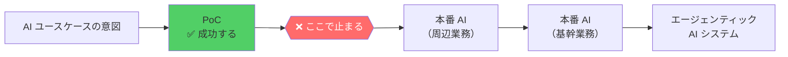
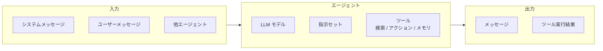
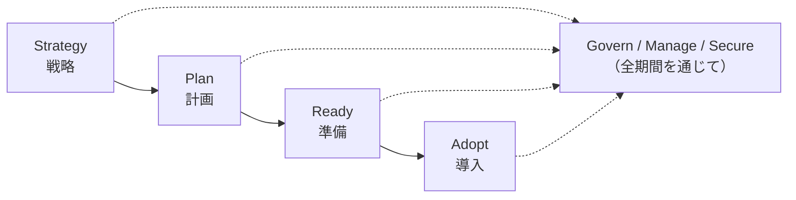
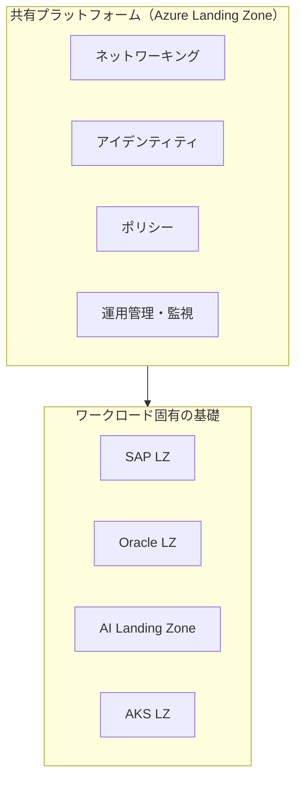
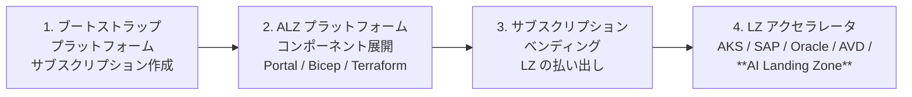
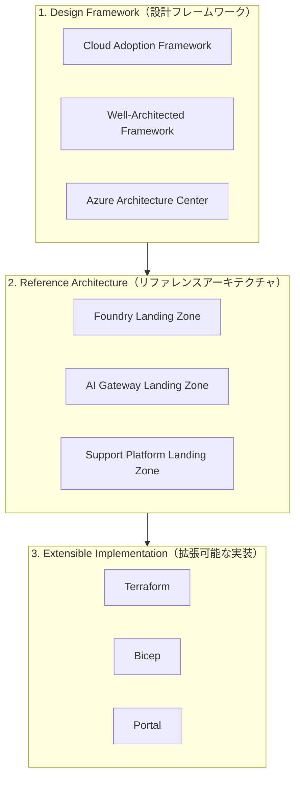
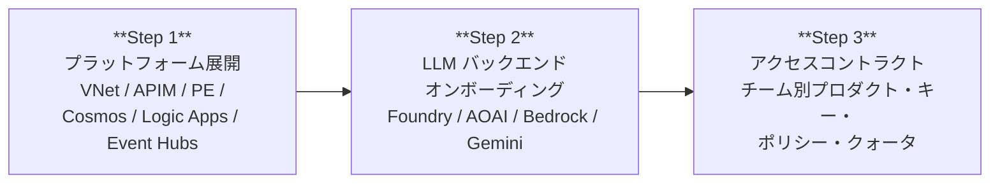

# ウェビナー書き起こし — Azure AI Landing Zones for Production at Scale

> **出典:** Microsoft ウェビナー「Azure AI Landing Zones for Production at Scale」
> **登壇者:** Bilal Amjad（Microsoft）/ Nadeem Shkir（Global AI Cloud Solution Architect, Microsoft）
> **構成:** プレゼンテーション 約 17 分 + デモ 約 27 分（計 44 分）+ スライド 41 枚
>
> 音声書き起こし（whisper large-v3-turbo）とスライド本文・スピーカーノートを統合し、
> 日本語で再構成しています。〔 〕内は文脈補足です。

---

## アジェンダ

1. Microsoft Foundry の紹介
2. Well-Architected Framework と AI ワークロード
3. Cloud Adoption Framework と AI シナリオ
4. Azure Landing Zones
5. **AI Landing Zones**（本題）
6. デモ

---

## 第1部: 課題設定 — なぜ本番に行けないのか

### 12 週間 vs 12 か月

> 「今日のスライドにはさまざまな調査データが載っていますが、私にとって最も際立っているのは、
> **AI ユースケースを本番化する方法を確立できた企業は約 12 週間でそれを成し遂げ、
> その 12 週間以内に投資に対するリターンを実感し始めている**という点です。
>
> 一方、本番化の方法を確立できていない企業は**最大 12 か月**かかっています。
> AI の時代において 12 か月というのは、どんな企業にとっても非常に長い時間です。」
> — Bilal Amjad

### 根拠データ（スライド 3）

| 指標 | 数値 | 出典 |
|---|---|---|
| AI リーダー企業の収益成長率 | 非リーダーの **1.5 倍** | McKinsey 2025 |
| AI をスケールできている企業 | わずか **28%** | BCG 2024 |
| PoC で停滞している企業 | **31%** | Adecco 2025 |
| EBITDA 改善を実現できた企業 | **10% 未満** | Gartner 2023 |

### 停滞ポイント（スライド 4）



> 「私たちが目にしているのは、**企業が旅路の特定の地点で行き詰まり、その先へ進めない**ということです。
> AI ユースケースの意図から始まり、PoC を行い、PoC は成功して AI のメリットが見える。
> しかし**その AI ユースケースを本番に持っていこうとした瞬間、ブロッカーと課題が現れ始める**のです。」

**停滞の原因は 2/3 以上のケースで、モデルの性能ではなく「インフラ・スキル・オペレーティングモデルの不足」です。**

---

## 第2部: Microsoft Foundry

### AI プラットフォームの 3 層（スライド 7）

> 「Microsoft Foundry は私たちの AI プラットフォームの一部であり、
> AI プラットフォームは **IaaS、PaaS、SaaS** にまたがっています。」

| 層 | 提供物 | 用途 |
|---|---|---|
| **IaaS** | GPU + コンテナ | AI プラットフォームを自前で構築 |
| **PaaS** | **Microsoft Foundry + Agent Service** | プラットフォーム構築を加速 |
| **SaaS** | Copilot Studio | ローコード / ノーコード |

### エージェントの構成要素

> 「エージェントは本質的に、**LLM モデル、指示セット、そしてプラグインするツール**で構成されています。
> エージェントは入力を受け取ります。その入力はシステムメッセージ、ユーザーメッセージ、
> あるいは他のエージェント自身からのものかもしれません。
> ツールをプラグインすることで、エージェントは**検索（retrieval）、アクション、そしてメモリ**を持てます。
> そしてエージェントは、自身のメッセージとツールの結果とともに出力を返します。」



### Foundry が提供するもの

> 「Microsoft Foundry は私たちの主力 AI プラットフォームサービスであり、
> **エージェント開発を加速する能力**を提供します。
> モデル、Agent Service、IQ ツール、機械学習を **Control Plane** と組み合わせて使えます。
> これにより完全なプラットフォームが手に入り、さらに **Agent 365、Defender、Purview、Entra**
> が統合されたセキュリティ・コンプライアンス・ガバナンスが組み込まれています。」

### 「このアーキテクチャは本番にスケールしない」（スライド 9）★重要

> 「みなさんはさまざまなカンファレンスやプレゼンテーションで、
> Foundry のリファレンスアーキテクチャがどう見えるべきかを示した、こういう図をご覧になったことがあるでしょう。
> Foundry に接続する BYO リソース、AI ゲートウェイとして機能する APIM、
> Foundry Agent Service、Foundry Control Plane、そして Foundry Agent Framework が見えます。
>
> **しかしここで重要なのは、このアーキテクチャは本番にスケールしないということです。
> これはアーキテクトがサインオフするようなアーキテクチャではありません。**
> そしてそれこそが、AI Landing Zone が解決しようとしていることなのです。」
> — Bilal Amjad

#### スピーカーノートより（Foundry リファレンスアーキテクチャの詳細）

> これは、今日成功しているエンタープライズ導入事例全体から見えてきた、ハイレベルなリファレンスパターンです。
> 顧客環境はそれぞれ異なり、Foundry は既存のインフラ・ガバナンス・コンプライアンス要件に
> 柔軟に適合するよう設計されています。
>
> - **中心にあるのは Foundry Agent Service。** エージェンティックアプリケーションを構築・ホスト・
>   オーケストレーションするフルマネージドプラットフォームを提供します。新しくアップグレードされた
>   Agent Service は、**業界をリードする OpenAI Responses API の上に構築され、現在 GA** となっています。
>   ここでモデル・メモリ・知識システム・ツールを統合し、統制された本番対応のエージェントエンドポイントとして公開します。
> - **その上のレイヤーが Microsoft Agent Framework。** マルチエージェントシステムをオーケストレーションします。
>   Foundry でホストされたエージェント同士の協調に加え、**A2A（Agent-to-Agent）や MCP（Model Context Protocol）
>   などのオープン標準を使ってサードパーティのエージェントとも接続**できます。
>   これが、単一エージェントの機能から、複雑なビジネスプロセスを調整するエージェント・エコシステム全体へ
>   移行する方法です。
> - **環境全体にわたって Foundry Control Plane が完全な可観測性を提供します。**
>   トレース、ログ、分析から、フリート全体へのポリシー適用まで。Entra Agent ID、Purview、Defender を含む
>   Microsoft のセキュリティスイートと直接統合されています。
> - **顧客は自身のリソースを持ち込むことも多い（BYO）。**
>   会話スレッド用の Azure Cosmos DB や Azure Storage、シークレット・トークン・接続管理用の
>   自テナントの Azure Key Vault など。これにより、すべてのワークロードが自社のセキュリティ境界と
>   整合した状態を保てます。
> - **多くの規制業種はネットワーク分離を義務付けています。** Foundry は完全にセキュアな VNET 境界内で
>   エージェントを動作させることをサポートします。モデル、ツール、メモリ、エージェント実行のすべてが
>   プライベートネットワーク内に留まります — 医療、金融、行政などのセクターには必須です。
> - **安全な拡張性のために、Azure API Management の AI Gateway** がサードパーティのツール・API・
>   MCP サーバへの接続を統制・仲介し、エージェントが外部システムに到達する安全で監査可能な経路を提供します。
> - **エージェントを構築したら、多様なチャネルへ即座に発行できます。**
>   Microsoft 365、Agent 365、Teams、Slack、Messenger など。
>
> **繰り返しますが、これはパターンであって厳格な処方箋ではありません。**

---

## 第3部: 2 つのフレームワーク

### Well-Architected Framework（WAF）と AI ワークロード

> 「Well-Architected Framework は、ワークロード設計における
> **信頼性、セキュリティ、コスト最適化、オペレーショナルエクセレンス、パフォーマンス効率**
> に対処する方法を導くフレームワークです。
> **AI ワークロード**は、AI ユースケースのために AI ワークロードをどう構成すべきかを示す、
> 私たちが提供するリファレンスワークロードです。」

### Cloud Adoption Framework（CAF）と AI シナリオ

> 「Cloud Adoption Framework と AI シナリオは、**ワークロード単位ではなくプラットフォーム全体のレベルで、
> エンタープライズに AI をどう導入するか**を示す導入フレームワークです。
> 戦略を定義し、計画を立て、その計画に従って環境を準備・整備し、導入を開始する。
> その過程を通じて、**ガバナンス、管理、セキュリティ**を担保します。」



**WAF と CAF の違い:**
- **WAF** = ワークロード単位の設計品質
- **CAF** = 組織全体の導入プロセス

---

## 第4部: Azure Landing Zones

### 都市のアナロジー ★説明に使える

> 「Landing Zone は Cloud Adoption Framework の一部である概念です。
> **Landing Zone は都市のようなものだと考えてください。**
> あなたがその都市の建築家で、さまざまなタイプの建物が建てられるように都市を整備している、と。
> ちょうど IT アーキテクトが、組織内でさまざまな種類のワークロードやアプリケーションを
> ホストするためのプラットフォームを整備するように。
>
> 都市では、誰かが何かを建設する前 — それが家であれ橋であれスタジアムであれ —
> **共有のユーティリティサービス**を提供します。水道、電気、下水などです。
> これを IT のユースケースに当てはめると、**ネットワーキング、アイデンティティ、ポリシー、
> 運用管理と監視**を供給し、それにプラグインして活用できるようにするわけです。
>
> そして、都市に建てるさまざまな建物 — 家、スタジアム、橋 — はそれぞれ**異なる要件と
> 異なる基礎**を必要とします。同様に、**SAP ワークロード、Oracle ワークロード、AI ワークロード
> はそれぞれ異なり、同じプラットフォーム上で異なる基礎を構築する必要がある**のです。」



### Landing Zone の目的

> - ベストプラクティスに基づいた旅の出発点を与える
> - 適切に設計された基礎を作る
> - 一貫性のある再現可能な環境設計を使えるようにする
> - ベストプラクティスを組み込む
> - 移行と新規アプリ開発の両方を可能にする
> - すべてのプラットフォームリソースを考慮し、IaaS と PaaS を区別しない

### 設計原則（5 つ）

1. **サブスクリプションの民主化**（Subscription democratization）
2. **ポリシー駆動のガバナンス**（Policy-driven governance）
3. **単一のコントロール・管理プレーン**（Single control and management plane）
4. **アプリケーション中心かつアーキタイプ中立**（Application-centric and archetype neutral）
5. **Azure ネイティブ設計とプラットフォームロードマップとの整合**

### 設計領域（2 分類）

| 環境（Environment） | コンプライアンス（Compliance） |
|---|---|
| Azure 課金 / Entra ID テナント | セキュリティ |
| アイデンティティとアクセス管理 | ガバナンス |
| リソース組織 | 管理 |
| ネットワークトポロジと接続性 | プラットフォーム自動化と DevOps |

### 導入の全体フロー



---

## 第5部: AI Landing Zones ★本題

### 定義

> 「AI Landing Zones は、ここまで見てきたすべてを統合します。
> 製品（Microsoft Foundry）、Well-Architected Framework、Cloud Adoption Framework、
> そして Azure Landing Zones について話しました。
> **顧客がこれら 4 つすべてのベストプラクティスを把握して本番の AI ユースケースを立ち上げるのは、
> 処理すべきことが多すぎます。**
>
> AI Landing Zones は、それらすべてを 1 つにまとめ、
> **Microsoft Foundry のための設計フレームワーク、リファレンスアーキテクチャ、
> 拡張可能な実装**を提供することで、これを加速します。」

### 3 つの構成要素（スライド 31）



#### スピーカーノートより

> **第一に、Design Framework** はチームが前もって正しい意思決定を行う手助けをします —
> 初期の PoC では見落とされ、本番で障壁になる類の意思決定です。
> CAF、WAF、AAC のベストプラクティスガイダンスに基づいています。
> **目標は、そのガイダンスを実行可能な設計領域とチェックリストに翻訳し、
> チームが「単に動くデモ」ではなく、セキュアで統制され運用準備の整った AI ワークロードを
> 構築できるようにすることです。**
> 毎回アーキテクチャの議論を再発明する代わりに、設計フレームワークはそれを反復可能にします。
>
> **第二に、Reference Architecture** はベースラインのブループリント —
> Microsoft Foundry 上のエンタープライズグレード AI における「良い状態」がどう見えるか — を提供します。
> 意図は曖昧さを減らすこと。**チームは AI をスケールする際に、アイデンティティ、ネットワーキング、
> ガバナンス、プラットフォーム依存関係をどう構成すべきか推測する必要がないようにすべきです。**
>
> **第三に、これをデプロイ可能にします** — 概念だけでなく。組織に合った方法で採用できるよう、
> Terraform、Bicep、Portal ベースのデプロイという選択肢を含みます。
>
> **まとめると: フレームワークが意思決定を導き、リファレンスアーキテクチャがベースラインの
> ブループリントを提供し、実装オプションが一貫性と再現性のあるデプロイを可能にします。**

### 設計領域（スライド 33）

> 「これらの設計領域は、AI Landing Zone のために設計が必要なあらゆることを完全にカバーします。
> ちょうど都市の建築家や建物の建築家が、**後で問題に対処する羽目にならないよう、
> 最初にすべてを設計しておく**必要があるのと同じです。」

**AI 固有の設計領域（12）:**

| | | | |
|---|---|---|---|
| Compute<br/>コンピュート | Models<br/>モデル | Tools<br/>ツール | Gateway<br/>ゲートウェイ |
| Agents<br/>エージェント | Data<br/>データ | Network<br/>ネットワーク | Identity<br/>アイデンティティ |
| Monitoring<br/>監視 | Governance<br/>ガバナンス | Resource organization<br/>リソース組織 | Platform Ops<br/>プラットフォーム運用 |

**WAF 5 本柱:** Reliability / Security / Cost optimization / Operational excellence / Performance efficiency

#### スピーカーノートより ★重要

> **なぜ Design Framework が存在するのか**
>
> 顧客が AI ソリューションを構築するとき、彼らはしばしばこれらの設計領域の**一部だけ**に注力します。
> **しかし本番での課題は、通常「対処されなかった設計領域」から生じます。**
>
> Design Framework は、重要な意思決定が**早期に**行われるようにするために存在します —
> チームが PoC から本番へスケールしようとしたときに**後から発見される**のではなく。
>
> これは設計領域のチェックリストだと考えてください。すべてのボックスが、
> 本番グレードの AI のために対処されなければならない意思決定領域を表しています。
> **初日にすべてから始める必要はありませんが、スケールしたいなら、どれも無視できません。**

### リファレンスアーキテクチャ（スライド 35）

> 「これはブループリントであり、リファレンスアーキテクチャは 2 つの形式で提供されます。
> **AI Gateway Landing Zone** と **AI Foundry Landing Zone** です。
> **どちらのリファレンスアーキテクチャも本番向けであり、本番化を支援するためのものです。**
>
> 先ほどウェビナーでお見せしたリファレンスアーキテクチャは、
> **より詳細で低レベルな設計アーキテクチャに翻訳され**、本番化に向けて活用・計画・採用できます。」

→ 詳細は **[04. リファレンスアーキテクチャ](04-reference-architecture.md)** を参照。

### 拡張可能な実装（スライド 37）

> 「デプロイの旅のどこにいるかに応じて — Portal か、Terraform か、Bicep か —
> IaC オプションから標準的な Portal オプションまで、すべてのシナリオをカバーする選択肢があります。」

#### スピーカーノートより

> - 「このスライドは意図的にシンプルです。AI Landing Zones をデプロイする方法を 3 つサポートします —
>   **Terraform、Bicep、Azure Portal**。」
> - 「なぜ 3 つか？ **顧客の運用モデルは同じではないから**です。Terraform で標準化している組織もあれば、
>   Bicep の組織もあり、素早く始めるために摩擦の少ない Portal ベースのオンランプが必要なチームもあります。」
> - 「**Terraform** は、確立された Terraform 運用モデルを持つ顧客に最適です。ここでは
>   **Azure Verified Modules とパターンモジュール**を活用し、BYO とモジュール作成リソースの
>   使い分けのような柔軟性をサポートしつつ、迅速なデプロイを可能にします。」
> - 「**Bicep** は Azure ネイティブな IaC チームに理想的です。**standalone と platform-integrated**
>   のようなエンタープライズパターンをサポートし、パラメータと機能トグルで設定可能な構造になっています。」
> - 「**Portal** は同じ基盤に基づく簡素化されたデプロイ体験を提供します — コンパイル済みテンプレートから
>   構築されているため、まだ完全な IaC ワークフローを採用する準備ができていないチームでも、
>   デフォルト設定と軽いカスタマイズでデプロイできます。」
> - 「**重要な点: 顧客が Terraform を選ぼうと Bicep を選ぼうと、意図は一貫した結果です —
>   異なるアーキテクチャを手にするのではなく、組織に合った実装パスを選んでいるだけです。**」

### 本番化に必要なものの内訳（スライド 25）

> 「この頂点の三角形が AI アプリケーションだと想像してください。
> **この AI アプリケーションを本番に持っていくには何が必要でしょうか？**
>
> まず、まだ整備していなければ **Azure Landing Zones でプラットフォームインフラを整備**します。
> それができたら、その上に **AI Landing Zones でアプリケーションインフラを整備**します。
> そしてその上で、アプリケーションユースケースの開発を行います —
> RAG であれ、文書処理であれ、ファインチューニングであれ — そしてデプロイする。
> それで AI アプリケーションが本番稼働します。
>
> **AI アプリケーションが本番に入る前に起こらなければならないことは、たくさんあるのです。
> そして Azure Landing Zones と AI Landing Zones は、そのかなり大きな部分を加速します。**」

| レイヤ | 割合 |
|---|---|
| Azure Landing Zone（プラットフォーム基盤） | **50%** |
| AI Landing Zone（AI アプリ基盤） | **30%** |
| AI ユースケース（アプリ本体） | **20%** |

---

## 第6部: デモ — AI Hub Gateway Landing Zone（Terraform）

**デモ担当:** Nadeem Shkir

### なぜガバナンスハブが必要なのか ★重要

> 「まず質問から始めさせてください。**そもそもなぜガバナンスハブが必要なのか？
> なぜ AI エンドポイントのための AI ハブとして機能する Landing Zone が必要なのか？**
>
> すべての企業が生成 AI を本番投入しようと競争していますが、**ほぼ全員が同じ壁にぶつかります。**
> 個々のチームが独自の Foundry リソースを立ち上げ、独自のキーを生成し、ユースケースの作業を始めます。
> 数週間のうちに**モデルのスプロール（乱立）**が起き、
>
> - **「AI にいくら使っているのか、どのチームがいくらか」という問いに誰も答えられない**
> - **共有のガードレールがない**
> - **機密データがマスキングされないままモデルに流れているかもしれない**
> - **1 つのユースケースの暴走したエージェントが、モデルのクォータ全体を使い果たし、
>   他の全員を巻き添えにしてダウンさせうる**
> - **セキュリティにはチョークポイントがなく、財務には帰属がなく、
>   プラットフォームチームには統制がない**
>
> それがまさに AI Hub Gateway があり、そのガバナンス問題に答えようとしている理由です。」

### デプロイ構成

> 「AI Hub Landing Zone のリファレンスアクセラレータは、ネットワーク部分も完全にデプロイします。
> **グリーンフィールド**設定でデプロイしたい場合は VNet から始めてすべての Private Endpoint が入ります。
> あるいは **ブラウンフィールド**設定で、すでに Azure Landing Zone があり
> ネットワーク全体が構築済みなら、そこにフックすることもできます。
>
> **AI Hub Landing Zone の中核は、ご想像のとおり API Management ゲートウェイ**です。
> これはすべての AI モデルへのフロントドアとして機能します —
> Foundry のデプロイであれ、**AWS Bedrock** であれ、**その他のサードパーティプロバイダ**であれ。」

### デプロイの 3 ステップ ★デモの結論



> 「一歩下がって、ここで何をしたか見てみましょう。
> **プラットフォームをデプロイし、複数の LLM エンドポイントをオンボードし、アクセスコントラクトを有効化しました。**
> このデモから持ち帰ってほしいのは、まさにこの 3 つの操作です。
> **ハブのセットアップ、独立した活動としての新しいモデルバックエンドのオンボーディング、
> そして最後にアクセスと使用を統制するアクセスコントラクト。
> それぞれが独自のモジュールになっています。**
> それが完全な管理とライフサイクルを可能にします。」

#### Step 1: プラットフォーム

- リポジトリを clone → 変数ファイル（`dev.tfvars` / `prod.tfvars`）を作成 → デプロイスクリプト実行
- スクリプトが検証 → `terraform init` → `plan` → `apply` を自動実行
- **所要時間 25〜30 分**
- デプロイされるもの: VNet、API Management、Private Endpoints、Cosmos DB（課金計測）、Logic Apps、Event Hubs（ストリーム取り込み）、API Center、（オプションで）Foundry アカウントとプロジェクト
- すべてが**単一のリソースグループ**に入る → ライフサイクル管理とコスト追跡が容易

> 「1 つのグループ、1 つのデプロイ、1 人のプラットフォームオーナー。」

- 初期デプロイ時点で API が公開済み: **Universal API（統合 API）** と **Azure OpenAI 互換 API**

#### Step 2: LLM バックエンドのオンボーディング

> 「実世界では、プラットフォームがあった上でモデルのオンボーディングも必要です。
> そしてそれは**決して一度きりのイベントではありません。**
> モデルは常に追加されます。**毎日とは言わないまでも、ほぼ毎週新しいモデルが出荷される**継続的な流れがあります。
> フェイルオーバー用に 2 つ目のリージョンも追加したいでしょう。
> AWS Bedrock や Gemini のエンドポイントのような外部プロバイダのリソースも持ち込みたいかもしれません。
>
> **新しいモデルをオンボードするたびにプラットフォーム全体を再デプロイしなければならないとしたら、
> それは時間がかかり、エラーを起こしやすい作業です。**
> だからこそデプロイを別々のモジュールに分割しているのです。」

**サポートされるバックエンドタイプ:**
- AI Foundry
- Azure OpenAI Service
- **AWS Bedrock**
- **Google Gemini**
- 任意の外部エンドポイント

**モデルエイリアス:**

> 「バックエンドと同様に、**モデルエイリアス**も定義できます。
> これはモデルに対する名前を作り、その名前の背後にモデルのリストを作れるようにします。
> そしてその名前（エイリアス）がアプリケーションから使われます。
> **アプリケーションはどのモデルが呼ばれているかを知る必要がありません。**
> 戦略に基づいて設定でき、さまざまな戦略が使えます。
> **これによりモデルの切り替えも可能になります。モデルが廃止されても、
> それを消費するアプリケーションに影響を与えずに簡単に切り替えられます。**」

- 戦略: `weighted`（重み付け）、`priority`（プライマリ/セカンダリのフェイルオーバー）
- Jupyter Notebook が用意されており、各ステップを可視化しながら実行 → 生成された `.tfvars` を
  リポジトリにコミットして CI/CD パイプラインで適用

#### Step 3: アクセスコントラクト ★ガバナンスの要

> 「モデルはゲートウェイを通って流れるようになりましたが、**まだガバナンスのギャップがあります。**
> **マスターサブスクリプションキーを持っている人なら誰でも、どのモデルでも呼び出せてしまう**のです。
> スモークテストや開発ならそれでもいいかもしれませんが、
> **それはほとんどの企業が必要としているものの正反対**です。
>
> **チームごとの帰属もなく、スコープの制限もなく、
> 全員に影響を与えずに 1 チームのアクセスだけを取り消す方法もありません。**
> そこで登場するのが**アクセスコントラクト**です。」

**アクセスコントラクトが行うこと:**
- チーム／ユースケースごとに **APIM のプロダクト**を作成
- それぞれに**独自のサブスクリプションキー**と**独自のポリシー**
- キーは Key Vault に保存するか、直接クレデンシャルとして使うか設定可能
- Foundry コネクションの有効化も設定可能

**設定例（JSON）:**

```jsonc
{
  "useCase": "customer-support-assistant",
  "businessUnit": "Sales",
  "allowedModels": ["gpt-5.4-mini"],        // gpt-5.4 は許可しない
  "capacityAllocation": { "tokenQuota": 50000 }
}
```

**デモでの検証結果:**
- 3 つのユースケースを定義。うち 1 つには上位モデルを許可しない設定
- 上位モデルを呼び出すと、**許可していないコントラクトのみ拒否**され、他の 2 つは成功
- ストレステストを実施し、**パフォーマンス・トークン消費量・レスポンスタイムの劣化**をチャートで可視化

> 「これで**モデルはすべて統制され、セキュアで、計測されており、
> ユースケースごとにキャパシティ制限がある**、フルマネージドな APIM を AI プラットフォームの
> フロントドアとして手に入れました。」

---

## 第7部: 次のステップ

> 「AI Landing Zones を探索してください。この QR コードまたは短縮リンク **aka.ms/AILZ** を使えます。
> **リファレンスデザイン、アーキテクチャ、実装オプション**の詳細を提供するドキュメントサイトに
> たどり着けます。そこから組織で AI Landing Zones を使い始められます。」

- 公式サイト: **https://aka.ms/AILZ**
- 詳細: [デプロイガイド](06-deployment-guide.md)

---

## 補足: 元資料の構成（スライド 41 枚）

| # | タイトル | 要点 |
|---|---|---|
| 1-2 | タイトル・アジェンダ | 6 部構成 |
| 3 | AI リーダー vs ラガード | 1.5x 収益成長 / 28% のみ at scale |
| 4 | どこで詰まるか | PoC → 本番のホッケースティック |
| 5-6 | Microsoft Foundry | AI プラットフォーム紹介 |
| 7 | Build agents, your way | IaaS / PaaS / SaaS |
| 8 | エージェントの構成 | モデル + 指示 + ツール |
| 9 | **Reference Architecture** | 「本番にスケールしない」問題提起 |
| 10-14 | WAF & AI Workload | 5 本柱 + AI ワークロード |
| 15-19 | CAF & AI Scenario | Strategy → Plan → Ready → Adopt |
| 20-30 | Azure Landing Zones | 都市アナロジー、設計原則、概念図、導入フロー |
| 25 | 50/30/20 の内訳 | ALZ 50% / AILZ 30% / ユースケース 20% |
| 31 | **AI Landing Zones の 3 要素** | 設計 FW + リファレンス Arch + 実装 |
| 32-33 | Design Framework | 12 設計領域 + WAF 5 本柱 |
| 34-35 | **Reference Architecture** | Foundry LZ / AI Gateway LZ の詳細図 |
| 36-37 | Extensible Implementation | Terraform / Bicep / Portal |
| 38-39 | AI Landing Zone Accelerator | 再利用可能アセット |
| 40 | Call to Action | **https://aka.ms/AILZ** |
| 41 | Thank you | — |
