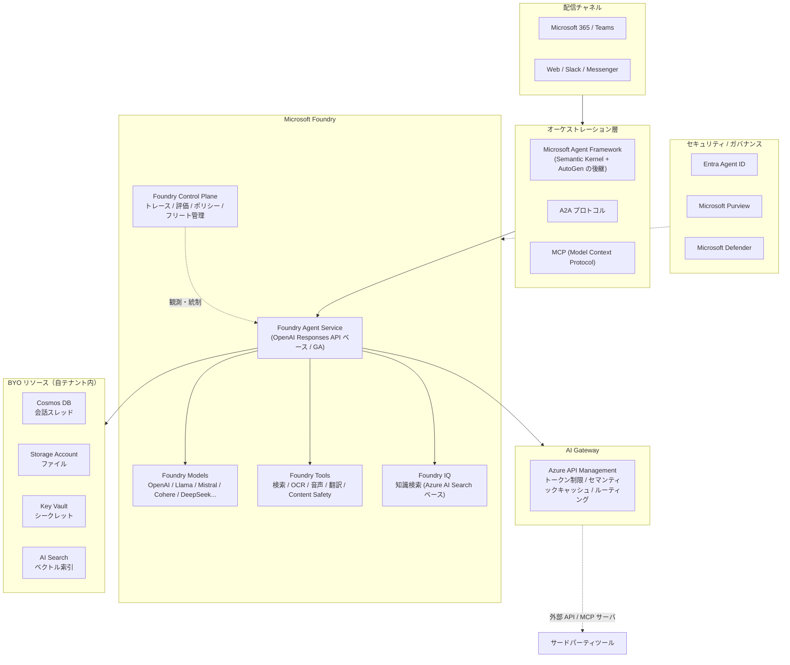
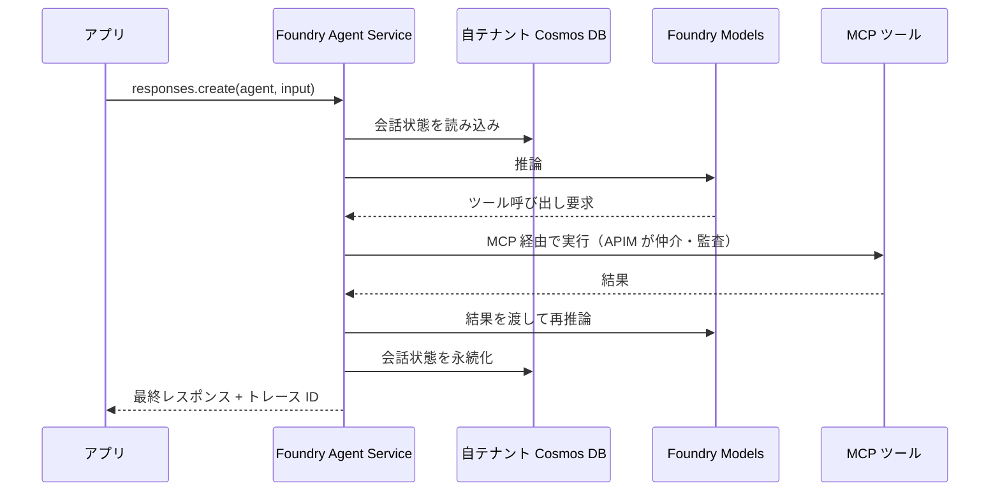

# なぜ Microsoft Foundry なのか — プロフェッショナル開発者向けの技術的根拠

> 対象読者: アプリケーション開発者、ソリューションアーキテクト、プラットフォームエンジニア
> 前提: LLM API を叩いた経験があり、「OpenAI API を直接使えばいいのでは？」と考えたことがある人

---

## 0. 3行サマリ

1. **モデルは差別化要因ではなくなった。** 差がつくのは「エージェントを本番運用する基盤」であり、そこが最も難しい。
2. **Microsoft Foundry は、その基盤（モデル・ツール・メモリ・オーケストレーション・ガバナンス）を単一のコントロールプレーンで提供する唯一の PaaS。**
3. **既存の OpenAI SDK 資産をそのまま使いながら、VNet 分離・Entra 認証・Purview 監査・コスト帰属を後付けできる**のが決定的な差。

---

## 1. 問題設定 — 「動く PoC」と「本番エージェント」の距離

### 1.1 PoC で書くコード

```python
from openai import OpenAI
client = OpenAI(api_key="sk-...")
resp = client.responses.create(model="gpt-5", input="売上レポートを要約して")
print(resp.output_text)
```

これは 5 分で動きます。しかし本番に出す瞬間、以下がすべて未解決であることに気づきます。

### 1.2 本番で必要になるもの（PoC では見えない 20 項目）

| カテゴリ | 本番で必要になること | PoC での扱い |
|---|---|---|
| **認証** | API キーではなく Entra ID / Managed Identity | ハードコードされた `sk-...` |
| **ネットワーク** | Private Endpoint、VNet 内完結、送信 FW 制御 | パブリックインターネット |
| **データ保護** | プロンプト内 PII の検出・マスキング | 素通し |
| **監査** | 誰がいつ何のモデルに何を送ったか | ログなし |
| **コスト帰属** | チーム別・ユースケース別のトークン課金 | サブスクリプション一括 |
| **クォータ制御** | 1 エージェントの暴走が全社を止めない仕組み | 無制限 |
| **モデルライフサイクル** | モデル廃止時にアプリを書き換えない仕組み | モデル名ハードコード |
| **可用性** | リージョン障害時のフェイルオーバー | 単一エンドポイント |
| **状態管理** | 会話スレッドの永続化、マルチターン、再開 | メモリ上の list |
| **ツール実行** | 関数呼び出しの安全な実行、権限分離 | ローカル関数 |
| **知識接続** | 社内ドキュメントの検索、権限を考慮した RAG | ベタ書きプロンプト |
| **エージェント連携** | 複数エージェントの協調、外部エージェント接続 | 単一 LLM 呼び出し |
| **評価** | 回答品質の継続的評価、リグレッション検出 | 目視 |
| **可観測性** | トレース、レイテンシ、トークン、失敗率 | print 文 |
| **コンテンツ安全性** | 有害コンテンツ・ジェイルブレイク検出 | なし |
| **バージョニング** | プロンプト・エージェント定義のバージョン管理 | Git にすら入っていない |
| **チャネル配信** | Teams / Slack / Web への配信 | ローカル CLI |
| **ID 管理** | エージェント自身の ID とアクセス権 | 人間のアカウント流用 |
| **DLP** | 機密データの外部流出防止 | なし |
| **レート制限** | 429 のリトライ、バックオフ、キャッシュ | 例外で落ちる |

**この 20 項目を自前で実装すると 6〜12 か月かかります。** これが「PoC は 2 週間、本番は 12 か月」の正体です。

---

## 2. Microsoft Foundry が提供するもの

### 2.1 アーキテクチャ全体像



### 2.2 「PaaS である」ことの意味

Microsoft の AI プラットフォームは 3 層に分かれています。

| 層 | 選択肢 | 適するケース | 開発者が負う責任 |
|---|---|---|---|
| **IaaS** | AKS + GPU + vLLM/Triton | モデルを完全に自社管理したい、独自モデル、極端なコスト最適化 | **全部**（スケジューリング、GPU 最適化、推論サーバ、監視、更新） |
| **PaaS** | **Microsoft Foundry** | エンタープライズ AI アプリの大半 | **アプリロジックとエージェント設計のみ** |
| **SaaS** | Copilot Studio / Microsoft 365 Copilot | 市民開発者、ローコード、業務ユーザー主導 | プロンプトと接続設定のみ |

> **プロ開発者にとっての要点:** IaaS は自由度が高いが、GPU の面倒を見るチームが常設で必要。
> SaaS は速いが、コードで制御できる範囲が狭い。**Foundry は「コードで制御できる範囲を保ったまま、
> 運用負荷を PaaS に寄せられる」唯一の位置**にある。

---

## 3. 技術的な差別化ポイント（開発者が実際に嬉しい点）

### 3.1 OpenAI SDK 互換 — 既存コードがほぼそのまま動く

Foundry Agent Service は **OpenAI Responses API の上に構築**されています。
つまり移行コストが極小です。

```python
# Before: OpenAI 直
from openai import OpenAI
client = OpenAI(api_key=os.environ["OPENAI_API_KEY"])

# After: Microsoft Foundry（Managed Identity + Private Endpoint）
from azure.identity import DefaultAzureCredential
from azure.ai.projects import AIProjectClient

project = AIProjectClient(
    endpoint="https://<foundry>.services.ai.azure.com/api/projects/<project>",
    credential=DefaultAzureCredential(),   # ← API キーが消える
)
client = project.get_openai_client()        # ← OpenAI() 互換クライアント

# 以降の呼び出しは完全に同じ
resp = client.responses.create(model="gpt-5", input="売上レポートを要約して")
```

**変わったのは接続の 3 行だけ。** しかしこれだけで以下が手に入ります。

- API キーの消滅（Managed Identity / Entra ID 認証）
- Private Endpoint 経由の通信（インターネットに出ない）
- Entra RBAC によるモデル単位のアクセス制御
- 全リクエストの Azure Monitor へのトレース
- Purview によるプロンプト・レスポンスの監査

### 3.2 モデルルーティング — アプリを書き換えずにモデルを切り替える

モデルは 3〜6 か月で世代交代します。`model="gpt-4o"` をコードに書くと、
廃止のたびに全アプリを改修することになります。

AI Gateway（APIM）の**モデルエイリアス**を使うと、この結合を切れます。

```jsonc
// エイリアス定義（インフラ側で管理、アプリは触らない）
{
  "alias": "chat-default",
  "strategy": "weighted",
  "models": [
    { "backend": "foundry-primary",   "model": "gpt-5",      "weight": 80 },
    { "backend": "foundry-secondary", "model": "gpt-5-mini", "weight": 20 }
  ]
}
```

```python
# アプリ側のコードは永久に変わらない
resp = client.responses.create(model="chat-default", input=prompt)
```

**追加で得られること:**
- リージョン障害時の自動フェイルオーバー（priority 戦略）
- カナリアリリース（新モデルに 5% だけ流す）
- マルチプロバイダ統合（**AWS Bedrock / Google Gemini / 任意の外部エンドポイント**も同じゲートウェイ配下に置ける）

### 3.3 アクセスコントラクト — チーム単位のガバナンス

「マスターキーを知っていれば誰でもどのモデルでも叩ける」状態は、
エンタープライズでは受け入れられません。AI Gateway はこれをプロダクト/サブスクリプション単位で解きます。

```jsonc
{
  "useCase": "sales-customer-support-assistant",
  "businessUnit": "Sales",
  "allowedModels": ["gpt-5-mini", "text-embedding-3-large"],  // gpt-5 は不許可
  "tokenQuota": { "perMinute": 50000, "perMonth": 20000000 }
}
```

これにより実現できること:

| 課題 | 解決 |
|---|---|
| 「AI に月いくら使ってる？チーム別は？」に答えられない | サブスクリプションキー単位でトークン計測 → Cosmos DB → コスト按分 |
| 1 エージェントの暴走で全社のクォータが枯渇 | ユースケース別トークン上限 |
| 1 チームだけアクセスを止めたい | 該当サブスクリプションキーのみ失効 |
| 高価なモデルを誰でも使える | プロダクト単位で許可モデルを制限 |

### 3.4 エージェントの状態管理を自前で持たない

会話スレッド・メッセージ・実行状態を自前で設計すると、以下を全部作ることになります。

- スレッドの永続化スキーマ
- 同時実行制御
- 部分失敗からの再開
- ツール呼び出しの冪等性
- コンテキストウィンドウ超過時の要約・切り詰め

Foundry Agent Service はこれを **Conversations / Items / Responses / Agent Versions**
として提供します。しかも**保存先は自テナントの Cosmos DB / Storage / AI Search（BYO）**にできるため、
データレジデンシ要件も満たせます。



### 3.5 Microsoft Agent Framework — マルチエージェントを標準プロトコルで

単一エージェントで解ける業務は限られます。実務では
「調査エージェント → 分析エージェント → 承認ワークフロー」のような連鎖が必要になります。

**Microsoft Agent Framework** は Semantic Kernel と AutoGen を統合した後継フレームワークで、
以下の標準プロトコルをサポートします。

| プロトコル | 用途 |
|---|---|
| **MCP (Model Context Protocol)** | ツール・データソースの標準接続。既存 MCP サーバをそのまま利用可能 |
| **A2A (Agent-to-Agent)** | エージェント間通信。**他社製エージェントとも相互運用**できる |

```bash
# .NET
dotnet add package Microsoft.Agents.AI.Foundry --prerelease
# Python
pip install agent-framework
# Go（public preview）
go get github.com/microsoft/agent-framework-go
```

> **ロックインについての正直な話:** A2A と MCP はオープン標準です。
> Foundry を選んでもエージェント間の接続方式はポータブルに保てます。
> ロックインされるのは「運用基盤」であって「エージェントの設計」ではありません。

### 3.6 Foundry Control Plane — フリート単位の可観測性

エージェントが 5 個を超えたあたりから、個別の App Insights ダッシュボードでは管理不能になります。
Control Plane は横断的に以下を提供します。

- **トレース**: エージェント → ツール → モデルの実行チェーン全体
- **評価**: 回答品質の継続測定、リグレッション検出
- **ポリシー**: フリート全体への一括ポリシー適用
- **セキュリティ統合**: Entra Agent ID（エージェント自身の ID）、Purview（DLP・監査）、Defender（脅威検知）

**Entra Agent ID** は特に重要です。エージェントに人間のアカウントを流用すると、
権限過多と監査不能が同時に発生します。エージェントを第一級の ID として扱えることが、
規制業種での必須要件になりつつあります。

---

## 4. 選択肢との比較

### 4.1 OpenAI API を直接使う場合

| 観点 | OpenAI 直 | Microsoft Foundry |
|---|---|---|
| 初期の速さ | ◎ | ○（Landing Zone があれば ◎） |
| SDK | OpenAI SDK | **OpenAI SDK 互換**（移行コスト極小） |
| 認証 | API キー | Entra ID / Managed Identity |
| ネットワーク分離 | ✗（パブリックのみ） | ◎ VNet + Private Endpoint |
| データレジデンシ | 限定的 | ◎ リージョン指定 + BYO ストレージ |
| モデル選択肢 | OpenAI のみ | OpenAI + Llama / Mistral / Cohere / DeepSeek / Grok 等 |
| 監査・DLP | ✗ | ◎ Purview 統合 |
| SLA / エンタープライズ契約 | 個別 | Azure の既存契約に統合 |
| コスト帰属 | 組織単位 | チーム/ユースケース単位 |

### 4.2 自前で AKS + vLLM を組む場合

| 観点 | 自前 IaaS | Microsoft Foundry |
|---|---|---|
| モデルの自由度 | ◎（任意の OSS モデル） | ○（カタログ + カスタム） |
| 単位推論コスト | 高負荷時は有利 | 低〜中負荷では PaaS が有利 |
| 必要な専門性 | GPU / K8s / 推論最適化チームが常設で必要 | アプリ開発者のみ |
| 本番化までの期間 | 6〜12 か月 | 数週間 |
| モデル更新 | 自前で追従 | カタログ更新に追従するだけ |
| エージェント基盤 | 全部自作 | 標準提供 |

> **判断基準:** 「GPU クラスタの面倒を見る専任チームを常設できるか？」が Yes なら IaaS も選択肢。
> No なら Foundry。多くの企業にとって答えは No です。

### 4.3 Copilot Studio（SaaS）との使い分け

| | Copilot Studio | Microsoft Foundry |
|---|---|---|
| 開発者 | 業務ユーザー・市民開発者 | プロ開発者 |
| 制御 | GUI 中心、ローコード | **コード・IaC・CI/CD で完全制御** |
| カスタムロジック | 制限あり | 任意（コンテナ、任意言語） |
| 適するケース | 定型的な Q&A、社内ヘルプデスク | 独自業務ロジック、外部システム統合、高度な RAG |

**両者は競合しません。** Copilot Studio で作られた市民開発エージェントと、
Foundry で作られたプロ開発エージェントを、同じガバナンス基盤（Entra / Purview / Defender）配下に置けるのが
Microsoft のプラットフォーム戦略です。

---

## 5. それでも残る現実的な注意点

技術者として正直に共有すべき点です。

| 項目 | 状況 | 対策 |
|---|---|---|
| 名称変更が頻繁 | Azure AI Studio → Azure AI Foundry → **Microsoft Foundry** | [用語集](07-naming-and-terminology.md) を参照。ドキュメント検索時は新旧両方で調べる |
| 一部機能が preview | Agent Service のメモリ / Web 検索ツール、A2A、Go SDK | 本番採用前に GA 状況を確認 |
| フル構成のコスト | Firewall + APIM + Bastion で月 US$3,000〜 | 段階的採用。まず networkIsolation なしで検証 |
| デプロイ時間 | フル構成で 60〜90 分 | CI/CD 前提の運用にする |
| Agent Service の Cosmos DB | 最低 3,000 RU/s が必要 | 小規模検証でも一定コストが乗る |
| リージョン差 | 最新モデルは特定リージョン先行 | `aiFoundryLocation` を分離指定できる（Sweden Central / East US 2 推奨） |

---

## 6. 意思決定チェックリスト

以下に 3 つ以上 Yes があれば、Microsoft Foundry が適合します。

- [ ] すでに Azure / Microsoft 365 を使っており、Entra ID が ID 基盤である
- [ ] AI へのアクセスを VNet 内に閉じる必要がある（金融・医療・公共・製造）
- [ ] プロンプト/レスポンスの監査ログを保持する規制要件がある
- [ ] チーム別・ユースケース別に AI コストを按分する必要がある
- [ ] エージェントを 3 個以上運用する予定がある（＝フリート管理が必要になる）
- [ ] OpenAI 以外のモデル（Llama、Mistral 等）も選択肢に入れたい
- [ ] GPU クラスタ運用の専任チームを持てない、または持ちたくない
- [ ] Teams / Microsoft 365 へエージェントを配信したい

以下に該当する場合は、他の選択肢を検討すべきです。

- [ ] Azure を一切使っておらず、今後も使う予定がない
- [ ] 完全にオンプレミス／エアギャップ環境でのみ動作させる必要がある
- [ ] 独自アーキテクチャのモデルを自社学習しており、推論スタックも自社製である
- [ ] 単発のプロトタイプで、本番化の予定がない（→ OpenAI 直で十分）

---

## 7. 30 秒で説明するなら

> 「モデルの性能はもうコモディティです。差がつくのは**エージェントを安全に本番運用する基盤**で、
> ここには認証・ネットワーク分離・監査・コスト帰属・クォータ制御・モデルライフサイクル管理など、
> 20 項目以上の課題があります。自前で作れば 6〜12 か月。
>
> Microsoft Foundry は、これを**OpenAI SDK 互換のまま**、PaaS として提供します。
> コードの変更は接続の 3 行だけで、Managed Identity 認証・Private Endpoint・
> Purview 監査・チーム別コスト按分が手に入る。
>
> そして AI Landing Zones は、その Foundry を**エンタープライズ構成でデプロイする Bicep/Terraform 実装**です。
> 12 か月かかっていた本番化を、12 週間にします。」

---

## 参考

- [設計フレームワーク](03-design-framework.md) — 何を設計判断すべきか
- [リファレンスアーキテクチャ](04-reference-architecture.md) — どう組むか
- [デプロイガイド](06-deployment-guide.md) — どう作るか
- [トークトラック](05-talk-track.md) — どう説明するか
