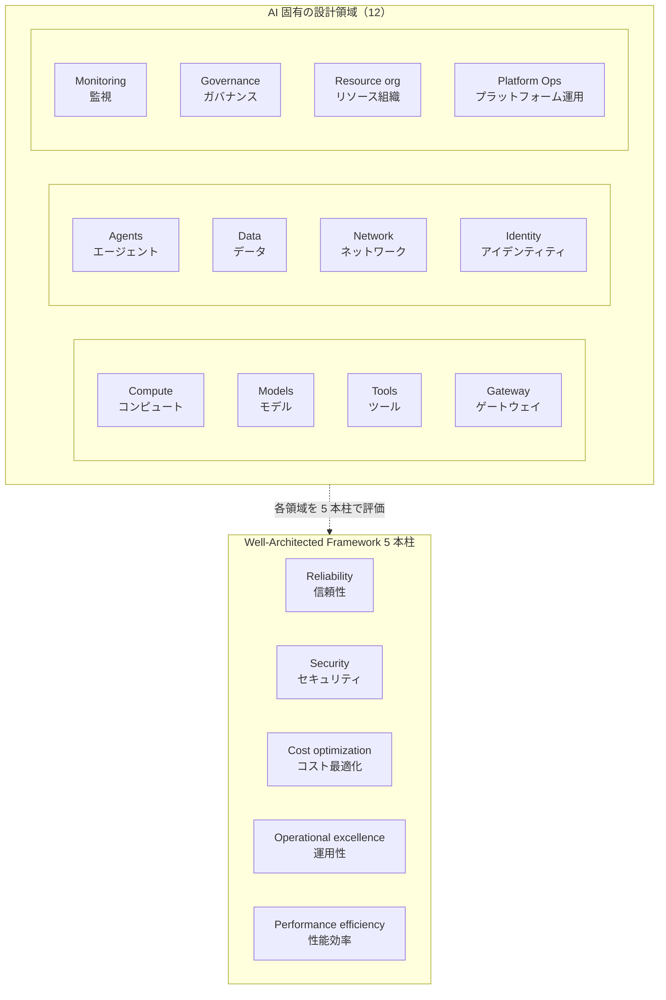
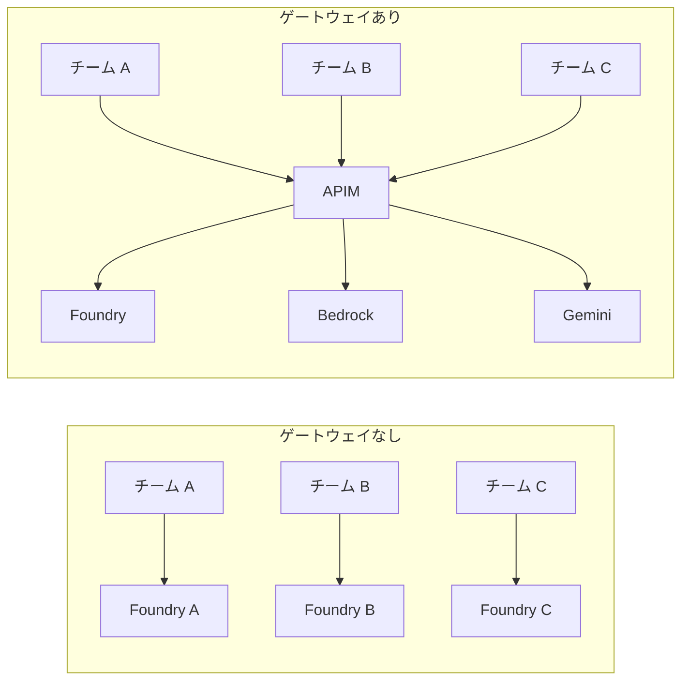
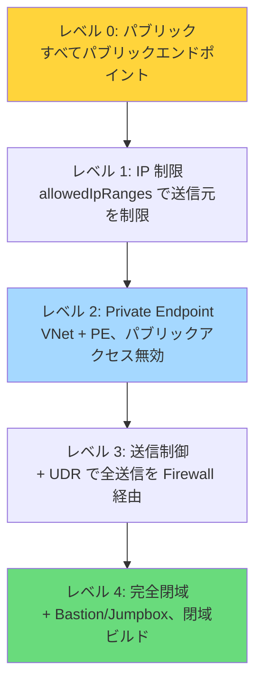
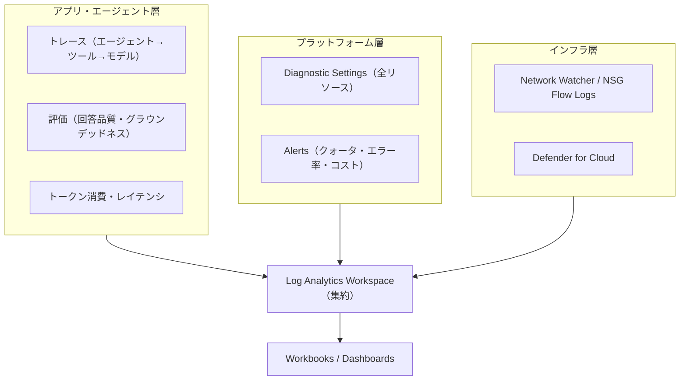

# 設計フレームワーク — 12 の設計領域と WAF 5 本柱

> **なぜこれが必要か（元資料スピーカーノートより）**
>
> 「顧客が AI ソリューションを構築するとき、彼らはしばしばこれらの設計領域の**一部だけ**に注力します。
> **しかし本番での課題は、通常「対処されなかった設計領域」から生じます。**
>
> これは設計領域のチェックリストだと考えてください。
> **初日にすべてから始める必要はありませんが、スケールしたいなら、どれも無視できません。**」

---

## 全体像



**出典の階層:**
- **Cloud Adoption Framework (CAF)** — 組織全体の導入プロセス
- **Well-Architected Framework (WAF)** — ワークロードの設計品質
- **Azure Architecture Center (AAC)** — 実装パターン
- **製品ガイダンス** — Foundry 等の個別ベストプラクティス

---

## 使い方

各設計領域について「**判断すべきこと → 選択肢 → 推奨**」の順に整理しています。
プロジェクト開始時にこの表を埋めることを推奨します。

| フェーズ | 対応すべき領域 |
|---|---|
| **Day 0（PoC 開始前）** | Models, Identity, Resource organization |
| **Day 1（PoC → パイロット）** | Network, Data, Gateway, Monitoring |
| **Day 2（パイロット → 本番）** | Agents, Tools, Compute, Governance, Platform Ops |

---

## 1. Compute（コンピュート）

**判断すべきこと:** AI アプリケーション本体をどこで実行するか。

| 選択肢 | 適するケース | 注意点 |
|---|---|---|
| **Azure Container Apps** ⭐ | マイクロサービス構成、Dapr 利用、スケール to 0 | VNet 統合には専用サブネット必要 |
| Azure App Service | 単一 Web アプリ、既存 .NET/Java 資産 | コンテナ以外の構成も可 |
| Azure Kubernetes Service | 既に AKS 運用中、高度な制御が必要 | 運用負荷が高い |
| Azure Functions | イベント駆動、バッチ処理、Ingestion | 長時間実行に制約 |

**推奨（AI Landing Zone 既定）:** Container Apps Environment（Dapr 有効、VNet 統合、Workload Profile）

**チェックリスト:**
- [ ] スケール to 0 が許容できるか（コールドスタート遅延）
- [ ] Dapr の状態管理・Pub/Sub を使うか
- [ ] ビルドエージェントを閉域内に置くか（ACR Task Agent Pool）
- [ ] GPU が必要か（→ 必要なら AKS + GPU ノードプール、または Foundry のマネージド推論）

---

## 2. Models（モデル）

**判断すべきこと:** どのモデルを、どのデプロイタイプで、どのリージョンに配置するか。

### デプロイタイプ

| タイプ | 特徴 | 適するケース |
|---|---|---|
| **GlobalStandard** ⭐ | 最も安価、グローバルルーティング、最高スループット | 一般的な用途、データレジデンシ要件がない |
| **DataZoneStandard** | データゾーン内でルーティング（EU/US） | 地域データレジデンシ要件あり |
| **Standard** | 単一リージョン固定 | 厳格なリージョン要件 |
| **ProvisionedManaged (PTU)** | 専有スループット、レイテンシ保証 | 高負荷・SLA 要件あり（高コスト） |

### AI Landing Zone の既定モデル

| モデル | バージョン | デプロイタイプ | 容量 |
|---|---|---|---|
| `gpt-5-nano` | 2025-08-07 | GlobalStandard | 40 |
| `text-embedding-3-large` | 1 | Standard | 10 |

> 本番では用途に応じて `gpt-5` / `gpt-5-mini` を追加します。
> [デプロイガイド](06-deployment-guide.md#モデルデプロイのカスタマイズ) 参照。

**チェックリスト:**
- [ ] リージョンごとのモデル可用性を確認したか（最新モデルは Sweden Central / East US 2 先行が多い）
- [ ] `aiFoundryLocation` を他リソースと別リージョンにする必要があるか
- [ ] TPM（Tokens Per Minute）クォータは十分か → [クォータ確認](https://portal.azure.com)
- [ ] モデル廃止時の移行計画があるか（→ **Gateway のエイリアスで解決**）
- [ ] ファインチューニング／蒸留の必要性はあるか
- [ ] コンテンツフィルタのカスタマイズが必要か

---

## 3. Tools（ツール）

**判断すべきこと:** エージェントに何をさせるか、そのツールをどう安全に接続するか。

| ツール種別 | 提供 | 状態 |
|---|---|---|
| **File Search** | Foundry 組み込み | GA |
| **Azure AI Search** | 接続 | GA |
| **Grounding with Bing** | Foundry 組み込み | GA（既定 false） |
| **Function Calling** | 独自実装 | GA |
| **MCP (Model Context Protocol)** | 標準プロトコル | GA / 一部 preview |
| **Code Interpreter** | Foundry 組み込み | GA |
| **Web Search** | Foundry 組み込み | ⚠️ preview |
| **Memory** | Foundry 組み込み | ⚠️ preview |

**チェックリスト:**
- [ ] ツール実行の権限をエージェント ID に分離しているか（人間のアカウント流用は NG）
- [ ] 外部 API 呼び出しは APIM 経由で監査しているか
- [ ] MCP サーバを自前でホストする場合、閉域内に配置しているか
- [ ] ツール実行の失敗時のリトライ・タイムアウト方針は定めたか
- [ ] preview 機能を本番に含めていないか

---

## 4. Gateway（ゲートウェイ）

**判断すべきこと:** AI エンドポイントへのアクセスをどう統制するか。



| 課題 | ゲートウェイなし | APIM ゲートウェイあり |
|---|---|---|
| コスト可視化 | ✗ | ✓ ユースケース別トークン計測 |
| クォータ制御 | ✗ | ✓ ポリシーで上限設定 |
| モデル切替 | アプリ改修が必要 | エイリアスで無停止切替 |
| フェイルオーバー | ✗ | ✓ バックエンドプール |
| キャッシュ | ✗ | ✓ セマンティックキャッシュ（Redis） |
| 監査 | 分散 | ✓ 単一チョークポイント |
| 外部プロバイダ統合 | 個別実装 | ✓ 統一 API |

**主要な APIM ポリシー:**

| ポリシー | 用途 |
|---|---|
| `azure-openai-token-limit` | ユースケース別トークン上限 |
| `azure-openai-emit-token-metric` | トークン消費のメトリック出力 |
| `azure-openai-semantic-cache-lookup/store` | セマンティックキャッシュ |
| `llm-content-safety` | 有害コンテンツ・ジェイルブレイク検出 |
| `set-backend-service` + backend pool | ルーティング・フェイルオーバー |

**チェックリスト:**
- [ ] APIM の SKU は適切か（Developer は SLA なし、本番は Premium/StandardV2 を検討）
- [ ] APIM を VNet 内部モード（Internal）にするか、外部モード（External）にするか
- [ ] マスターサブスクリプションキーの利用を禁止しているか
- [ ] セマンティックキャッシュの類似度しきい値を検証したか
- [ ] トークン計測データの保存先とレポート方法を定めたか

---

## 5. Agents（エージェント）

**判断すべきこと:** エージェントをどう設計・実行・管理するか。

| 判断項目 | 選択肢 | 推奨 |
|---|---|---|
| ホスティング | Foundry Agent Service / 自前ホスト | **Agent Service**（状態管理を任せられる） |
| ランタイム | Classic / New runtime | New runtime（Responses API ベース） |
| オーケストレーション | 単一エージェント / Microsoft Agent Framework | 3 個以上なら Agent Framework |
| エージェント間通信 | 独自 / **A2A** | A2A（オープン標準、他社互換） |
| 状態保存先 | Foundry マネージド / **BYO** | BYO（データレジデンシ、バックアップ運用の適用） |
| ID | 人間アカウント流用 / **Entra Agent ID** | Entra Agent ID |

**チェックリスト:**
- [ ] エージェントごとに独立した ID とアクセス権を割り当てているか
- [ ] エージェント定義をバージョン管理しているか（Agent Versions）
- [ ] 会話スレッドの保持期間とパージ方針を定めたか
- [ ] コンテキストウィンドウ超過時の挙動を検証したか
- [ ] エージェントの暴走（無限ループ、過剰なツール呼び出し）に上限を設けたか
- [ ] Human-in-the-loop が必要な操作を特定したか

---

## 6. Data（データ）

**判断すべきこと:** データをどこに置き、どう検索し、どう保護するか。

### データの種類と配置

| 種類 | 保存先 | 考慮点 |
|---|---|---|
| 会話スレッド・実行状態 | Cosmos DB（BYO） | ≧3000 RU/s、リージョン、バックアップ |
| ベクトル索引 | Azure AI Search | レプリカ数、パーティション、セマンティックランカー |
| 原本ドキュメント | Blob Storage | ライフサイクル管理、暗号化キー |
| 設定・機能フラグ | App Configuration | — |
| シークレット | Key Vault | RBAC、ソフトデリート、パージ保護 |
| 構造化業務データ | PostgreSQL Flexible Server（オプション） | pgvector 利用時 |

### 検索バックエンド

| 選択肢 | 説明 |
|---|---|
| **`foundry_iq`** ⭐（既定） | Foundry IQ（Azure AI Search ベースの知識検索） |
| `azure_ai_search` | AI Search を直接利用 |

**チェックリスト:**
- [ ] データレジデンシ要件を満たすリージョンか
- [ ] ドキュメントレベルの権限（ACL trimming）が必要か
- [ ] チャンク戦略とオーバーラップを検証したか
- [ ] インデックス更新のパイプライン（Ingestion）を設計したか
- [ ] PII の検出・マスキングをどこで行うか（ゲートウェイ / アプリ / Purview）
- [ ] 顧客管理キー（CMK）が必要か

---

## 7. Network（ネットワーク）

**判断すべきこと:** どこまで閉域にするか。



| レベル | パラメータ | 用途 |
|---|---|---|
| 0 | `networkIsolation=false` | 短期検証のみ |
| 1 | `networkIsolation=false` + `allowedIpRanges` | 社内 IP からの検証 |
| 2 | `networkIsolation=true` | 一般的な本番 |
| 3 | + `deployAzureFirewall=true` | 規制業種 |
| 4 | + `deployBastion=true`, `deployJumpbox=true` | 金融・公共・医療 |

**チェックリスト:**
- [ ] Private DNS Zone を hub 集中管理にするか、spoke ごとに作るか
- [ ] IP アドレス空間が既存 VNet と重複しないか
- [ ] Foundry Agent subnet の委任（delegation）を確保したか
- [ ] Container Apps Environment サブネットのサイズは十分か（/23 以上推奨）
- [ ] ExpressRoute / VPN 経由のオンプレミス接続が必要か
- [ ] Firewall の送信ルールに必要な FQDN を洗い出したか

---

## 8. Identity（アイデンティティ）

**判断すべきこと:** 誰が・何が・何にアクセスできるか。

### 認証方式

| 方式 | 評価 |
|---|---|
| API キー | ❌ 本番では非推奨（ローテーション困難、漏洩リスク、監査不能） |
| **Managed Identity（システム割り当て）** | ⭐ 推奨。リソースと一体でライフサイクル管理 |
| **Managed Identity（ユーザー割り当て）** | ⭐ 複数リソースで共有する場合 |
| Service Principal | CI/CD からのデプロイ時 |
| **Entra Agent ID** | ⭐ エージェント自身の ID（新） |

### 主要な Foundry ロール（2026 年時点）

| ロール | 権限 |
|---|---|
| **Foundry Account Owner** | アカウント全体の管理 |
| **Foundry Owner** | プロジェクトの完全管理 |
| **Foundry Project Manager** | プロジェクト内のリソース管理 |
| **Foundry User** | モデル・エージェントの利用 |

**チェックリスト:**
- [ ] API キーを一切使わない構成にできているか
- [ ] 最小権限の原則に沿ったロール割り当てか
- [ ] エージェントに人間のアカウントを流用していないか
- [ ] Conditional Access ポリシーの適用範囲を確認したか
- [ ] `principalId` / `principalType` をデプロイ時に正しく設定したか
- [ ] PIM（Privileged Identity Management）による昇格を設計したか

---

## 9. Monitoring（監視）

**判断すべきこと:** 何を、どこに、どれだけ保持するか。

### 監視の 3 層



**AI 固有の監視項目:**

| 項目 | 取得元 | 用途 |
|---|---|---|
| トークン消費（入力/出力） | APIM メトリック / App Insights | コスト帰属 |
| 429（レート制限）率 | APIM / Foundry 診断ログ | クォータ調整 |
| Time to First Token | App Insights カスタムメトリック | UX 品質 |
| ツール呼び出し成功率 | Agent Service トレース | 信頼性 |
| コンテンツフィルタ発動率 | Content Safety ログ | 安全性 |
| グラウンデッドネススコア | Foundry 評価 | 回答品質 |
| セマンティックキャッシュヒット率 | APIM | コスト削減効果 |

**チェックリスト:**
- [ ] 全リソースに Diagnostic Settings を設定したか
- [ ] Log Analytics の保持期間とコストを見積もったか
- [ ] プロンプト・レスポンス本文をログに含めるか（PII 観点で要判断）
- [ ] コストアラートを設定したか
- [ ] 継続的評価（Continuous Evaluation）のパイプラインを組んだか

---

## 10. Governance（ガバナンス）

**判断すべきこと:** どうやってルールを強制するか。

| 手段 | 用途 |
|---|---|
| **Azure Policy** | リソース作成時の強制（パブリックアクセス禁止、必須タグ、許可リージョン） |
| **Management Groups** | ポリシーの階層的な適用 |
| **Azure Blueprints / Deployment Stacks** | 構成のドリフト検出 |
| **APIM ポリシー** | 実行時のガードレール（モデル制限、トークン上限） |
| **Purview** | データ分類、DLP、監査 |
| **Defender for Cloud** | セキュリティ姿勢管理、脅威検知 |

**AI 固有の推奨ポリシー:**
- Cognitive Services アカウントのパブリックネットワークアクセスを拒否
- Cognitive Services の顧客管理キーを要求
- 許可されたモデルデプロイのみ
- 診断設定の必須化
- 承認済みリージョンのみ

**チェックリスト:**
- [ ] AI 関連リソースへの Azure Policy を適用したか
- [ ] 責任ある AI（Responsible AI）の社内ガイドラインを定めたか
- [ ] モデルカード・システムカードを整備したか
- [ ] EU AI Act 等の規制への対応方針を定めたか
- [ ] コンテンツフィルタのレベルを業務要件に合わせたか

---

## 11. Resource organization（リソース組織）

**判断すべきこと:** サブスクリプション・リソースグループ・命名・タグの設計。

### 推奨構成

```
Management Group
├── Platform
│   ├── Connectivity Sub      … Hub VNet, Firewall, Private DNS Zones
│   ├── Identity Sub          … Entra DS, Domain Controllers
│   └── Management Sub        … Log Analytics, Automation
└── Landing Zones
    ├── AI Hub Prod Sub       … AI Gateway Landing Zone（全社共通）
    ├── AI Agent Prod Sub A   … Foundry Landing Zone（事業部 A）
    ├── AI Agent Prod Sub B   … Foundry Landing Zone（事業部 B）
    └── AI Agent Dev Sub      … 開発・検証
```

**サブスクリプションを分ける理由:**
- クォータ（TPM、vCPU）はサブスクリプション単位
- コスト境界が明確になる
- RBAC の分離境界として自然
- Blast radius の限定

**チェックリスト:**
- [ ] 命名規則（CAF 準拠）を定めたか → `cafEnvironmentName` パラメータ
- [ ] 必須タグ（コストセンター、オーナー、環境、機密度）を定めたか
- [ ] リソースロックを設定したか（本番の削除防止）
- [ ] サブスクリプションのクォータを事前確認したか

---

## 12. Platform Ops（プラットフォーム運用）

**判断すべきこと:** 誰がどう運用し続けるか。

### モジュール分割による責任分離

| モジュール | 変更頻度 | 責任 |
|---|---|---|
| Platform（VNet, APIM, PE） | 年数回 | プラットフォームチーム |
| Model Backend Onboarding | 週次 | プラットフォームチーム |
| Access Contracts | チーム参画時 | プラットフォーム + 事業部 |
| アプリケーション | 日次 | アプリケーションチーム |

> **重要:** 「新しいモデルを追加するたびにプラットフォーム全体を再デプロイする」設計にしてはいけません。
> モジュールを分割し、変更頻度ごとにライフサイクルを分離してください。

**チェックリスト:**
- [ ] IaC を Git 管理し、PR ベースでデプロイしているか
- [ ] 環境別（dev/staging/prod）のパラメータファイルを分離したか
- [ ] Terraform state / Bicep デプロイ履歴のバックアップ方針を定めたか
- [ ] ロールバック手順を検証したか
- [ ] オンコール体制とランブックを整備したか
- [ ] コスト レビューの定例を設けたか
- [ ] モデル廃止アナウンスの追跡プロセスがあるか

---

## WAF 5 本柱との対応

各設計領域を WAF の観点で評価します。

| 設計領域 | 信頼性 | セキュリティ | コスト | 運用性 | 性能 |
|---|:---:|:---:|:---:|:---:|:---:|
| Compute | ● | ○ | ● | ● | ● |
| Models | ○ | ○ | ● | ○ | ● |
| Tools | ● | ● | ○ | ● | ○ |
| Gateway | ● | ● | ● | ● | ● |
| Agents | ● | ● | ○ | ● | ● |
| Data | ● | ● | ● | ○ | ● |
| Network | ○ | ● | ○ | ○ | ○ |
| Identity | ○ | ● | — | ○ | — |
| Monitoring | ● | ● | ● | ● | ● |
| Governance | ○ | ● | ● | ● | — |
| Resource org | ○ | ○ | ● | ● | — |
| Platform Ops | ● | ○ | ● | ● | ○ |

● = 主要な関連 / ○ = 副次的な関連

---

## 参考

- [なぜ Microsoft Foundry なのか](02-why-microsoft-foundry.md)
- [リファレンスアーキテクチャ](04-reference-architecture.md)
- [デプロイガイド](06-deployment-guide.md)
- WAF AI ワークロード: https://learn.microsoft.com/azure/well-architected/ai/
- CAF AI シナリオ: https://learn.microsoft.com/azure/cloud-adoption-framework/scenarios/ai/
