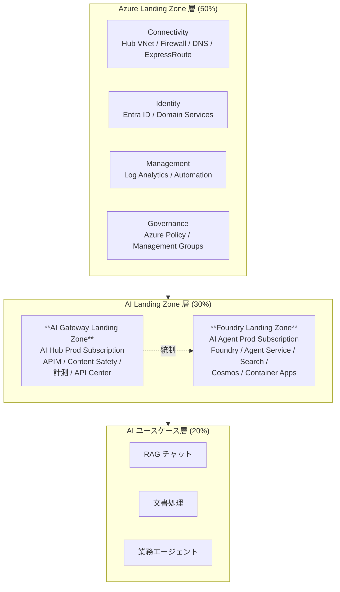
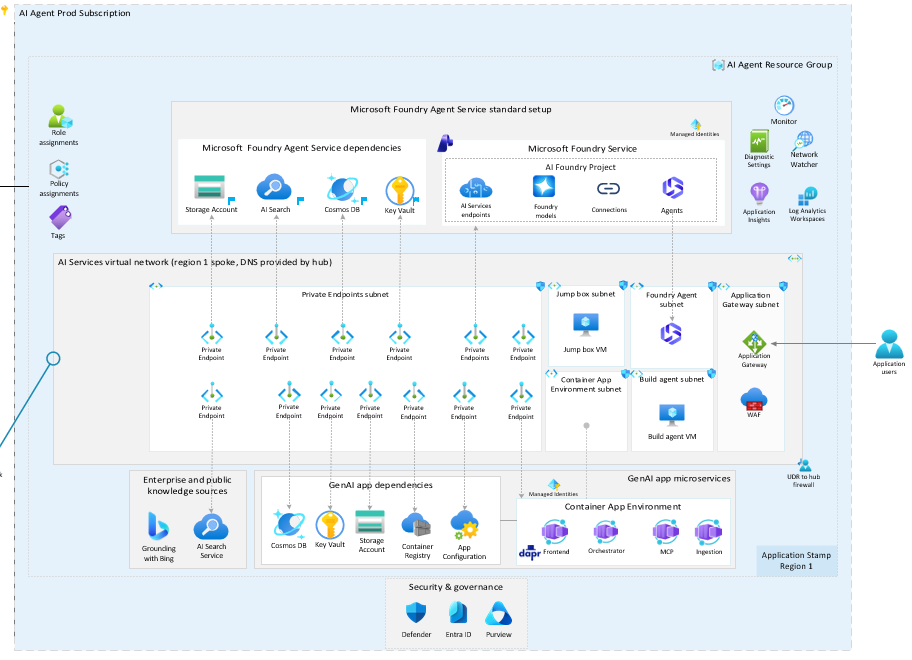
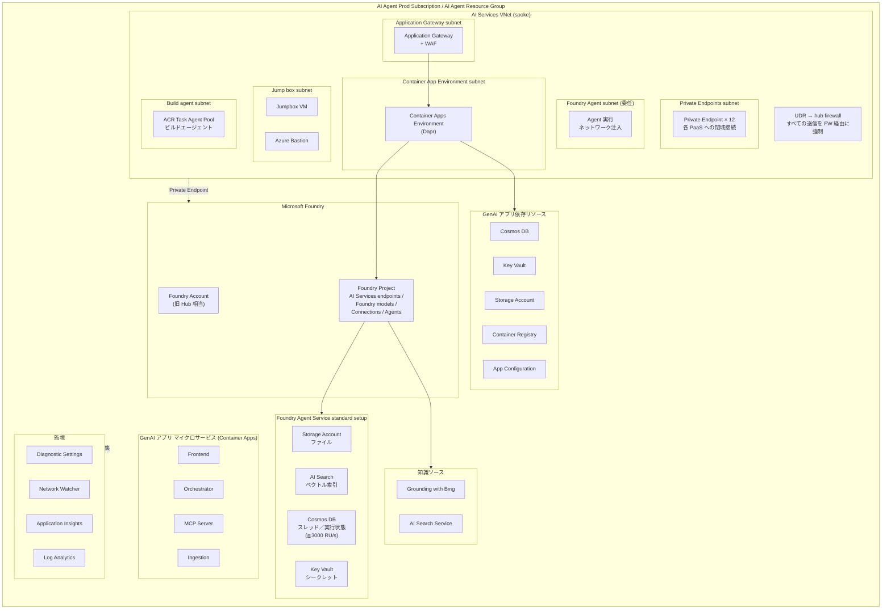
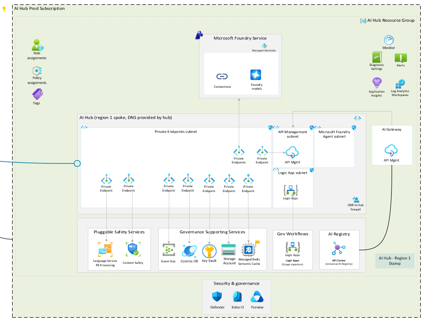
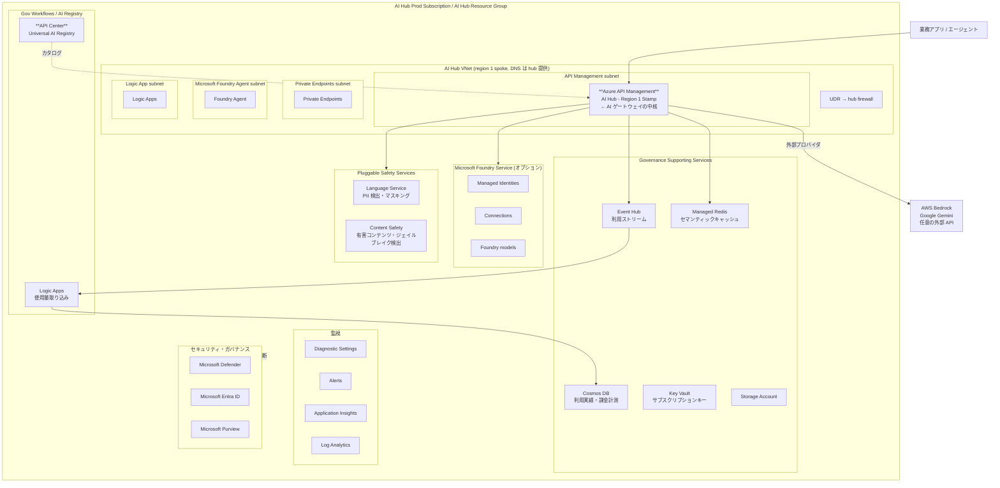
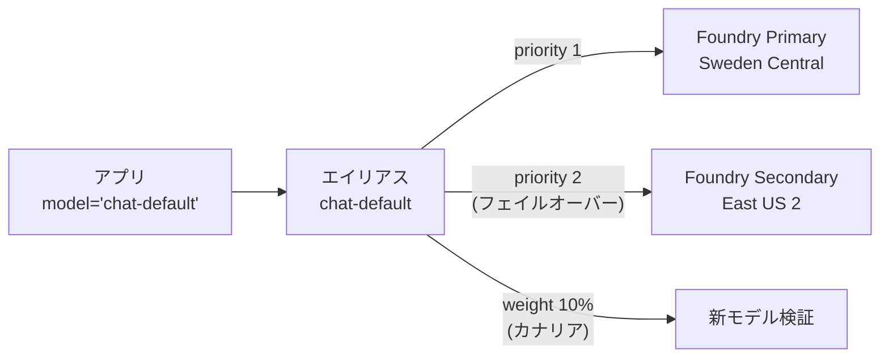
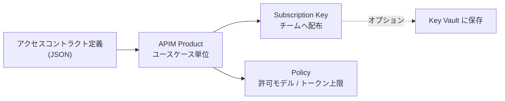
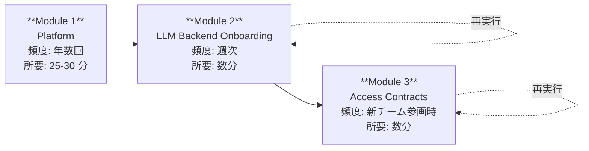
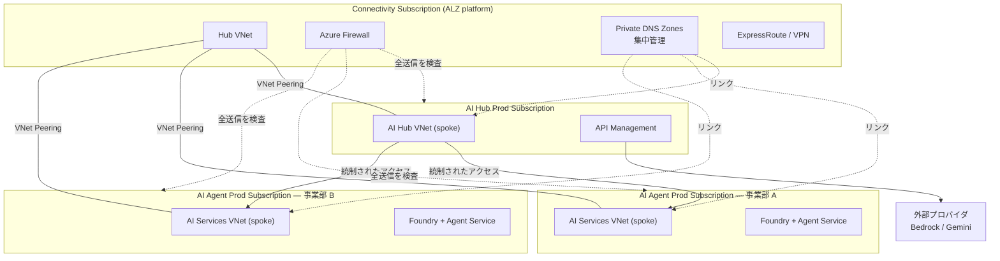

# リファレンスアーキテクチャ

AI Landing Zones は **2 つのリファレンスアーキテクチャ**を提供します。
どちらも Azure Landing Zone（プラットフォーム）の上に載る**ワークロード Landing Zone** です。

| Landing Zone | 目的 | 中核サービス | 典型的な配置 |
|---|---|---|---|
| **Foundry Landing Zone** | AI アプリケーション／エージェントの実行基盤 | Microsoft Foundry + Agent Service | AI Agent Prod Subscription |
| **AI Gateway Landing Zone** | 全社の AI エンドポイントを統制するガバナンスハブ | Azure API Management | AI Hub Prod Subscription |

> **両者の関係:** まず Foundry Landing Zone を展開してモデルとエージェントを配置し、
> その上に AI Gateway Landing Zone を重ねて全社ガバナンスを効かせる、というのが標準的な順序です。
> Gateway LZ は Foundry LZ 以外（AWS Bedrock、Google Gemini、他社 API）も配下に置けます。

---

## 全体の階層



---

## 1. Foundry Landing Zone



> 元資料スライド 35 より。

### 1.1 論理構成



### 1.2 主要な設計判断

| 設計領域 | 判断 | 理由 |
|---|---|---|
| **ネットワーク** | すべての PaaS を Private Endpoint 化、パブリックアクセス無効 | 規制要件・データ流出防止 |
| **送信制御** | UDR で全送信を hub の Azure Firewall へ強制 | エージェントの外部通信を監査可能に |
| **エージェント実行** | Foundry Agent subnet へ**ネットワーク注入** | エージェントの実行自体を VNet 内に閉じる |
| **状態管理** | Agent Service の依存を BYO（自テナントの Cosmos/Storage/Search/KV） | データレジデンシ、既存バックアップ運用の適用 |
| **アプリ実行** | Container Apps Environment（Dapr 有効） | マイクロサービス間通信、サービスディスカバリ、状態管理 |
| **入口** | Application Gateway + WAF | L7 保護、TLS 終端、OWASP ルール |
| **運用アクセス** | Bastion + Jumpbox（パブリック IP なし） | 閉域環境の運用手段 |
| **CI/CD** | Build agent subnet に ACR Task Agent Pool | 閉域内でのコンテナビルド |
| **DNS** | Private DNS Zone 15 種（既存 Zone の BYO 可） | hub 集中管理と整合 |

### 1.3 必要な Private DNS Zone（15 種）

| # | ゾーン | 対象サービス |
|---|---|---|
| 1 | `privatelink.cognitiveservices.azure.com` | Cognitive Services |
| 2 | `privatelink.openai.azure.com` | Azure OpenAI |
| 3 | `privatelink.services.ai.azure.com` | Foundry (AI Services) |
| 4 | `privatelink.search.windows.net` | AI Search |
| 5 | `privatelink.documents.azure.com` | Cosmos DB |
| 6 | `privatelink.blob.core.windows.net` | Storage (Blob) |
| 7 | `privatelink.vaultcore.azure.net` | Key Vault |
| 8 | `privatelink.azconfig.io` | App Configuration |
| 9 | `privatelink.<region>.azurecontainerapps.io` | Container Apps |
| 10 | `privatelink.azurecr.io` | Container Registry |
| 11 | `privatelink.monitor.azure.com` | Azure Monitor |
| 12 | `privatelink.oms.opinsights.azure.com` | Log Analytics (OMS) |
| 13 | `privatelink.ods.opinsights.azure.com` | Log Analytics (ODS) |
| 14 | `privatelink.agentsvc.azure-automation.net` | Agent Service |
| 15 | `privatelink.applicationinsights.azure.com` | Application Insights |

> Azure Landing Zone の connectivity サブスクリプションで DNS を集中管理している場合は、
> `existingPrivateDnsZone*` パラメータで既存ゾーンを参照できます（[デプロイガイド](06-deployment-guide.md)参照）。

### 1.4 Agent Service の Cosmos DB コンテナ

Foundry Agent Service（standard setup）は以下のコンテナを作成します。

| ランタイム | コンテナ |
|---|---|
| Classic | `thread-message-store`, `system-thread-message-store`, `agent-entity-store` |
| New runtime | `agent-definitions-v1`, `run-state-v1` |

> **注意:** アカウント全体で **最低 3,000 RU/s** が必要です。小規模検証でも一定のコストが発生します。

---

## 2. AI Gateway Landing Zone



> 元資料スライド 35 より。

### 2.1 論理構成



### 2.2 APIM が解く 5 つの課題

| 課題 | APIM での解決 | 実装 |
|---|---|---|
| **モデルスプロール** | 全モデルを単一のフロントドアに集約 | Universal LLM API / Azure OpenAI 互換 API |
| **コスト帰属不能** | サブスクリプションキー単位でトークン計測 | `azure-openai-emit-token-metric` → Event Hub → Logic Apps → Cosmos DB |
| **クォータ枯渇** | ユースケース別のトークン上限 | `azure-openai-token-limit` ポリシー |
| **アクセス制御なし** | プロダクト単位の許可モデルリスト | Product + Subscription + Policy |
| **モデル廃止時の改修** | モデルエイリアス | Backend Pool + weighted / priority 戦略 |

### 2.3 モデルエイリアスとルーティング戦略



| 戦略 | 用途 |
|---|---|
| `priority` | リージョン障害時のフェイルオーバー |
| `weighted` | カナリアリリース、コスト最適化（安価なモデルに一部を流す） |
| `round-robin` | 複数デプロイ間の負荷分散、TPM 上限の合算 |

### 2.4 アクセスコントラクトのデータモデル

```jsonc
[
  {
    "useCase": "sales-customer-support-assistant",
    "businessUnit": "Sales",
    "allowedModels": ["gpt-5-mini", "text-embedding-3-large"],
    "capacityAllocation": {
      "tokensPerMinute": 50000,
      "tokensPerMonth": 20000000
    },
    "storeKeyInKeyVault": true,
    "enableFoundryConnection": true
  },
  {
    "useCase": "finance-report-analyzer",
    "businessUnit": "Finance",
    "allowedModels": ["gpt-5", "gpt-5-mini"],
    "capacityAllocation": { "tokensPerMinute": 200000 }
  }
]
```

これが APIM 上で以下に展開されます。



### 2.5 デプロイのモジュール分割 ★重要な設計思想

> 「新しいモデルをオンボードするたびにプラットフォーム全体を再デプロイしなければならないとしたら、
> それは時間がかかり、エラーを起こしやすい作業です。」— Nadeem Shkir



| モジュール | 変更頻度 | 責任者 | 内容 |
|---|---|---|---|
| Platform | 低（年数回） | プラットフォームチーム | VNet, APIM, PE, Cosmos, Logic Apps, Event Hubs, API Center |
| Backend Onboarding | 中（週次） | プラットフォームチーム | モデルバックエンド追加、エイリアス定義、フェイルオーバー設定 |
| Access Contracts | 中（チーム参画時） | プラットフォームチーム + 各事業部 | プロダクト、キー、ポリシー、クォータ |

---

## 3. 2 つの Landing Zone の統合



### デプロイモード

Bicep 実装は `deploymentMode` パラメータで 2 つのモードをサポートします。

| モード | 動作 | 使う場面 |
|---|---|---|
| `standalone` | hub を含むすべてを新規作成 | ALZ 未整備、または独立検証環境 |
| `ailz-integrated` | spoke のみ作成し、既存 hub にピアリング | ALZ 整備済みの本番環境 |

---

## 4. 「本番にスケールしない」アーキテクチャとの差分

冒頭で提示された「よく見るがサインオフできないアーキテクチャ」との差分を整理します。

| 項目 | よくある PoC アーキテクチャ | AI Landing Zone |
|---|---|---|
| ネットワーク | パブリックエンドポイント | VNet + Private Endpoint 15 ゾーン + UDR で送信制御 |
| 認証 | API キー | Managed Identity + Entra RBAC |
| ゲートウェイ | なし（直接呼び出し） | APIM でトークン制限・キャッシュ・ルーティング・監査 |
| コスト帰属 | サブスクリプション一括 | ユースケース別トークン計測 → Cosmos DB |
| モデル管理 | モデル名ハードコード | エイリアス + バックエンドプール |
| 運用アクセス | パブリック IP の VM | Bastion + Jumpbox（パブリック IP なし） |
| CI/CD | ローカル実行 | 閉域内ビルドエージェント + パイプライン |
| 監視 | App Insights 単体 | Diagnostic Settings 全リソース + Log Analytics 集約 + Alerts |
| 安全性 | なし | Content Safety + PII 検出（プラガブル） |
| レジストリ | なし | API Center（Universal AI Registry） |
| DR | 単一リージョン | マルチリージョンバックエンド + priority フェイルオーバー |

---

## 参考

- [設計フレームワーク](03-design-framework.md) — 各設計領域の判断ポイント
- [デプロイガイド](06-deployment-guide.md) — 実際のパラメータ設定
- 公式: https://azure.github.io/AI-Landing-Zones/
