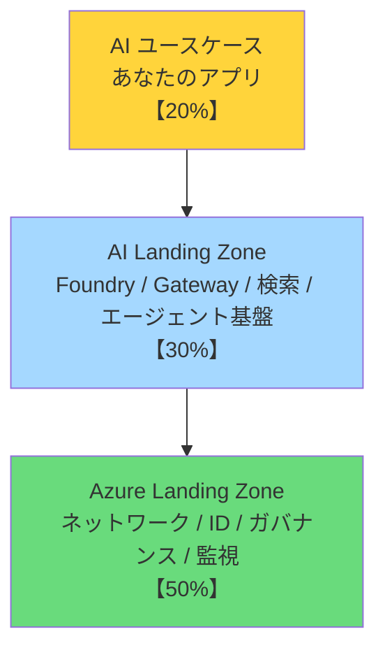
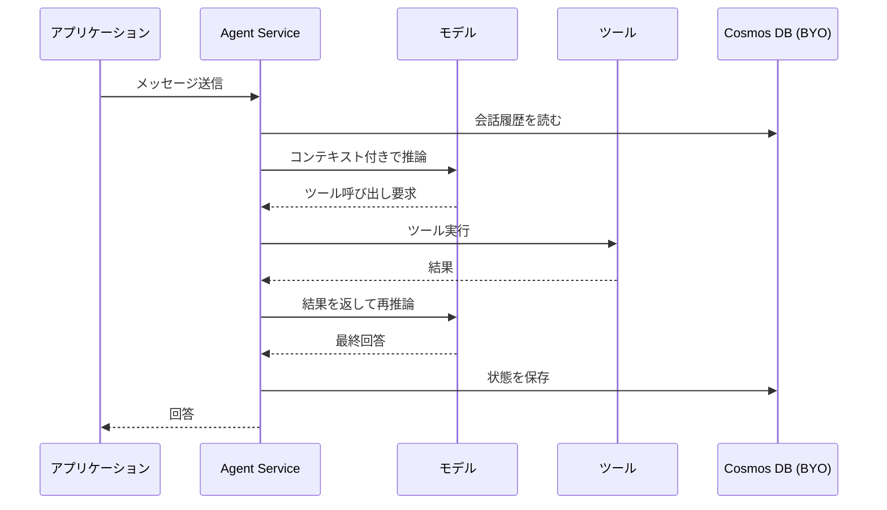

# トークトラック — プロ開発者に向けて話す

このドキュメントは、**開発者・アーキテクト・技術意思決定者に向けて AI Landing Zones と Microsoft Foundry を説明する**ための台本です。
5 分 / 15 分 / 45 分の 3 バージョンを用意しています。

---

## 目次

- [核となる 4 つのメッセージ](#核となる-4-つのメッセージ)
- [5 分版 — エレベーターピッチ](#5-分版--エレベーターピッチ)
- [15 分版 — 技術ブリーフィング](#15-分版--技術ブリーフィング)
- [45 分版 — フルセッション](#45-分版--フルセッション)
- [想定 Q&A](#想定-qa)
- [使ってはいけない言い回し](#使ってはいけない言い回し)

---

## 核となる 4 つのメッセージ

すべての説明はこの 4 つに収束させます。

### ① 12 週間 vs 12 か月

> 「PoC から本番まで、**12 週間**で行けるか、**12 か月**かかるか。
> その差はモデルの選択ではなく、**基盤が整っているかどうか**で決まります。」

**なぜ効くか:** 相手の実感（「PoC は動いたのに本番に行けない」）に直結する。

### ② サインオフできないアーキテクチャ

> 「デモは動きます。でも、セキュリティチームは**サインオフしません**。
> ネットワークが開いていて、API キーがハードコードされていて、監査ログがないからです。」

**なぜ効くか:** 「技術的に動く」と「本番に出せる」の間にある壁を言語化する。

### ③ 都市計画のアナロジー

> 「Azure Landing Zone は**都市計画**です。道路、電気、上下水道、区画整理。
> AI Landing Zone は**その都市に AI 地区を作る**こと。
> あなたのアプリは、その地区に建てる**建物**です。
>
> 建物を建てる前に、道路と電気を引く必要があります。」

**なぜ効くか:** 非エンジニアにも通じる。かつ「順序」を納得させられる。

### ④ ガバナンスギャップ

> 「今日、**マスターキーを持っている人は誰でも、どのモデルでも呼べます**。
> どのチームがいくら使ったか、わかりません。
> モデルが廃止されたら、全アプリを改修することになります。」

**なぜ効くか:** 具体的な痛みを提示できる。AI Gateway の必要性が自明になる。

---

## 5 分版 — エレベーターピッチ

**対象:** 立ち話、ブースでの説明、会議冒頭

---

**［導入 - 30 秒］**

「AI の PoC、うまくいってますか？
実は、業界データだと **PoC の 31% が本番に到達しません**（Adecco 2025）。
そして AI 導入企業のうち、**EBITDA に有意なインパクトを出せているのは 10% 未満**（Gartner）。

面白いのは、失敗の理由が**モデルの品質ではない**ということです。」

**［問題提起 - 1 分］**

「典型的なパターンをお話しします。

チームが 2 週間で素晴らしいプロトタイプを作ります。RAG が動いて、回答も良い。
デモは大成功。経営陣も乗り気。

そして本番化のレビューが始まります。

- セキュリティ「エンドポイントがパブリックですね」
- ネットワーク「Private Endpoint は？」
- 財務「どのチームがいくら使うんですか？」
- コンプライアンス「監査ログは？データはどこに保存されますか？」
- SRE「モデルが廃止されたらどうします？」

**誰も『NO』とは言いません。でも、誰もサインオフしません。**
そこから 12 か月のインフラ再構築が始まります。」

**［解決策 - 2 分］**

「AI Landing Zones は、この**再構築を先回りする**ものです。

3 つのレイヤで考えます。

1. **Azure Landing Zone（基盤の 50%）** — ネットワーク、ID、ガバナンス。都市計画にあたる部分。
2. **AI Landing Zone（30%）** — Foundry、AI Gateway、ベクトル検索、エージェント基盤。AI 地区。
3. **AI ユースケース（20%）** — あなたのアプリケーション。建物。

多くのチームは 20% から始めて、あとで 80% を作り直します。
**逆にすれば、12 週間で本番に行けます。**

そして Microsoft はこの 80% を**再利用可能な実装として公開**しています。
Bicep / Terraform / ポータルの 3 形態。今日から `azd up` で立ち上がります。」

**［Foundry の位置づけ - 1 分］**

「なぜ Microsoft Foundry かというと、**モデルではなくプラットフォームだから**です。

OpenAI SDK はそのまま使えます。変えるのは 3 行、認証部分だけ。
その 3 行で、Managed Identity、Private Endpoint、監査ログ、コスト帰属、コンテンツフィルタ、
モデルのマルチテナント管理が全部ついてきます。

**自分で作らなくていいものを、自分で作らない。** これが Foundry を選ぶ理由です。」

**［クロージング - 30 秒］**

「リポジトリを公開しています。日本語のリファレンスアーキテクチャと、
そのまま `azd up` できる公式 Bicep 実装が入っています。

まず最小構成で 1 時間、閉域フル構成でも 90 分で立ち上がります。
試してみてください。」

---

## 15 分版 — 技術ブリーフィング

**対象:** 開発チームへの説明、社内勉強会、顧客との技術ディスカッション

### 構成

| 時間 | セクション | ゴール |
|---|---|---|
| 0:00-2:00 | 問題設定 | 「うちのことだ」と思わせる |
| 2:00-5:00 | なぜ Foundry か | プラットフォーム価値の理解 |
| 5:00-9:00 | 3 レイヤモデル | 順序の必然性を納得させる |
| 9:00-13:00 | 2 つの Landing Zone | 具体的な絵を持ち帰らせる |
| 13:00-15:00 | 次のアクション | 手を動かす気にさせる |

---

### 0:00-2:00 — 問題設定

> 5 分版の「問題提起」をそのまま使う。
> スライドに出すなら、レビュー会議での 5 つの質問を箇条書きで。

**追加で使える数字:**
- McKinsey 2025: AI 先進企業は競合の **1.5 倍**の売上成長
- BCG 2024: AI をスケールできている企業は **28%** のみ
- Adecco 2025: **31%** が PoC で停滞

**言い方:**
「機会は本物です。1.5 倍の成長差がついている。
でも、実際にスケールできているのは 28%。この差は何か。」

---

### 2:00-5:00 — なぜ Microsoft Foundry か

**開発者に刺さる話し方:**

> 「みなさん、OpenAI の SDK は使ってますよね。
> Foundry に移すとき、コードは**何行変わると思いますか？**
>
> **3 行です。**」

```python
# Before
from openai import OpenAI
client = OpenAI(api_key=os.environ["OPENAI_API_KEY"])

# After
from azure.identity import DefaultAzureCredential, get_bearer_token_provider
from openai import AzureOpenAI
client = AzureOpenAI(
    azure_endpoint=os.environ["AZURE_OPENAI_ENDPOINT"],
    azure_ad_token_provider=get_bearer_token_provider(
        DefaultAzureCredential(), "https://cognitiveservices.azure.com/.default"),
    api_version="2025-04-01-preview",
)
# 以降の client.chat.completions.create(...) は完全に同じ
```

「この 3 行の差で何が変わるか。

- API キーが**消えます**。Managed Identity になる。
- エンドポイントが**閉域**になる。Private Endpoint 経由。
- **監査ログ**が Azure Monitor に流れる。
- **コスト帰属**がリソースグループ単位でつく。
- **コンテンツフィルタ**が既定でかかる。

自分で実装したら何人月かかりますか？」

**「本番に必要になる 20 項目」を見せる**

> [02-why-microsoft-foundry.md](02-why-microsoft-foundry.md) の表を投影。
> 20 項目のうち、Foundry が「標準で提供」する項目に色をつけて見せる。

---

### 5:00-9:00 — 3 レイヤモデル



**都市アナロジーで説明:**

「ALZ が都市計画です。道路、電気、水道、区画。
AILZ はその都市の**AI 地区**。データセンターと変電所と光ファイバを引くようなもの。
あなたのアプリは、そこに建てる**建物**。

多くのチームは、更地に建物だけ建てます。
動きます。でも水道も電気も来てない。**あとから引くのは、最初から引くより高くつく。**」

**ここで一呼吸置いて聞く:**

> 「みなさんの組織、ALZ はもうありますか？」
>
> - **ある** → 「では AILZ を `deploymentMode=ailz-integrated` で既存 hub に統合できます」
> - **ない** → 「standalone モードで AILZ 単体を立ち上げて、あとで統合できます」

---

### 9:00-13:00 — 2 つの Landing Zone

**Foundry Landing Zone**

「1 つ目は **Foundry Landing Zone**。エージェントを作って動かすための地区です。

中身は：
- Foundry リソース（モデル + Agent Service）
- Cosmos DB — スレッドと実行状態（BYO。データレジデンシとバックアップを自分で管理できる）
- AI Search — ベクトル検索
- Storage — 原本ドキュメント
- Key Vault、App Configuration
- Container Apps — アプリケーション本体
- 全部 Private Endpoint。VNet 内。

これが 1 つのチーム、1 つのプロジェクト単位のスコープです。」

**AI Gateway Landing Zone**

「2 つ目は **AI Gateway Landing Zone**。全社共通のチョークポイントです。

なぜ必要か。ここが一番響くところなので、ゆっくり話します。

**今、あなたの組織では誰がどのモデルを呼んでいますか？**

マスターキーが 1 つあって、それを知っている人は誰でも、
GPT-5 でも、埋め込みモデルでも、何でも呼べる。
月末に請求書が来て、『これ誰の分？』とわからない。

これが**ガバナンスギャップ**です。

AI Gateway は APIM で、これを解きます。

1. **アクセスコントラクト** — チーム A には gpt-4o-mini を日 10 万トークンまで、
   チーム B には gpt-5 を日 100 万トークンまで、とサブスクリプションキー単位で契約する。
2. **トークン計測** — 誰がいくら使ったかがメトリックで出る。
3. **モデルエイリアス** — アプリは `chat-model` という論理名を呼ぶ。
   実体が gpt-4o から gpt-5 に変わっても、**アプリのコードは 1 行も変わらない**。
4. **セマンティックキャッシュ** — 類似質問はキャッシュから返す。コストが下がる。
5. **マルチプロバイダ** — Foundry だけでなく、AWS Bedrock も Google Gemini も
   同じ API で呼べる。ベンダーロックインを避けたい組織に効きます。」

**デモがあるならここで:**
- APIM の Product / Subscription 一覧
- トークン消費のダッシュボード
- エイリアスの重み付けルーティング設定

---

### 13:00-15:00 — 次のアクション

「3 つ提案します。

1. **今週** — 最小構成をデプロイして触ってみる。
   `azd up` で 20-30 分。パブリックエンドポイント、コスト月 200 ドル程度。

2. **今月** — [設計フレームワーク](03-design-framework.md) の 12 領域チェックリストを、
   自分たちのプロジェクトで埋めてみる。空欄が本番化のリスクです。

3. **今四半期** — 閉域構成をパイロット環境に立てて、
   セキュリティチームとネットワークチームを巻き込んでレビューする。

リポジトリはこちらです。日本語の設計ドキュメントと公式 Bicep 実装が入っています。」

---

## 45 分版 — フルセッション

**対象:** ウェビナー、社内テックトーク、顧客向けワークショップ

### アジェンダ

| 時間 | セクション | 内容 |
|---|---|---|
| 0:00-5:00 | **なぜ今か** | 市場データ、失敗パターン、機会損失 |
| 5:00-12:00 | **Microsoft Foundry** | プラットフォームとしての価値、20 項目、コード差分 |
| 12:00-18:00 | **設計の枠組み** | CAF / WAF / AAC の階層、12 設計領域 |
| 18:00-24:00 | **Azure Landing Zone** | 都市アナロジー、既存 ALZ との統合 |
| 24:00-34:00 | **AI Landing Zones** | 設計 FW / リファレンスアーキ / 実装の 3 要素、2 つの LZ |
| 34:00-42:00 | **デモ** | Gateway の 3 ステップ |
| 42:00-45:00 | **次のステップ** | リポジトリ、学習リソース、Q&A |

---

### 0:00-5:00 — なぜ今か

**開き方（2 択）:**

**A. データから入る**
> 「McKinsey の 2025 年の調査では、AI を業務に組み込んだ企業は競合の 1.5 倍の売上成長。
> 一方で BCG は、実際にスケールできている企業は 28% と報告しています。
> この 72% と 28% の差は何でしょうか。」

**B. 体験から入る（推奨）**
> 「PoC のデモが大成功して、経営陣が『これを本番に』と言った瞬間から、
> プロジェクトが止まった経験、ありませんか？」
> （手を挙げてもらう）

**続けて失敗パターンの詳細:**

「本番化レビューで出る質問を並べます。

| 誰が | 何を聞くか |
|---|---|
| セキュリティ | エンドポイントは閉域か、認証は何か、シークレット管理は |
| ネットワーク | Private Endpoint、DNS、送信制御 |
| コンプライアンス | データレジデンシ、監査ログ、保持期間 |
| 財務 | コスト帰属、予算上限、予測 |
| SRE | SLA、フェイルオーバー、モデル廃止時の対応 |
| データ保護 | PII の扱い、暗号化キー |

**この 6 つ全部に答えられる PoC はありません。**
だから 12 か月かかる。」

---

### 5:00-12:00 — Microsoft Foundry

15 分版のセクションを拡張。追加で話すこと：

**IaaS / PaaS / SaaS のアナロジー**

「Foundry の位置づけを、みなさんが知っている枠で説明します。

- **モデル API を直接叩く** = IaaS 的。全部自分でやる。
- **Foundry** = PaaS 的。プラットフォームの共通課題は解決済み。
- **Copilot Studio** = SaaS 的。設定だけで動くが、細かい制御はできない。

『自分で全部やる』のは、最初は速い。でも本番の 20 項目で詰まります。」

**Agent Service の状態管理**



「この**オーケストレーションループ**を自分で書くと、
リトライ、タイムアウト、コンテキスト管理、状態の永続化、
並行実行、エラーハンドリングを全部実装することになります。

Agent Service はこれをマネージドで提供します。
そして状態の保存先は**自分の Cosmos DB**を指定できる（BYO）。
データがどこにあるか把握できるし、既存のバックアップ運用も使えます。」

---

### 12:00-18:00 — 設計の枠組み

「Microsoft のガイダンスには階層があります。

- **CAF（Cloud Adoption Framework）** — 組織としてどう導入するか
- **WAF（Well-Architected Framework）** — ワークロードをどう設計するか（5 本柱）
- **Azure Architecture Center** — 具体的な実装パターン
- **製品ドキュメント** — Foundry 等の個別ガイド

AI Landing Zones は、この階層の**すべてを AI 向けに具体化したもの**です。」

**12 設計領域を見せる:**

> [03-design-framework.md](03-design-framework.md) の全体図を投影。

「12 の設計領域があります。
Compute、Models、Tools、Gateway、Agents、Data、Network、Identity、
Monitoring、Governance、Resource organization、Platform Ops。

**元資料の言葉を引用します:**

> 『顧客は、これらの設計領域の一部だけに注力しがちです。
> **しかし本番での課題は、通常「対処されなかった設計領域」から生じます。**』

初日から全部やる必要はありません。
でも、**どれを今やっていないかを自覚している**ことが重要です。」

---

### 18:00-24:00 — Azure Landing Zone

都市アナロジーをここでじっくり展開。

「Azure Landing Zone は 8 つの設計領域からなります。
Azure 課金と Entra テナント、ID とアクセス管理、リソース組織、
ネットワークトポロジと接続、セキュリティ、管理、ガバナンス、プラットフォーム自動化と DevOps。

これは AI に限った話ではありません。**すべてのワークロードの土台**です。

すでにお持ちの組織は、AI Landing Zone を `ailz-integrated` モードでその上に載せられます。
まだの組織は、`standalone` モードで AI 部分だけ先に立てて、あとで統合できます。」

**既存 ALZ との統合ポイント:**

| 要素 | 統合方法 |
|---|---|
| Hub VNet | spoke としてピアリング |
| Private DNS Zone | hub の既存ゾーンを参照（`existingPrivateDnsZone*`） |
| Firewall | hub の Firewall へ UDR |
| Log Analytics | 既存ワークスペースを指定 |
| ポリシー | Management Group から継承 |

---

### 24:00-34:00 — AI Landing Zones

**3 つの構成要素**

「AI Landing Zones は 3 つのものからできています。

1. **設計フレームワーク** — 何を判断すべきかのチェックリスト
2. **リファレンスアーキテクチャ** — 判断済みの推奨構成
3. **実装** — そのまま動く IaC（Bicep / Terraform / ポータル）

**実装が 3 形態あるのは意図的です。**
Bicep 派も Terraform 派も、GUI で理解したい人も、全員が使えるように。」

**2 つの Landing Zone を詳しく**

> [04-reference-architecture.md](04-reference-architecture.md) の図を投影。

Foundry LZ と AI Gateway LZ の関係、それぞれのコンポーネント、
Private Endpoint と DNS の設計を説明。

**「本番にスケールしないアーキテクチャ」との差分表を見せる:**

| 観点 | よくある PoC 構成 | AI Landing Zone |
|---|---|---|
| 認証 | API キー（ハードコード） | Managed Identity |
| ネットワーク | パブリックエンドポイント | Private Endpoint + VNet |
| 状態管理 | インメモリ / ローカル | Cosmos DB（BYO） |
| コスト帰属 | 不明 | APIM でユースケース別計測 |
| モデル切替 | コード改修 | エイリアスで無停止 |
| 監査 | なし | Log Analytics 集約 |
| 秘密情報 | .env ファイル | Key Vault + MI |
| デプロイ | 手動 | IaC + CI/CD |

---

### 34:00-42:00 — デモ

**3 ステップで見せる（元資料のデモ構成）**

**ステップ 1: Platform（25-30 分、年数回）**
「VNet、APIM、Private Endpoint、Cosmos DB、Logic Apps、Event Hubs、API Center。
これは 1 回作れば、ほとんど変えません。」

**ステップ 2: LLM Backend Onboarding（週次）**
「新しいモデルが出たら、バックエンドとして登録する。
Foundry のモデルも、Azure OpenAI も、**AWS Bedrock も Google Gemini も**、
外部の OpenAI 互換 API も、同じ手順で登録できます。

ここがポイントで、**プラットフォーム全体を再デプロイしません**。
モジュールが分かれているから、バックエンド登録だけを回せます。」

**ステップ 3: Access Contracts（チーム参画時）**
「APIM Product を作り、サブスクリプションキーを発行し、
ポリシーでトークンクォータをかける。

これで『チーム A は gpt-4o-mini を日 10 万トークンまで』という契約ができます。
マスターキーは配りません。」

**可視化**
「Jupyter Notebook で構成を可視化して、`.tfvars` を生成し、CI/CD に流します。
GUI で確認しながら、成果物は IaC。」

---

### 42:00-45:00 — 次のステップ

「3 つのレベルで提案します。

**レベル 1（今週）** — リポジトリを clone して最小構成をデプロイ
**レベル 2（今月）** — 12 設計領域のチェックリストを埋める
**レベル 3（今四半期）** — 閉域構成をパイロットに立て、セキュリティレビューを通す

リポジトリ: https://github.com/ChibaYuki347/ai-landing-zone-reference-jp

公式リソース:
- Azure/AI-Landing-Zones
- Azure/bicep-ptn-aiml-landing-zone
- WAF AI ワークロードガイダンス

質問をどうぞ。」

---

## 想定 Q&A

### Q1. すでに Azure Landing Zone があります。作り直しですか？

**A.** いいえ。`deploymentMode=ailz-integrated` を使うと、既存の hub VNet に spoke として接続し、
既存の Private DNS Zone、Firewall、Log Analytics を参照します。
AI 固有の部分だけを追加する形になります。

---

### Q2. コストはどれくらいですか？

**A.** 構成によって大きく変わります。

| 構成 | 概算（月額 USD） | 主なコスト源 |
|---|---|---|
| 最小（パブリック） | 150-300 | Foundry、AI Search Basic、Container Apps |
| 標準（閉域） | 800-1,500 | + Private Endpoint × 15、APIM |
| フル（Firewall + Bastion） | 3,000+ | + Azure Firewall（約 900）、Bastion（約 140）、VM |

これは**インフラのみ**で、モデルのトークン消費は別です。
検証後は必ず `azd down --purge` で削除してください。

---

### Q3. Terraform 派なんですが。

**A.** 公式実装は Bicep と Terraform の両方があります。
このリポジトリは Bicep 版を同梱していますが、
Terraform 版は `Azure/AI-Landing-Zones` リポジトリにあります。
設計ドキュメント（01-04）はどちらでも共通で使えます。

---

### Q4. OpenAI を直接使うのと比べて、レイテンシは増えませんか？

**A.** Private Endpoint 経由と APIM 経由でそれぞれ数 ms から数十 ms のオーバーヘッドがあります。
一方で、セマンティックキャッシュがヒットすればモデル推論そのものをスキップできるため、
**平均レイテンシはむしろ下がるケースが多い**です。

レイテンシが最優先なら、APIM をバイパスして Foundry の Private Endpoint に直接繋ぐ構成も可能です。
ただしガバナンスは失われます。

---

### Q5. `deployAzureFirewall=true` は必須ですか？

**A.** いいえ。既定では環境変数依存です。

必要になるのは、**送信トラフィックを FQDN レベルで制御する規制要件がある場合**です。
金融、公共、医療では求められることが多いですが、
一般的な企業では NSG + Private Endpoint で十分なケースが多いです。

Firewall は月額約 900 USD かかるため、要件がないなら外してください。

---

### Q6. Foundry と Copilot Studio、どちらを使うべきですか？

**A.** 判断基準は「**コードを書くかどうか**」です。

| | Copilot Studio | Microsoft Foundry |
|---|---|---|
| 対象 | 市民開発者、業務部門 | プロ開発者 |
| カスタマイズ | 設定ベース | コードベース（無制限） |
| CI/CD | 限定的 | 完全な IaC + Git |
| 閉域 | 制約あり | 完全対応 |
| コスト制御 | メッセージ単位 | トークン単位、細粒度 |

社内 FAQ ボットなら Copilot Studio、
基幹業務に組み込むエージェントなら Foundry です。両方使う組織も多いです。

---

### Q7. モデルが廃止されたらどうなりますか？

**A.** これが AI Gateway を入れる最大の理由の 1 つです。

**Gateway なし:** すべてのアプリのコードとデプロイ設定を変更し、テストし、再デプロイする。
**Gateway あり:** APIM のバックエンド設定を変えるだけ。アプリは論理名（例: `chat-model`）を呼び続けます。

さらに、重み付けルーティングを使えば、
新モデルに 10% → 50% → 100% と段階的に切り替えるカナリアリリースもできます。

---

### Q8. データはどこに保存されますか？学習に使われますか？

**A.** Azure OpenAI / Foundry では、**プロンプトとレスポンスはモデルの学習に使われません**。

保存先は自分でコントロールできます:
- 会話スレッド・実行状態 → **自分の Cosmos DB**（BYO）
- ドキュメント → 自分の Blob Storage
- ベクトル索引 → 自分の AI Search

不正利用監視のための一時保存（最大 30 日）は、
要件があればオプトアウトを申請できます。

---

### Q9. `preview` の機能が多くて不安です。

**A.** 本番に含めるかどうかは慎重に判断してください。

2026 年時点で preview のもの:
- Agent Service の memory / web search ツール
- A2A（Agent-to-Agent）プロトコル
- Agent Framework の Go SDK

既定のデプロイでは preview 機能は無効になっているものが多いです。
[07-naming-and-terminology.md](07-naming-and-terminology.md) に状態一覧があります。

---

### Q10. 小さく始めるにはどうすれば？

**A.** [デプロイガイド](06-deployment-guide.md#最小構成での検証) の最小構成から始めてください。

- `NETWORK_ISOLATION=false`
- Firewall / Bastion / Jumpbox なし
- モデルは `gpt-5-nano` 1 つ

20-30 分でデプロイでき、月 200 USD 程度です。
まず動くものを見てから、閉域化を段階的に進めるのが現実的です。

---

## 使ってはいけない言い回し

技術者向けに話すとき、信頼を失う表現があります。

| ❌ 避ける | ✅ 代わりに |
|---|---|
| 「すべて自動で解決します」 | 「12 の設計領域のうち、これとこれが標準で解決されます」 |
| 「Foundry を使えば安全です」 | 「Managed Identity と Private Endpoint が既定になります。ポリシーは別途必要です」 |
| 「他社より優れています」 | 「この要件ならこう、別の要件ならこう、という判断基準を示します」 |
| 「業界標準です」 | 「Microsoft のガイダンスでは、CAF / WAF でこう定義されています」 |
| 「エージェントが業務を代行します」 | 「Human-in-the-loop が必要な操作を先に特定してください」 |
| 「コストが下がります」 | 「セマンティックキャッシュのヒット率次第です。まず計測してください」 |

**原則:** 開発者は「できないこと」を正直に言う人を信頼します。
[02-why-microsoft-foundry.md](02-why-microsoft-foundry.md#正直な注意点) の「正直な注意点」セクションを一緒に見せると効果的です。

---

## 参考

- [ウェビナー書き起こし](01-webinar-transcript.md) — 元資料の完全な内容
- [なぜ Microsoft Foundry なのか](02-why-microsoft-foundry.md) — 技術的な裏付け
- [設計フレームワーク](03-design-framework.md) — 12 設計領域のチェックリスト
- [リファレンスアーキテクチャ](04-reference-architecture.md) — 図と設計判断
