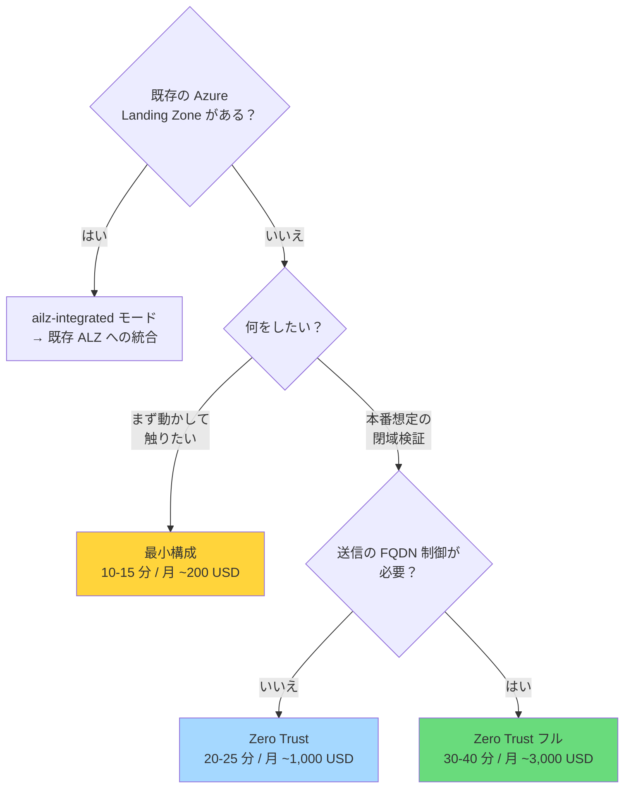

# デプロイガイド

このリポジトリに同梱している公式 Bicep 実装（`Azure/bicep-ptn-aiml-landing-zone` **v2.4.1**）を
Azure にデプロイする手順です。

> 📖 上流の詳細ランブックは [`infra-upstream/docs/runbook-standalone.md`](../infra-upstream/docs/runbook-standalone.md)（英語）にあります。
> 本ドキュメントはそれを日本語で要約し、日本の利用者向けの補足を加えたものです。

> [!NOTE]
> **本ガイドは 2026年8月に Japan East で実際にデプロイして検証済みです。**
> 遭遇した実障害（azd の認証エラー、ACR Task Agent Pool の非対応、Azure Firewall の
> `InternalServerError`）と、その切り分け・回避手順をすべて反映しています。
> 実測値と Zero Trust の実証結果は [README の「実機検証済み」](../README.md#実機検証済み2026年8月--japan-east) を参照してください。

---

## 目次

- [前提条件](#前提条件)
- [デプロイ構成の選択](#デプロイ構成の選択)
- [最小構成での検証](#最小構成での検証)
- [閉域構成（Zero Trust）](#閉域構成zero-trust)
  - [閉域構成での動作確認](#閉域構成での動作確認) — 外部からの遮断・VNet 内からの到達・マネージド ID でのモデル呼び出し
- [既存 ALZ への統合](#既存-alz-への統合)
- [モデルデプロイのカスタマイズ](#モデルデプロイのカスタマイズ)
- [デプロイ後の確認](#デプロイ後の確認)
- [コスト](#コスト)
- [削除](#削除)
- [トラブルシューティング](#トラブルシューティング)
- [主要な環境変数リファレンス](#主要な環境変数リファレンス)


---

## 前提条件

### 権限

| 必要なもの | 理由 |
|---|---|
| **Contributor**（サブスクリプションスコープ） | リソース作成 |
| **User Access Administrator** | ロール割り当て（Managed Identity への RBAC 付与） |

> `Owner` があれば両方を満たします。

### ツール

| ツール | 最低バージョン | 確認コマンド |
|---|---|---|
| Azure CLI (`az`) | 2.60 以上 | `az version` |
| Azure Developer CLI (`azd`) | 1.25 以上 | `azd version` |
| PowerShell | 7 以上 | `$PSVersionTable.PSVersion` |

**インストール:**

```powershell
winget install Microsoft.AzureCLI
winget install Microsoft.Azd
winget install Microsoft.PowerShell
```

### クォータ

デプロイ前に対象リージョンで以下を確認してください。

| 種別 | 必要量 | 用途 |
|---|---|---|
| `standardDSv2Family` vCPU | 10 以上 | Jumpbox + Container Apps Environment |
| `standardDdsv5Family` vCPU | 5 以上 | Foundry コンピュート |
| OpenAI モデル TPM | モデル定義の capacity 分 | `gpt-5-nano` = 40K TPM 等 |

```powershell
az vm list-usage --location swedencentral --query "[?contains(name.value,'standardDSv2Family')]" -o table
```

> プリフライトスクリプト（`scripts/Invoke-PreflightChecks.ps1`）が
> `azd provision` の前に自動実行され、モデルクォータ不足を検出します。

### リージョン選択

| リージョン | 特徴 |
|---|---|
| **Sweden Central** ⭐ | 最新モデルの提供が早い。AI Landing Zone の検証実績が多い |
| **East US 2** ⭐ | 同上。米国データレジデンシが必要な場合 |
| Japan East | 日本国内レジデンシが必要な場合。**下記の制約あり** |
| West Europe | EU データレジデンシ |

> モデルとリージョンの対応: https://learn.microsoft.com/azure/ai-foundry/openai/concepts/models

#### Japan East の既知の制約（2026年8月 実機検証）

本リポジトリでフル構成を japaneast にデプロイした際に確認した事象です。

| 事象 | 症状 | 回避策 |
|---|---|---|
| **ACR Task Agent Pool 非対応** | `LocationNotAvailableForResourceType: Microsoft.ContainerRegistry/registries/agentPools` でバリデーション失敗 | `azd env set DEPLOY_ACR_TASK_AGENT_POOL false`（上流の既定値も `false`） |
| **Azure Firewall の作成失敗** | `InternalServerError: An error occurred.` — **3回連続で再現**。サブネット `/26`・Standard Public IP・Policy `Succeeded` と構成は正常なのでプラットフォーム側の問題 | `azd env set DEPLOY_AZURE_FIREWALL false`、または Firewall だけ別リージョンに置く |
| **Cosmos DB の可用性ゾーン非対応** | プリフライトが `COSMOS_NO_AZ` を WARN | ゾーン冗長が必須なら別リージョンへ |

`agentPools` が利用できるリージョン（2026年8月時点）:
`eastus, westeurope, westus2, southcentralus, australiaeast, canadacentral, centralus, eastasia, eastus2, northeurope, francecentral, switzerlandnorth, swedencentral, jioindiawest, jioindiacentral`

> **Firewall なしでも Zero Trust は成立します。** NAT Gateway による固定送信 IP、NSG、
> Private Endpoint、パブリックアクセス無効化は維持されます。失われるのは
> **送信 FQDN のホワイトリスト制御**のみです。規制要件で明示的に求められる場合のみ
> Firewall を有効化し、そのリージョンで作成できることを事前に確認してください。

**リージョンを分けることもできます:**

```powershell
azd env set AZURE_LOCATION japaneast              # インフラ全体
azd env set AZURE_AI_FOUNDRY_LOCATION swedencentral  # Foundry のみ最新モデルのリージョン
azd env set AZURE_SEARCH_LOCATION eastus          # Search の容量不足回避
```

### ログイン

```powershell
az login
azd auth login
az account set --subscription '<subscription-id-or-name>'
```

#### `azd` が `AADSTS9002313` で認証に失敗する場合

`azd auth login` が成功しても `azd up` の途中で
`ERROR: Reauthentication required. / AADSTS9002313: Invalid request` が出ることがあります。
azd 独自のトークンキャッシュが壊れている状態です。az CLI の認証情報を使うよう切り替えてください。

```powershell
azd config set auth.useAzCliAuth true
azd auth token   # トークンが取得できれば OK
```

ブラウザが自動で開かない環境ではデバイスコードを使います。

```powershell
az login --use-device-code
azd auth login --use-device-code
```

---

## デプロイ構成の選択



| 構成 | 所要時間 | リソース数 | 用途 |
|---|---|---|---|
| **最小** | 10-15 分 | 約 60 | 機能確認、開発 |
| **Zero Trust** | 20-25 分 | 約 75 | 本番相当の検証 |
| **Zero Trust フル** | 30-40 分 | 約 80 | 規制業種の本番 |

---

## 最小構成での検証

まずここから始めることを推奨します。

```powershell
cd infra-upstream

azd env new ailz-demo
azd env set AZURE_LOCATION swedencentral

azd up
```

**これだけです。** 既定値がすべて最小構成向けになっています。

- `NETWORK_ISOLATION` = `false`（パブリックエンドポイント）
- Firewall / Bastion / Jumpbox / NAT Gateway はデプロイされない
- Private Endpoint なし

### 自分の IP だけを許可する

パブリックだが不特定多数からのアクセスは避けたい場合：

```powershell
$myIp = (Invoke-RestMethod https://api.ipify.org)
azd env set ALLOWED_IP_RANGES "[`"$myIp/32`"]"
azd provision
```

Storage、Key Vault、App Configuration、ACR、Cosmos DB、AI Search、Foundry のデータプレーンが
この IP からのみアクセス可能になります。

### 動作確認

```powershell
$rg = azd env get-value AZURE_RESOURCE_GROUP
$ca = az containerapp list -g $rg --query "[0].name" -o tsv
$fqdn = az containerapp show -g $rg -n $ca --query "properties.configuration.ingress.fqdn" -o tsv
curl "http://$fqdn"
```

ASP.NET の hello-world HTML が返れば成功です。

---

## 閉域構成（Zero Trust）

本番相当の構成です。

```powershell
cd infra-upstream

$stamp = Get-Date -Format 'MMddyyHHmm'
azd env new "ailz-$stamp"

azd env set AZURE_LOCATION swedencentral
azd env set NETWORK_ISOLATION true
azd env set DEPLOYMENT_MODE standalone

# 運用アクセス用
azd env set DEPLOY_JUMPBOX true
azd env set DEPLOY_BASTION true
azd env set DEPLOY_NAT_GATEWAY true

# 送信制御（規制要件がなければ false でよい）
azd env set DEPLOY_AZURE_FIREWALL true

azd up
```

### 各フラグの意味

| フラグ | 効果 | 外してよい条件 |
|---|---|---|
| `NETWORK_ISOLATION=true` | 全 PaaS に Private Endpoint、パブリックアクセス無効 | — （閉域の本体） |
| `DEPLOY_AZURE_FIREWALL=true` | 送信トラフィックを Firewall 経由に（UDR） | 管理グループレベルで送信制御済み。**月 ~900 USD 削減** |
| `DEPLOY_BASTION=true` | Jumpbox への RDP 接続手段 | 社内 VPN から VNet に到達できる。**月 ~140 USD 削減** |
| `DEPLOY_JUMPBOX=true` | VNet 内の操作用 Windows VM | 別の管理端末がある |
| `DEPLOY_NAT_GATEWAY=true` | Jumpbox の送信 IP を固定 | Firewall が送信を担う場合は不要 |

> `DEPLOY_BASTION` / `DEPLOY_JUMPBOX` / `DEPLOY_NAT_GATEWAY` は既定 `null` で、
> `DEPLOY_VM` の値を継承します。明示的に指定するのが安全です。

### Jumpbox の初期セットアップを自動化する

```powershell
azd env set DEPLOY_SOFTWARE true
```

Custom Script Extension が az / azd / git / PowerShell モジュールをインストールし、
`manifest.json` に列挙されたリポジトリを `C:\github\` に clone します。

### Container App をインターネットに公開する（WAF 付き）

閉域構成では Container App は VNet 内部からのみアクセス可能です。
外部公開が必要な場合は Application Gateway WAF v2 を前段に置けます。

```powershell
azd env set PUBLIC_INGRESS '{"enabled": true}'
```

### 閉域構成での動作確認

閉域構成では、**外から遮断され、中から到達できる**ことの両方を確認します。
片方だけでは「閉域になっている」証明になりません。

> [!IMPORTANT]
> `az vm run-command invoke --scripts "..."` に**スクリプトを直接埋め込むのは避けてください。**
> PowerShell の文字列補間と cmd.exe のクォート解釈が衝突して構文エラーになり、
> さらに**日本語を含めると VM 側で文字化けしてパースエラー**になります
> （`Unexpected token 'a,S=^?"^?SY)'` のような症状）。
> **ASCII のみの .ps1 ファイルを作り、`--scripts "@ファイルパス"` で渡してください。**

#### 1. 外部から遮断されていることを確認

自分の PC（VNet 外）から実行します。

```powershell
$rg = azd env get-value AZURE_RESOURCE_GROUP
$acct = az cognitiveservices account list -g $rg --query "[0].name" -o tsv

# Foundry のデータプレーンを叩く
$tok = az account get-access-token --resource https://cognitiveservices.azure.com --query accessToken -o tsv
$body = @{ messages = @(@{ role='user'; content='hi' }); max_completion_tokens = 16 } | ConvertTo-Json -Depth 5
$uri = "https://$acct.cognitiveservices.azure.com/openai/deployments/chat/chat/completions?api-version=2025-01-01-preview"

$r = Invoke-WebRequest -Uri $uri -Method POST -Headers @{ Authorization = "Bearer $tok" } `
       -ContentType "application/json" -Body $body -SkipHttpErrorCheck
"HTTP $($r.StatusCode)"
$r.Content
```

**期待される結果:**

```
HTTP 403
{"error":{"code":"403","message": "Public access is disabled. Please configure private endpoint."}}
```

Key Vault も同様に拒否されます。

```powershell
az keyvault secret list --vault-name (az keyvault list -g $rg --query "[0].name" -o tsv)
# ERROR: (Forbidden) Public network access is disabled and request is not from
#        a trusted service nor via an approved private link.
```

> [!TIP]
> ブラウザや `Invoke-WebRequest` でエンドポイントのルート URL（`https://<name>.cognitiveservices.azure.com/`）
> を叩くと **HTTP 200 が返ることがあります**が、これは Azure のフロントエンドが TLS 終端で返しているだけで、
> データプレーンには到達していません。**必ず実際の API パスで検証してください。**

#### 2. VNet 内から到達できることを確認

Jumpbox から実行します。まず ASCII のみのスクリプトファイルを作ります。

```powershell
$rg     = azd env get-value AZURE_RESOURCE_GROUP
$vmName = az vm list -g $rg --query "[0].name" -o tsv
$acct   = az cognitiveservices account list -g $rg --query "[0].name" -o tsv
$ca     = az containerapp list -g $rg --query "[0].name" -o tsv
$fqdn   = az containerapp show -g $rg -n $ca --query "properties.configuration.ingress.fqdn" -o tsv
$kv     = az keyvault list -g $rg --query "[0].name" -o tsv

@"
`$ErrorActionPreference = 'Continue'
function Test-Url(`$n, `$u) {
    try { Write-Output (`$n + '=' + [int](Invoke-WebRequest -Uri `$u -TimeoutSec 30 -UseBasicParsing).StatusCode) }
    catch { if (`$_.Exception.Response) { Write-Output (`$n + '=' + [int]`$_.Exception.Response.StatusCode) }
            else { Write-Output (`$n + '=UNREACHABLE') } }
}
Write-Output '--- HTTP ---'
Test-Url 'ACA'     'https://$fqdn/'
Test-Url 'FOUNDRY' 'https://$acct.cognitiveservices.azure.com/'
Write-Output '--- DNS (expect private IPs) ---'
foreach (`$h in @('$acct.cognitiveservices.azure.com', '$fqdn', '$kv.vault.azure.net')) {
    `$ips = (Resolve-DnsName `$h -Type A -EA SilentlyContinue | Where-Object { `$_.IPAddress }).IPAddress
    Write-Output (`$h + ' -> ' + (`$ips -join ', '))
}
Write-Output '--- Outbound IP (expect NAT Gateway) ---'
Write-Output (Invoke-RestMethod -Uri 'https://api.ipify.org' -TimeoutSec 20)
"@ | Set-Content -Path .\check.ps1 -Encoding ascii

$out = az vm run-command invoke -g $rg -n $vmName --command-id RunPowerShellScript `
         --scripts "@.\check.ps1" -o json | ConvertFrom-Json
$out.value | ForEach-Object { $_.message }
```

**期待される結果:**

```
--- HTTP ---
ACA=200
FOUNDRY=200
--- DNS (expect private IPs) ---
aif-xxxxx.cognitiveservices.azure.com -> 192.168.2.31
ca-xxxxx.<env>.japaneast.azurecontainerapps.io -> 192.168.2.11
kv-xxxxx.vault.azure.net -> 192.168.2.9
--- Outbound IP (expect NAT Gateway) ---
13.78.18.18
```

**確認ポイント:**

| 項目 | 意味 |
|---|---|
| `FOUNDRY=200`（外部からは 403） | Private Endpoint 経由でのみ到達できている |
| DNS が `192.168.2.x` を返す | Private DNS Zone が VNet にリンクされ、PE の内部 IP を解決している |
| 送信 IP が NAT Gateway の Public IP | 送信 IP が固定され、相手側でホワイトリスト化できる |

送信 IP は NAT Gateway の Public IP と一致するはずです。

```powershell
$ng = az network nat gateway list -g $rg --query "[0].name" -o tsv
$pipId = az network nat gateway show -g $rg -n $ng --query "publicIpAddresses[0].id" -o tsv
az network public-ip show --ids $pipId --query ipAddress -o tsv
```

#### 3. マネージド ID でモデルを実呼び出しする（最終確認）

**API キーを一切使わずに**モデルが応答することを確認します。これが通れば、
Private Endpoint + Private DNS + Entra ID 認証 + RBAC の一式が機能している証明になります。

Jumpbox のマネージド ID には `Cognitive Services OpenAI User` が付与済みです。

```powershell
@"
`$imds = 'http://169.254.169.254/metadata/identity/oauth2/token?api-version=2018-02-01&resource=https%3A%2F%2Fcognitiveservices.azure.com'
`$tok = (Invoke-RestMethod -Uri `$imds -Headers @{ Metadata = 'true' } -TimeoutSec 30).access_token
`$body = @{ messages = @(@{ role = 'user'; content = 'Reply with exactly: AILZ-OK' }); max_completion_tokens = 512 } | ConvertTo-Json -Depth 6
`$r = Invoke-RestMethod -Uri 'https://$acct.cognitiveservices.azure.com/openai/deployments/chat/chat/completions?api-version=2025-01-01-preview' ``
       -Method POST -Headers @{ Authorization = 'Bearer ' + `$tok } -ContentType 'application/json' -Body `$body -TimeoutSec 90
Write-Output ('content       : ' + `$r.choices[0].message.content)
Write-Output ('finish_reason : ' + `$r.choices[0].finish_reason)
Write-Output ('model         : ' + `$r.model)
"@ | Set-Content -Path .\model-call.ps1 -Encoding ascii

$out = az vm run-command invoke -g $rg -n $vmName --command-id RunPowerShellScript `
         --scripts "@.\model-call.ps1" -o json | ConvertFrom-Json
$out.value | ForEach-Object { $_.message }
```

**期待される結果:**

```
content       : AILZ-OK
finish_reason : stop
model         : gpt-5-nano-2025-08-07
```

> [!NOTE]
> `gpt-5-nano` などの推論モデルは**推論トークンを消費する**ため、
> `max_completion_tokens` が小さすぎると `finish_reason: length` で
> **`content` が空文字**になります（上の例では推論に 64 トークン使用）。
> 動作確認時は **512 以上**を指定してください。

#### 4. Container App の到達性についての注意

ACA Environment が `internal: true` の場合、Container App 側の
`ingress.external` が `true` でも **インターネットからは到達できません。**
`external` は「ACA Environment 内での外部公開」を意味するだけです。

```powershell
# ACA Environment が internal かどうかを確認する
az containerapp env show -g $rg -n (az containerapp env list -g $rg --query "[0].name" -o tsv) `
  --query "{internal:properties.vnetConfiguration.internal, staticIp:properties.staticIp}" -o json
```

`internal: true` が返れば閉域です。同梱の `scripts/Test-Deployment.ps1` は
この判定を行い、「VNet 内のみ（ACA Environment が internal）」と表示します。

### Bastion 経由での RDP

1. Azure ポータル → VM → **サポート + トラブルシューティング → パスワードのリセット**
   （ユーザー名 `testvmuser`）
2. 接続：

```powershell
azd env set BASTION_ENABLE_TUNNELING true   # ネイティブクライアント接続を使う場合
azd provision

$bastion = az network bastion list -g $rg --query "[0].name" -o tsv
$vmId = az vm show -g $rg -n $vmName --query id -o tsv
az network bastion rdp --name $bastion --resource-group $rg --target-resource-id $vmId
```

---

## 既存 ALZ への統合

すでに Azure Landing Zone（hub-spoke）を運用している場合。

```powershell
azd env set DEPLOYMENT_MODE ailz-integrated
azd env set NETWORK_ISOLATION true

# hub VNet とのピアリング
azd env set HUB_INTEGRATION_HUB_VNET_RESOURCE_ID '/subscriptions/.../virtualNetworks/vnet-hub'
azd env set HUB_INTEGRATION_CREATE_HUB_PEERING true
azd env set HUB_INTEGRATION_EGRESS_NEXT_HOP_IP '10.0.1.4'   # hub の Firewall プライベート IP

# 自前の Firewall は不要
azd env set DEPLOY_AZURE_FIREWALL false
```

### 既存リソースの再利用（BYO）

| 対象 | 環境変数 |
|---|---|
| VNet | `USE_EXISTING_VNET=true` + `EXISTING_VNET_RESOURCE_ID` |
| Log Analytics | `EXISTING_LOG_ANALYTICS_WORKSPACE_RESOURCE_ID` |
| Application Insights | `EXISTING_APPLICATION_INSIGHTS_RESOURCE_ID` |
| Bastion | `EXISTING_BASTION_RESOURCE_ID` |
| Jumpbox | `EXISTING_JUMPBOX_RESOURCE_ID` |
| NAT Gateway | `EXISTING_NAT_GATEWAY_RESOURCE_ID` |
| Private DNS Zone（15 種） | `EXISTING_PRIVATE_DNS_ZONE_*_RESOURCE_ID` |

**Private DNS Zone の 15 種:**

```
ACR / AISERVICES / APPCONFIG / APPINSIGHTS / AZUREAUTOMATION
AZUREMONITOR / BLOB / COGSVCS / CONTAINERAPPS / COSMOS
KEYVAULT / ODSOPSINSIGHTS / OMSOPSINSIGHTS / OPENAI / SEARCH
```

例：

```powershell
azd env set EXISTING_PRIVATE_DNS_ZONE_OPENAI_RESOURCE_ID `
  '/subscriptions/.../privateDnsZones/privatelink.openai.azure.com'
```

> ⚠️ BYO の DNS ゾーンを指定した場合、**spoke VNet への仮想ネットワークリンクは自分で作成する必要があります。**
> リンクがないと Jumpbox から PaaS の FQDN が解決できません。

詳細は [`infra-upstream/docs/runbook-hub-spoke.md`](../infra-upstream/docs/runbook-hub-spoke.md) を参照。

---

## モデルデプロイのカスタマイズ

既定では以下の 2 モデルがデプロイされます。

| 名前 | モデル | バージョン | SKU | 容量 |
|---|---|---|---|---|
| `chat` | `gpt-5-nano` | 2025-08-07 | GlobalStandard | 40 |
| `text-embedding` | `text-embedding-3-large` | 1 | Standard | 10 |

変更するには `infra-upstream/main.parameters.json` の `modelDeploymentList` を編集します。

```json
{
  "modelDeploymentList": {
    "value": [
      {
        "name": "chat",
        "model": { "format": "OpenAI", "name": "gpt-5", "version": "2025-08-07" },
        "sku": { "name": "GlobalStandard", "capacity": 100 },
        "canonical_name": "CHAT_DEPLOYMENT_NAME",
        "apiVersion": "2025-12-01-preview"
      },
      {
        "name": "chat-mini",
        "model": { "format": "OpenAI", "name": "gpt-5-mini", "version": "2025-08-07" },
        "sku": { "name": "GlobalStandard", "capacity": 200 },
        "canonical_name": "CHAT_MINI_DEPLOYMENT_NAME",
        "apiVersion": "2025-12-01-preview"
      },
      {
        "name": "text-embedding",
        "model": { "format": "OpenAI", "name": "text-embedding-3-large", "version": "1" },
        "sku": { "name": "Standard", "capacity": 50 },
        "canonical_name": "EMBEDDING_DEPLOYMENT_NAME",
        "apiVersion": "2025-12-01-preview"
      }
    ]
  }
}
```

> `capacity` は **1,000 TPM 単位**です。`40` = 40,000 TPM。
> サブスクリプションのクォータを超えるとプリフライトチェックで失敗します。

---

## デプロイ後の確認

```powershell
$rg = azd env get-value AZURE_RESOURCE_GROUP

# リソース数（最小 ~60、Zero Trust フル ~80）
az resource list -g $rg --query "length(@)" -o tsv

# 種別ごとの内訳
az resource list -g $rg --query "[].type" -o tsv | Group-Object | Sort-Object Count -Descending | Format-Table Count, Name

# Foundry のエンドポイント
az cognitiveservices account list -g $rg --query "[].{name:name, endpoint:properties.endpoint}" -o table

# モデルデプロイ
$aiName = az cognitiveservices account list -g $rg --query "[0].name" -o tsv
az cognitiveservices account deployment list -g $rg -n $aiName `
  --query "[].{name:name, model:properties.model.name, sku:sku.name, capacity:sku.capacity}" -o table
```

### azd の出力値

```powershell
azd env get-values
```

`AZURE_RESOURCE_GROUP`、Foundry エンドポイント、Container App FQDN などが出力されます。

---

## コスト

> ⚠️ **必ず読んでください。** 検証目的なら使い終わったら削除してください。

### インフラのみの概算（月額 USD、Sweden Central）

| 構成要素 | 最小 | Zero Trust | ZT フル |
|---|---:|---:|---:|
| Foundry アカウント | ~0 | ~0 | ~0 |
| AI Search (Basic) | 75 | 75 | 75 |
| Cosmos DB (3000 RU/s) | ~175 | ~175 | ~175 |
| Container Apps Environment | ~50 | ~50 | ~50 |
| Container Registry (Premium) | 50 | 50 | 50 |
| Key Vault / App Config / Storage | ~20 | ~30 | ~30 |
| Log Analytics（取り込み量次第） | ~30 | ~50 | ~80 |
| **Private Endpoint × 15** | — | ~110 | ~110 |
| **Azure Firewall (Standard)** | — | — | ~900 |
| **Azure Bastion (Standard)** | — | ~140 | ~140 |
| **Jumpbox VM (D2s_v3)** | — | ~70 | ~70 |
| NAT Gateway | — | ~35 | ~35 |
| **合計（概算）** | **~400** | **~785** | **~1,715** |

> 実際の料金はリージョン、為替、取り込みログ量、割引契約によって変動します。
> 正確な見積もりは [Azure 料金計算ツール](https://azure.microsoft.com/pricing/calculator/) を使用してください。

#### 実機検証時の構成（Japan East / 2026年8月）

本リポジトリの検証では、Japan East で Azure Firewall が作成できなかったため
（[Japan East の既知の制約](#japan-east-の既知の制約2026年8月-実機検証)参照）
**Firewall なしの「ZT フル相当」= 月 ~US$785** で運用しました。

| 項目 | 実測値 |
|---|---|
| 作成リソース数 | 91（Private Endpoint 13 / Private DNS Zone 15） |
| デプロイ時間 | 20 分 39 秒（差分）／初回フル約 70 分 |
| 該当コスト列 | **Zero Trust（~US$785）** — Bastion / Jumpbox / NAT Gateway 込み、Firewall なし |

Firewall なしでも受信閉域化・PaaS のパブリック無効化・送信 IP 固定は維持されます。

### モデルの利用料（別途）

インフラとは別に、トークン消費に応じた課金が発生します。

| モデル | 入力 (1M tokens) | 出力 (1M tokens) |
|---|---:|---:|
| gpt-5-nano | 安価 | 安価 |
| gpt-5-mini | 中 | 中 |
| gpt-5 | 高 | 高 |

> 最新の価格は https://azure.microsoft.com/pricing/details/ai-foundry/ を参照。

### コストを下げる

| 施策 | 削減額（月） |
|---|---:|
| `DEPLOY_AZURE_FIREWALL=false` | ~900 |
| `DEPLOY_BASTION=false` | ~140 |
| `DEPLOY_JUMPBOX=false` | ~70 |
| `DEPLOY_SEARCH_SERVICE=false` | ~75 |
| Cosmos の RU を最小（3000）に維持 | — |
| Log Analytics の保持期間を 30 日に | ~20 |
| **検証後に `azd down --purge`** | **全額** |

### コストアラートの設定

```powershell
$subId = az account show --query id -o tsv
az consumption budget create `
  --budget-name ailz-budget `
  --amount 1000 `
  --time-grain Monthly `
  --start-date (Get-Date -Format 'yyyy-MM-01') `
  --end-date (Get-Date).AddYears(1).ToString('yyyy-MM-01') `
  --category Cost `
  --resource-group $rg
```

---

## 削除

### 推奨: 付属スクリプトを使う

閉域構成の `azd down` は **2 段階で必ず失敗します**（詳細は後述）。
本リポジトリには正しい順序で片付けるスクリプトを同梱しています。

```powershell
.\scripts\Remove-Deployment.ps1
```

以下を自動で行います。

| 手順 | 内容 | 回避する障害 |
|---|---|---|
| 1 | AMPLS のスコープリンクを解除 | `CannotDeleteWorkspaceWhenLinkedToPrivateLinkScopes` |
| 2 | ACA 環境を先に削除（SAL の回収を早く始めさせる） | `InUseSubnetCannotBeDeleted` |
| 3 | AI Search の SPL を削除 → Search 本体を削除 | `LockedSPLResourceFound` |
| 4 | `azd down --force --purge` | — |
| 5 | NAT Gateway を切り離して削除（**課金停止**） | VNet 残存時の約 $35/月 |
| 6 | 孤児 Service Association Link の自動回収を待機 | `ResourceGroupDeletionBlocked` |
| 7 | リソースグループを削除 | — |
| 8 | Key Vault / App Config / Foundry の論理削除を purge | `NameUnavailable` での再デプロイ失敗 |

```powershell
# azd down が既に失敗した後のリカバリ
.\scripts\Remove-Deployment.ps1 -ResourceGroup rg-ailz-full -SkipAzdDown

# SAL の回収を待たず、課金だけ止めて抜ける（後で RG 削除を再実行）
.\scripts\Remove-Deployment.ps1 -SalTimeoutMinutes 0

# 実行内容の事前確認
.\scripts\Remove-Deployment.ps1 -WhatIf
```

### 手動で行う場合

```powershell
cd infra-upstream
azd down --force --purge
```

**`--purge` は必須です。** これがないと Key Vault / App Configuration / Cognitive Services が
論理削除状態で残り、同じ名前で再デプロイできません。

> [!WARNING]
> 閉域構成では、この 1 コマンドだけでは**必ず失敗します。**
> 以下の 2 つの障害を順に解消する必要があります。

### `CannotDeleteWorkspaceWhenLinkedToPrivateLinkScopes` で失敗する場合（閉域構成では必ず発生）

閉域構成では Log Analytics と Application Insights が
**Azure Monitor Private Link Scope (AMPLS)** に紐づけられるため、
`azd down --force --purge` が purge 段階で 409 エラーになります。

```
ERROR: deleting infrastructure: ... purging log analytics workspace ...
RESPONSE 409: 409 Conflict
ERROR CODE: CannotDeleteWorkspaceWhenLinkedToPrivateLinkScopes
```

> [!IMPORTANT]
> このエラーは **purge の段階で発生するため、リソースは1つも削除されていません。**
> 「途中まで消えた」状態ではないので、下記の対処後に `azd down` をそのまま再実行すれば済みます。

**対処:** AMPLS のスコープリンクを先に解除してから `azd down` を再実行します。

```powershell
$rg   = azd env get-value AZURE_RESOURCE_GROUP
$sub  = az account show --query id -o tsv
$pls  = az resource list -g $rg --resource-type "microsoft.insights/privateLinkScopes" --query "[0].name" -o tsv

# 1. AMPLS に紐づいているリソースを確認
$uri = "https://management.azure.com/subscriptions/$sub/resourceGroups/$rg/providers/microsoft.insights/privatelinkscopes/$pls/scopedResources?api-version=2019-10-17-preview"
$sr = az rest --method get --url $uri -o json | ConvertFrom-Json
$sr.value | ForEach-Object { "$($_.name) -> $(($_.properties.linkedResourceId -split '/')[-1])" }
# 例: appi-xxxxx -> appi-xxxxx
#     log-xxxxx  -> log-xxxxx

# 2. スコープリンクを解除
foreach ($s in $sr.value) {
    az rest --method delete --url "https://management.azure.com$($s.id)?api-version=2019-10-17-preview"
}

# 3. 再実行
cd infra-upstream
azd down --force --purge
```

> [!NOTE]
> `az monitor private-link-scope scoped-resource delete` でも同じことができますが、
> `application-insights` 拡張の対話インストールプロンプトで
> `EOFError` になることがあるため、上記の `az rest` を推奨します。

### `ResourceGroupDeletionBlocked` で失敗する場合（閉域構成では必ず発生）

AMPLS を解除して `azd down` を再実行すると、purge は通りますが
今度は **リソースグループの削除**で失敗します。

```
ERROR: deleting resource group 'rg-xxxxx': DELETE .../resourcegroups/rg-xxxxx
ERROR CODE: ResourceGroupDeletionBlocked
Message: Deletion of resource group 'rg-xxxxx' failed as resources with identifiers
'...' could not be deleted.
```

**原因:** リソースグループの削除は**依存関係を無視して並列削除**するため、
削除順序が必要なリソースが残ります。実測では **91 → 6 個**まで削除されて停止しました。

| 残ったリソース | ブロッカー |
|---|---|
| AI Search | `LockedSPLResourceFound` — Shared Private Link Resource (SPL) が 4 件残存 |
| VNet | `InUseSubnetCannotBeDeleted` — `agent-subnet` の `serviceAssociationLinks/legionservicelink` |
| NAT Gateway / Public IP / Route Table / NSG | VNet が消えれば連鎖的に解決 |

#### 対処 1: AI Search の Shared Private Link Resource を先に削除する

閉域構成では Search が Blob / Foundry / OpenAI へ SPL を張ります。
接続先が先に消えると SPL は `Disconnected` になりますが、**残っている限り Search は削除できません。**

```powershell
$rg   = azd env get-value AZURE_RESOURCE_GROUP
$srch = az resource list -g $rg --resource-type "Microsoft.Search/searchServices" --query "[0].name" -o tsv

# 1. SPL の一覧
$spl = az search shared-private-link-resource list --service-name $srch -g $rg -o json | ConvertFrom-Json
$spl | ForEach-Object { "$($_.name) -> $($_.properties.status)" }
# 例: spl-...-blob-0                      -> Disconnected
#     spl-...-openai_account-1            -> Disconnected
#     spl-...-foundry_account-1           -> Disconnected
#     spl-...-cognitiveservices_account-1 -> Disconnected

# 2. すべて削除（1 件あたり 1〜2 分）
foreach ($s in $spl) {
    az search shared-private-link-resource delete `
        --service-name $srch -g $rg --name $s.name --yes
}

# 3. Search 本体を削除
az resource delete --ids (az resource show -g $rg -n $srch `
    --resource-type "Microsoft.Search/searchServices" --query id -o tsv)
```

#### 対処 2: `agent-subnet` の孤児 Service Association Link

Container Apps 環境をサブネット委任で使うと、Azure が
`serviceAssociationLinks/legionservicelink` を自動作成します。
ACA 環境を削除してもこの SAL は**非同期にクリーンアップ**されるため、
削除直後は VNet が消せません。

```
(InUseSubnetCannotBeDeleted) Subnet agent-subnet is in use by
.../subnets/agent-subnet/serviceAssociationLinks/legionservicelink
```

> [!WARNING]
> **手動では解除できません。** 以下はすべて失敗します。
>
> | 試みたこと | 結果 |
> |---|---|
> | `az network vnet subnet update --remove delegations` | `SubnetMissingRequiredDelegation` — SAL があるので委任を外せない |
> | `az network vnet subnet delete` | `InUseSubnetCannotBeDeleted` |
> | `az rest --method delete` で SAL を直接削除 | `UnauthorizedClientApplication` — SAL の削除は `Microsoft.App` RP のみに許可 |
>
> 委任と SAL が相互にロックしあうデッドロック状態です。

**対処: 時間をおいて再実行します。**
`Microsoft.App` RP がバックグラウンドで SAL を回収するため、
放置しておけば自動的に消えます。**実測では約 1 時間**で解消しました。
（`Remove-Deployment.ps1` はこの待機と再削除を自動で行います）

```powershell
# SAL が残っているか確認
$vnet = az resource list -g $rg --resource-type "Microsoft.Network/virtualNetworks" --query "[0].name" -o tsv
$sub  = az account show --query id -o tsv
$url  = "https://management.azure.com/subscriptions/$sub/resourceGroups/$rg/providers/Microsoft.Network/virtualNetworks/$vnet/subnets/agent-subnet?api-version=2023-09-01"
(az rest --method get --url $url -o json | ConvertFrom-Json).properties.serviceAssociationLinks

# 消えていたら RG ごと削除
az group delete -n $rg --yes --no-wait
```

> [!TIP]
> **RG を残したまま放置してもコストはほぼ発生しません。**
> この段階で残るのは VNet / NSG / Route Table（無料）と
> NAT Gateway + Public IP（合計 約 $35/月）のみです。
> 急ぐ場合は NAT Gateway だけ先に削除しておけば、実質的な課金は止まります。
>
> ```powershell
> az network nat gateway delete -g $rg -n (az resource list -g $rg `
>     --resource-type "Microsoft.Network/natGateways" --query "[0].name" -o tsv)
> ```

#### 推奨: 最初から順序どおりに削除する

`azd down` を実行する前に、以下の順で片付けておくと 1 回で完了します。

```powershell
$rg = azd env get-value AZURE_RESOURCE_GROUP

# 1. AMPLS のスコープリンクを解除（前節）
# 2. Search の SPL を削除 → Search を削除（対処 1）
# 3. Container App / ACA 環境を先に削除して SAL の回収を始めさせる
az containerapp env list -g $rg --query "[].name" -o tsv | ForEach-Object {
    az containerapp env delete -g $rg -n $_ --yes
}
# 4. 30 分ほどおいてから
azd down --force --purge
```

### 削除の完了確認

`azd down` は約 10〜20 分かかります。完了後に確認します。

```powershell
# リソースグループが消えているか
az group exists -n rg-<env-name>     # false になれば完了

# 論理削除が残っていないか
az keyvault list-deleted --query "[].name" -o tsv
az appconfig list-deleted --query "[].name" -o tsv
az cognitiveservices account list-deleted --query "[].name" -o tsv
```

### 論理削除が残ってしまった場合

`azd down` が RG 削除で失敗すると `--purge` が最後まで走らないため、
論理削除の残骸が残ります。**残っていると同じ名前で再デプロイできません。**

```powershell
# Key Vault
az keyvault list-deleted --query "[].name" -o tsv
az keyvault purge --name <name> --location <location>

# App Configuration
az appconfig list-deleted --query "[].name" -o tsv
az appconfig purge --name <name> --yes

# Cognitive Services (Foundry)
az cognitiveservices account list-deleted --query "[].{name:name, location:location, rg:resourceGroup}" -o table
az cognitiveservices account purge --name <name> --location <location> --resource-group <rg>
```

> [!NOTE]
> Foundry の purge がアカウント削除直後に失敗することがあります。
>
> ```
> ERROR: Conflict({"error":{"code":"RequestConflict","message":
> "Cannot modify resource with id '.../accounts/aif-xxxxx' because the resource entity
> provisioning state is not terminal. Please wait for the provisioning state to become
> terminal and then retry the request."}})
> ```
>
> **リソースグループを削除した後でもこのエラーは続きます。**
> Cognitive Services 側の内部的な削除処理が終わるまで purge を受け付けないためで、
> 実測では 30 分以上かかりました。`az rest` で `deletedAccounts` を直接 DELETE しても同じです。
>
> 急がない場合は放置して構いません。**論理削除は 48 時間で自動的に消滅します。**
> 同じ名前ですぐ再デプロイしたい場合のみ、以下のように定期的にリトライしてください。
>
> ```powershell
> while ($true) {
>     $left = az cognitiveservices account list-deleted --query "[].name" -o tsv
>     if (-not $left) { "purge 完了"; break }
>     az cognitiveservices account purge --name <name> --location <location> --resource-group <rg>
>     if ($LASTEXITCODE -eq 0) { "purge 完了"; break }
>     Start-Sleep -Seconds 300
> }
> ```

---

## トラブルシューティング

| 症状 | 原因と対処 |
|---|---|
| `InsufficientResourcesAvailable`（AI Search） | リージョンの容量不足。`azd env set AZURE_SEARCH_LOCATION eastus` で別リージョンへ |
| `NameUnavailable: appcs-... is already in use` | 論理削除の残骸。上記の purge 手順を実行 |
| `azd down` が `CannotDeleteWorkspaceWhenLinkedToPrivateLinkScopes` (409) | 閉域構成では Log Analytics / App Insights が AMPLS に紐づく。**purge 段階の失敗なのでリソースは未削除。** [削除](#削除)節の手順でスコープリンクを解除してから再実行 |
| `azd down` が `ResourceGroupDeletionBlocked` | RG 削除は並列削除なので依存関係で止まる。実測 91 → 6 個で停止。[削除](#resourcegroupdeletionblocked-で失敗する場合閉域構成では必ず発生)節を参照 |
| Search が `LockedSPLResourceFound` で削除できない | Shared Private Link Resource が残存。`az search shared-private-link-resource delete` で 4 件すべて削除してから Search を削除 |
| VNet が `InUseSubnetCannotBeDeleted`（`legionservicelink`） | ACA 環境の孤児 Service Association Link。**手動解除は不可**（委任と SAL が相互ロック）。実測約 1 時間で自動回収されるので待って再実行。`Remove-Deployment.ps1` が自動で待機する |
| Foundry の purge が `RequestConflict`（`provisioning state is not terminal`） | Cognitive Services 側の削除処理が未完了。**RG 削除後も継続し、実測 30 分以上**かかる。48 時間で自動消滅するので、同名で再デプロイしない限り放置可 |
| `Login expired` がデプロイ中に発生 | `azd auth login` 後に `azd provision` を再実行。ARM デプロイはサーバ側で継続中 |
| Container App が 502 | イメージ pull 失敗。`az containerapp logs show -g $rg -n <ca>`。Firewall の `AllowMicrosoftContainerRegistry` ルールを確認 |
| Jumpbox の CSE が失敗 | ポータル → VM → 拡張機能 → `AzureCustomScriptExtension` でエラー確認。Firewall の FQDN 許可リスト不足が多い |
| Jumpbox から PaaS の FQDN が解決できない | Private DNS Zone が spoke VNet にリンクされていない。BYO ゾーン指定時は手動リンクが必要 |
| モデルクォータ不足でプリフライト失敗 | ポータルのクォータ画面で増枠申請、または `capacity` を下げる |
| プリフライトを一時的に無視したい | `$env:PREFLIGHT_SKIP = 'true'`（非推奨） |
| ARM テンプレートサイズ超過 | 不要な `DEPLOY_*` を `false` に。`scripts/Measure-MainJsonSize.ps1` で確認（警告 3.5MB / 失敗 4.7MB） |
| `AADSTS9002313` で azd が認証失敗 | azd のトークンキャッシュ破損。`azd config set auth.useAzCliAuth true` で az CLI 認証に切り替え |
| `LocationNotAvailableForResourceType: .../agentPools` | ACR Task Agent Pool が非対応リージョン。`azd env set DEPLOY_ACR_TASK_AGENT_POOL false` |
| Azure Firewall が `InternalServerError` | プラットフォーム側の障害。下記「Azure Firewall が作成できない」を参照 |
| `FirewallPolicyUpdateFailed: ... Failed with 1 faulted referenced firewalls` | `Failed` 状態の Firewall が Policy 更新をブロック。Firewall を削除してから再実行 |
| `az network firewall ...` が `EOF when reading a line` で異常終了 | 拡張の対話インストールプロンプト。`az extension add -n azure-firewall -y` を先に実行するか、`az resource delete --ids <resourceId>` を使う |
| `PolicyDeployment_*` が失敗している | サブスクリプションのガバナンスポリシー（deployIfNotExists）由来。AI Landing Zone のデプロイとは無関係で、無視して問題ない |
| `az vm run-command` が `Unexpected token` / 文字化けで失敗 | `--scripts` にスクリプトを直接埋め込むと、クォート解釈の衝突と日本語の文字化けで壊れる。**ASCII のみの .ps1 を作り `--scripts "@ファイルパス"`** で渡す |
| `az ... --query "length(@)"` が `-o was unexpected at this time.` | `(` `)` が cmd.exe に解釈される。`-o json \| ConvertFrom-Json` してから `.Count` を取る |
| `invalid jmespath_type value: '[].{???:name,...}'` | JMESPath に日本語を書くと Windows のコードページで壊れる。**JMESPath は ASCII のみ**にし、表示のローカライズは `Format-Table @{L='名前';E={$_.name}}` で行う |
| モデルの応答 `content` が空で `finish_reason: length` | 推論モデル（gpt-5 系）が推論トークンを使い切っている。`max_completion_tokens` を 512 以上に |
| 外部から PaaS のルート URL に HTTP 200 が返る | Azure のフロントエンドが TLS 終端で返しているだけ。閉域の確認は**実際の API パス**で行う（正しく閉じていれば 403） |
| Container App が `ingress.external=true` なのに外から繋がらない | 正常。ACA Environment が `internal: true` なら `external` は「環境内での公開」を意味し、VNet 内からのみ到達可能 |

### Azure Firewall が作成できない

`Microsoft.Network/azureFirewalls/write` が `InternalServerError: An error occurred.` で
失敗するケースがあります。**japaneast では 3 回連続で再現しました（2026年8月）。**

まず構成側の問題を切り分けます。すべて正常なら、プラットフォーム側の問題です。

```powershell
$rg = 'rg-<env-name>'

# AzureFirewallSubnet が /26 以上か
az network vnet show -g $rg -n <vnet> --query "subnets[?name=='AzureFirewallSubnet'].addressPrefix" -o tsv

# Public IP が Standard SKU か
az network public-ip list -g $rg --query "[?starts_with(name,'pip-afw')].{Sku:sku.name, State:provisioningState}" -o table

# Firewall Policy が Succeeded か
az resource show --ids "/subscriptions/<sub>/resourceGroups/$rg/providers/Microsoft.Network/firewallPolicies/<policy>" --query "properties.provisioningState" -o tsv
```

**リトライする場合** — `Failed` 状態の Firewall は必ず削除してから再実行します。
残したまま `azd up` すると `FirewallPolicyUpdateFailed` になります。

```powershell
az resource delete --ids "/subscriptions/<sub>/resourceGroups/$rg/providers/Microsoft.Network/azureFirewalls/<fw-name>"
azd provision --no-prompt
```

**あきらめる場合** — Firewall を外しても Zero Trust の大半は維持されます。

```powershell
az resource delete --ids ".../azureFirewalls/<fw-name>"
azd env set DEPLOY_AZURE_FIREWALL false
azd up --no-prompt
```

| 統制 | Firewall あり | Firewall なし |
|---|:---:|:---:|
| Private Endpoint による受信閉域化 | ✅ | ✅ |
| PaaS のパブリックアクセス無効化 | ✅ | ✅ |
| NSG によるサブネット間制御 | ✅ | ✅ |
| NAT Gateway による送信 IP 固定 | ✅ | ✅ |
| **送信 FQDN のホワイトリスト制御** | ✅ | ❌ |
| 送信トラフィックの L7 ログ | ✅ | ❌ |
| 月額コスト | +~900 USD | — |

> 送信 FQDN 制御が規制要件で明示されている場合のみ Firewall が必須です。
> その場合は swedencentral / eastus2 など、作成実績のあるリージョンを選んでください。

### デプロイ状況の確認

```powershell
az deployment sub list --query "[0].{name:name, state:properties.provisioningState, ts:properties.timestamp}" -o table
az deployment group list -g $rg --query "[?properties.provisioningState=='Failed'].{name:name, error:properties.error.message}" -o json

# 失敗した個別リソースまで掘る
az deployment operation group list -g $rg -n <deployment-name> `
  --query "[?properties.provisioningState=='Failed'].{Res:properties.targetResource.resourceName, Code:properties.statusMessage.error.code, Msg:properties.statusMessage.error.message}" -o json

# リソースの現在状態を一覧（Succeeded 以外を洗い出す）
$all = az resource list -g $rg -o json | ConvertFrom-Json
$all | Where-Object { $_.provisioningState -ne 'Succeeded' } | Select-Object name, type, provisioningState
```

---

## 主要な環境変数リファレンス

`azd env set <NAME> <VALUE>` で設定します。全 158 パラメータのうち、よく使うものを抜粋。

### 基本

| 環境変数 | 既定値 | 説明 |
|---|---|---|
| `AZURE_ENV_NAME` | — | azd 環境名（リソース名のシードになる） |
| `AZURE_LOCATION` | — | 主リージョン |
| `AZURE_PRINCIPAL_ID` | 自動 | RBAC を付与する対象の principal ID |
| `AZURE_PRINCIPAL_TYPE` | `User` | `User` / `ServicePrincipal` / `Group` |
| `DEPLOYMENT_MODE` | `standalone` | `standalone` / `ailz-integrated` |
| `GREEN_FIELD_DEPLOYMENT` | `true` | 新規デプロイか |

### ネットワーク

| 環境変数 | 既定値 | 説明 |
|---|---|---|
| `NETWORK_ISOLATION` | `false` | Zero Trust モード（PE + Private DNS + パブリック無効） |
| `ALLOWED_IP_RANGES` | `[]` | PaaS データプレーンを許可する公開 IP CIDR |
| `DEPLOY_AZURE_FIREWALL` | ZT 時 `true` | 送信制御 |
| `DEPLOY_NAT_GATEWAY` | `DEPLOY_VM` 継承 | 送信 IP 固定 |
| `DEPLOY_SUBNETS` | — | サブネットを作成するか |
| `USE_EXISTING_VNET` | `false` | 既存 VNet を使う |
| `EXISTING_VNET_RESOURCE_ID` | — | 既存 VNet のリソース ID |
| `PUBLIC_INGRESS` | `{enabled:false}` | App Gateway WAF v2 の前段配置 |

### 運用アクセス

| 環境変数 | 既定値 | 説明 |
|---|---|---|
| `DEPLOY_VM` | `null` | Jumpbox/Bastion/NAT の親フラグ |
| `DEPLOY_JUMPBOX` | `DEPLOY_VM` 継承 | Jumpbox VM |
| `DEPLOY_BASTION` | `DEPLOY_VM` 継承 | Azure Bastion |
| `BASTION_SKU_NAME` | `Standard` | `Basic` / `Standard` / `Premium` |
| `BASTION_ENABLE_TUNNELING` | `false` | ネイティブクライアント接続 |
| `AZURE_VM_SIZE` | `Standard_D2s_v3` | Jumpbox のサイズ |
| `DEPLOY_SOFTWARE` | `DEPLOY_VM` 時 `true` | Jumpbox の初期セットアップ |

### AI コンポーネント

| 環境変数 | 既定値 | 説明 |
|---|---|---|
| `DEPLOY_AAF_AGENT_SVC` | `true` | Agent Service（false で推論のみ） |
| `DEPLOY_SEARCH_SERVICE` | `true` | AI Search（false で月 ~75 USD 削減） |
| `DEPLOY_GROUNDING_WITH_BING` | `false` | Bing グラウンディング |
| `DEPLOY_SPEECH_SERVICE` | `false` | Speech |
| `DEPLOY_POSTGRES` | `false` | PostgreSQL Flexible Server |
| `DEPLOY_MCP` | `true` | MCP サーバ |
| `DEPLOY_HOSTED_AGENT` | `false` | ホスト型エージェント |
| `RETRIEVAL_BACKEND` | `foundry_iq` | `foundry_iq` / `azure_ai_search` |
| `ENABLE_AGENTIC_RETRIEVAL` | — | エージェント型検索 |

### リージョン分離

| 環境変数 | 説明 |
|---|---|
| `AZURE_AI_FOUNDRY_LOCATION` | Foundry のリージョン |
| `AZURE_SEARCH_LOCATION` | AI Search のリージョン（容量不足回避に有効） |
| `AZURE_COSMOS_LOCATION` | Cosmos DB のリージョン |
| `AZURE_PSQL_LOCATION` | PostgreSQL のリージョン |
| `AZURE_SPEECH_LOCATION` | Speech のリージョン |
| `AZURE_PE_LOCATION` | Private Endpoint のリージョン |

### 命名

| 環境変数 | 既定値 | 説明 |
|---|---|---|
| `RESOURCE_NAMING_MODE` | `caf` | CAF 準拠の命名 |
| `CAF_ENVIRONMENT_NAME` | 空 | `dev` / `test` / `prod` 等 |
| `CAF_WORKLOAD_NAME` | — | ワークロード名 |
| `CAF_REGION_NAME` | — | リージョン略称 |
| `CAF_INSTANCE` | — | インスタンス番号 |

> 全パラメータは `infra-upstream/main.bicep` と `infra-upstream/main.parameters.json` を参照してください。

---

## 参考

- [リファレンスアーキテクチャ](04-reference-architecture.md) — 何がデプロイされるかの解説
- [設計フレームワーク](03-design-framework.md) — 構成を決める前のチェックリスト
- [用語と命名](07-naming-and-terminology.md) — パラメータ名に出てくる用語の説明
- 上流ランブック（英語）:
  - [standalone](../infra-upstream/docs/runbook-standalone.md)
  - [hub-spoke](../infra-upstream/docs/runbook-hub-spoke.md)
  - [v2 移行ガイド](../infra-upstream/docs/v2-migration.md)
