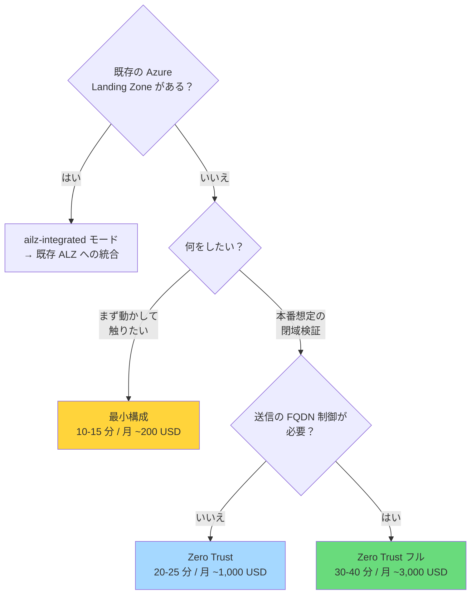

# デプロイガイド

このリポジトリに同梱している公式 Bicep 実装（`Azure/bicep-ptn-aiml-landing-zone` **v2.4.1**）を
Azure にデプロイする手順です。

> 📖 上流の詳細ランブックは [`infra-upstream/docs/runbook-standalone.md`](../infra-upstream/docs/runbook-standalone.md)（英語）にあります。
> 本ドキュメントはそれを日本語で要約し、日本の利用者向けの補足を加えたものです。

---

## 目次

- [前提条件](#前提条件)
- [デプロイ構成の選択](#デプロイ構成の選択)
- [最小構成での検証](#最小構成での検証)
- [閉域構成（Zero Trust）](#閉域構成zero-trust)
- [既存 ALZ への統合](#既存-alz-への統合)
- [モデルデプロイのカスタマイズ](#モデルデプロイのカスタマイズ)
- [デプロイ後の確認](#デプロイ後の確認)
- [コスト](#コスト)
- [削除](#削除)
- [トラブルシューティング](#トラブルシューティング)
- [主要な環境変数リファレンス](#主要な環境変数リファレンス)

---

## 前提条件

### 権限

| 必要なもの | 理由 |
|---|---|
| **Contributor**（サブスクリプションスコープ） | リソース作成 |
| **User Access Administrator** | ロール割り当て（Managed Identity への RBAC 付与） |

> `Owner` があれば両方を満たします。

### ツール

| ツール | 最低バージョン | 確認コマンド |
|---|---|---|
| Azure CLI (`az`) | 2.60 以上 | `az version` |
| Azure Developer CLI (`azd`) | 1.25 以上 | `azd version` |
| PowerShell | 7 以上 | `$PSVersionTable.PSVersion` |

**インストール:**

```powershell
winget install Microsoft.AzureCLI
winget install Microsoft.Azd
winget install Microsoft.PowerShell
```

### クォータ

デプロイ前に対象リージョンで以下を確認してください。

| 種別 | 必要量 | 用途 |
|---|---|---|
| `standardDSv2Family` vCPU | 10 以上 | Jumpbox + Container Apps Environment |
| `standardDdsv5Family` vCPU | 5 以上 | Foundry コンピュート |
| OpenAI モデル TPM | モデル定義の capacity 分 | `gpt-5-nano` = 40K TPM 等 |

```powershell
az vm list-usage --location swedencentral --query "[?contains(name.value,'standardDSv2Family')]" -o table
```

> プリフライトスクリプト（`scripts/Invoke-PreflightChecks.ps1`）が
> `azd provision` の前に自動実行され、モデルクォータ不足を検出します。

### リージョン選択

| リージョン | 特徴 |
|---|---|
| **Sweden Central** ⭐ | 最新モデルの提供が早い。AI Landing Zone の検証実績が多い |
| **East US 2** ⭐ | 同上。米国データレジデンシが必要な場合 |
| Japan East | 日本国内レジデンシが必要な場合。最新モデルは遅れることがある |
| West Europe | EU データレジデンシ |

> モデルとリージョンの対応: https://learn.microsoft.com/azure/ai-foundry/openai/concepts/models

**リージョンを分けることもできます:**

```powershell
azd env set AZURE_LOCATION japaneast              # インフラ全体
azd env set AZURE_AI_FOUNDRY_LOCATION swedencentral  # Foundry のみ最新モデルのリージョン
azd env set AZURE_SEARCH_LOCATION eastus          # Search の容量不足回避
```

### ログイン

```powershell
az login
azd auth login
az account set --subscription '<subscription-id-or-name>'
```

---

## デプロイ構成の選択



| 構成 | 所要時間 | リソース数 | 用途 |
|---|---|---|---|
| **最小** | 10-15 分 | 約 60 | 機能確認、開発 |
| **Zero Trust** | 20-25 分 | 約 75 | 本番相当の検証 |
| **Zero Trust フル** | 30-40 分 | 約 80 | 規制業種の本番 |

---

## 最小構成での検証

まずここから始めることを推奨します。

```powershell
cd infra-upstream

azd env new ailz-demo
azd env set AZURE_LOCATION swedencentral

azd up
```

**これだけです。** 既定値がすべて最小構成向けになっています。

- `NETWORK_ISOLATION` = `false`（パブリックエンドポイント）
- Firewall / Bastion / Jumpbox / NAT Gateway はデプロイされない
- Private Endpoint なし

### 自分の IP だけを許可する

パブリックだが不特定多数からのアクセスは避けたい場合：

```powershell
$myIp = (Invoke-RestMethod https://api.ipify.org)
azd env set ALLOWED_IP_RANGES "[`"$myIp/32`"]"
azd provision
```

Storage、Key Vault、App Configuration、ACR、Cosmos DB、AI Search、Foundry のデータプレーンが
この IP からのみアクセス可能になります。

### 動作確認

```powershell
$rg = azd env get-value AZURE_RESOURCE_GROUP
$ca = az containerapp list -g $rg --query "[0].name" -o tsv
$fqdn = az containerapp show -g $rg -n $ca --query "properties.configuration.ingress.fqdn" -o tsv
curl "http://$fqdn"
```

ASP.NET の hello-world HTML が返れば成功です。

---

## 閉域構成（Zero Trust）

本番相当の構成です。

```powershell
cd infra-upstream

$stamp = Get-Date -Format 'MMddyyHHmm'
azd env new "ailz-$stamp"

azd env set AZURE_LOCATION swedencentral
azd env set NETWORK_ISOLATION true
azd env set DEPLOYMENT_MODE standalone

# 運用アクセス用
azd env set DEPLOY_JUMPBOX true
azd env set DEPLOY_BASTION true
azd env set DEPLOY_NAT_GATEWAY true

# 送信制御（規制要件がなければ false でよい）
azd env set DEPLOY_AZURE_FIREWALL true

azd up
```

### 各フラグの意味

| フラグ | 効果 | 外してよい条件 |
|---|---|---|
| `NETWORK_ISOLATION=true` | 全 PaaS に Private Endpoint、パブリックアクセス無効 | — （閉域の本体） |
| `DEPLOY_AZURE_FIREWALL=true` | 送信トラフィックを Firewall 経由に（UDR） | 管理グループレベルで送信制御済み。**月 ~900 USD 削減** |
| `DEPLOY_BASTION=true` | Jumpbox への RDP 接続手段 | 社内 VPN から VNet に到達できる。**月 ~140 USD 削減** |
| `DEPLOY_JUMPBOX=true` | VNet 内の操作用 Windows VM | 別の管理端末がある |
| `DEPLOY_NAT_GATEWAY=true` | Jumpbox の送信 IP を固定 | Firewall が送信を担う場合は不要 |

> `DEPLOY_BASTION` / `DEPLOY_JUMPBOX` / `DEPLOY_NAT_GATEWAY` は既定 `null` で、
> `DEPLOY_VM` の値を継承します。明示的に指定するのが安全です。

### Jumpbox の初期セットアップを自動化する

```powershell
azd env set DEPLOY_SOFTWARE true
```

Custom Script Extension が az / azd / git / PowerShell モジュールをインストールし、
`manifest.json` に列挙されたリポジトリを `C:\github\` に clone します。

### Container App をインターネットに公開する（WAF 付き）

閉域構成では Container App は VNet 内部からのみアクセス可能です。
外部公開が必要な場合は Application Gateway WAF v2 を前段に置けます。

```powershell
azd env set PUBLIC_INGRESS '{"enabled": true}'
```

### 閉域構成での動作確認

Container App は自分の PC からは到達できません。Jumpbox 経由で確認します。

```powershell
$rg = azd env get-value AZURE_RESOURCE_GROUP
$vmName = az vm list -g $rg --query "[0].name" -o tsv
$ca = az containerapp list -g $rg --query "[0].name" -o tsv
$fqdn = az containerapp show -g $rg -n $ca --query "properties.configuration.ingress.fqdn" -o tsv

$script = @"
try {
    `$r = Invoke-WebRequest -Uri 'http://$fqdn' -UseBasicParsing -TimeoutSec 30
    Write-Host ('Status=' + `$r.StatusCode + ' Len=' + `$r.Content.Length)
} catch { Write-Host ('ERROR: ' + `$_.Exception.Message) }
"@

az vm run-command invoke -g $rg -n $vmName --command-id RunPowerShellScript `
    --scripts $script --query "value[0].message" -o tsv
```

`Status=200` が返れば成功です。

### Bastion 経由での RDP

1. Azure ポータル → VM → **サポート + トラブルシューティング → パスワードのリセット**
   （ユーザー名 `testvmuser`）
2. 接続：

```powershell
azd env set BASTION_ENABLE_TUNNELING true   # ネイティブクライアント接続を使う場合
azd provision

$bastion = az network bastion list -g $rg --query "[0].name" -o tsv
$vmId = az vm show -g $rg -n $vmName --query id -o tsv
az network bastion rdp --name $bastion --resource-group $rg --target-resource-id $vmId
```

---

## 既存 ALZ への統合

すでに Azure Landing Zone（hub-spoke）を運用している場合。

```powershell
azd env set DEPLOYMENT_MODE ailz-integrated
azd env set NETWORK_ISOLATION true

# hub VNet とのピアリング
azd env set HUB_INTEGRATION_HUB_VNET_RESOURCE_ID '/subscriptions/.../virtualNetworks/vnet-hub'
azd env set HUB_INTEGRATION_CREATE_HUB_PEERING true
azd env set HUB_INTEGRATION_EGRESS_NEXT_HOP_IP '10.0.1.4'   # hub の Firewall プライベート IP

# 自前の Firewall は不要
azd env set DEPLOY_AZURE_FIREWALL false
```

### 既存リソースの再利用（BYO）

| 対象 | 環境変数 |
|---|---|
| VNet | `USE_EXISTING_VNET=true` + `EXISTING_VNET_RESOURCE_ID` |
| Log Analytics | `EXISTING_LOG_ANALYTICS_WORKSPACE_RESOURCE_ID` |
| Application Insights | `EXISTING_APPLICATION_INSIGHTS_RESOURCE_ID` |
| Bastion | `EXISTING_BASTION_RESOURCE_ID` |
| Jumpbox | `EXISTING_JUMPBOX_RESOURCE_ID` |
| NAT Gateway | `EXISTING_NAT_GATEWAY_RESOURCE_ID` |
| Private DNS Zone（15 種） | `EXISTING_PRIVATE_DNS_ZONE_*_RESOURCE_ID` |

**Private DNS Zone の 15 種:**

```
ACR / AISERVICES / APPCONFIG / APPINSIGHTS / AZUREAUTOMATION
AZUREMONITOR / BLOB / COGSVCS / CONTAINERAPPS / COSMOS
KEYVAULT / ODSOPSINSIGHTS / OMSOPSINSIGHTS / OPENAI / SEARCH
```

例：

```powershell
azd env set EXISTING_PRIVATE_DNS_ZONE_OPENAI_RESOURCE_ID `
  '/subscriptions/.../privateDnsZones/privatelink.openai.azure.com'
```

> ⚠️ BYO の DNS ゾーンを指定した場合、**spoke VNet への仮想ネットワークリンクは自分で作成する必要があります。**
> リンクがないと Jumpbox から PaaS の FQDN が解決できません。

詳細は [`infra-upstream/docs/runbook-hub-spoke.md`](../infra-upstream/docs/runbook-hub-spoke.md) を参照。

---

## モデルデプロイのカスタマイズ

既定では以下の 2 モデルがデプロイされます。

| 名前 | モデル | バージョン | SKU | 容量 |
|---|---|---|---|---|
| `chat` | `gpt-5-nano` | 2025-08-07 | GlobalStandard | 40 |
| `text-embedding` | `text-embedding-3-large` | 1 | Standard | 10 |

変更するには `infra-upstream/main.parameters.json` の `modelDeploymentList` を編集します。

```json
{
  "modelDeploymentList": {
    "value": [
      {
        "name": "chat",
        "model": { "format": "OpenAI", "name": "gpt-5", "version": "2025-08-07" },
        "sku": { "name": "GlobalStandard", "capacity": 100 },
        "canonical_name": "CHAT_DEPLOYMENT_NAME",
        "apiVersion": "2025-12-01-preview"
      },
      {
        "name": "chat-mini",
        "model": { "format": "OpenAI", "name": "gpt-5-mini", "version": "2025-08-07" },
        "sku": { "name": "GlobalStandard", "capacity": 200 },
        "canonical_name": "CHAT_MINI_DEPLOYMENT_NAME",
        "apiVersion": "2025-12-01-preview"
      },
      {
        "name": "text-embedding",
        "model": { "format": "OpenAI", "name": "text-embedding-3-large", "version": "1" },
        "sku": { "name": "Standard", "capacity": 50 },
        "canonical_name": "EMBEDDING_DEPLOYMENT_NAME",
        "apiVersion": "2025-12-01-preview"
      }
    ]
  }
}
```

> `capacity` は **1,000 TPM 単位**です。`40` = 40,000 TPM。
> サブスクリプションのクォータを超えるとプリフライトチェックで失敗します。

---

## デプロイ後の確認

```powershell
$rg = azd env get-value AZURE_RESOURCE_GROUP

# リソース数（最小 ~60、Zero Trust フル ~80）
az resource list -g $rg --query "length(@)" -o tsv

# 種別ごとの内訳
az resource list -g $rg --query "[].type" -o tsv | Group-Object | Sort-Object Count -Descending | Format-Table Count, Name

# Foundry のエンドポイント
az cognitiveservices account list -g $rg --query "[].{name:name, endpoint:properties.endpoint}" -o table

# モデルデプロイ
$aiName = az cognitiveservices account list -g $rg --query "[0].name" -o tsv
az cognitiveservices account deployment list -g $rg -n $aiName `
  --query "[].{name:name, model:properties.model.name, sku:sku.name, capacity:sku.capacity}" -o table
```

### azd の出力値

```powershell
azd env get-values
```

`AZURE_RESOURCE_GROUP`、Foundry エンドポイント、Container App FQDN などが出力されます。

---

## コスト

> ⚠️ **必ず読んでください。** 検証目的なら使い終わったら削除してください。

### インフラのみの概算（月額 USD、Sweden Central）

| 構成要素 | 最小 | Zero Trust | ZT フル |
|---|---:|---:|---:|
| Foundry アカウント | ~0 | ~0 | ~0 |
| AI Search (Basic) | 75 | 75 | 75 |
| Cosmos DB (3000 RU/s) | ~175 | ~175 | ~175 |
| Container Apps Environment | ~50 | ~50 | ~50 |
| Container Registry (Premium) | 50 | 50 | 50 |
| Key Vault / App Config / Storage | ~20 | ~30 | ~30 |
| Log Analytics（取り込み量次第） | ~30 | ~50 | ~80 |
| **Private Endpoint × 15** | — | ~110 | ~110 |
| **Azure Firewall (Standard)** | — | — | ~900 |
| **Azure Bastion (Standard)** | — | ~140 | ~140 |
| **Jumpbox VM (D2s_v3)** | — | ~70 | ~70 |
| NAT Gateway | — | ~35 | ~35 |
| **合計（概算）** | **~400** | **~785** | **~1,715** |

> 実際の料金はリージョン、為替、取り込みログ量、割引契約によって変動します。
> 正確な見積もりは [Azure 料金計算ツール](https://azure.microsoft.com/pricing/calculator/) を使用してください。

### モデルの利用料（別途）

インフラとは別に、トークン消費に応じた課金が発生します。

| モデル | 入力 (1M tokens) | 出力 (1M tokens) |
|---|---:|---:|
| gpt-5-nano | 安価 | 安価 |
| gpt-5-mini | 中 | 中 |
| gpt-5 | 高 | 高 |

> 最新の価格は https://azure.microsoft.com/pricing/details/ai-foundry/ を参照。

### コストを下げる

| 施策 | 削減額（月） |
|---|---:|
| `DEPLOY_AZURE_FIREWALL=false` | ~900 |
| `DEPLOY_BASTION=false` | ~140 |
| `DEPLOY_JUMPBOX=false` | ~70 |
| `DEPLOY_SEARCH_SERVICE=false` | ~75 |
| Cosmos の RU を最小（3000）に維持 | — |
| Log Analytics の保持期間を 30 日に | ~20 |
| **検証後に `azd down --purge`** | **全額** |

### コストアラートの設定

```powershell
$subId = az account show --query id -o tsv
az consumption budget create `
  --budget-name ailz-budget `
  --amount 1000 `
  --time-grain Monthly `
  --start-date (Get-Date -Format 'yyyy-MM-01') `
  --end-date (Get-Date).AddYears(1).ToString('yyyy-MM-01') `
  --category Cost `
  --resource-group $rg
```

---

## 削除

```powershell
cd infra-upstream
azd down --force --purge
```

**`--purge` は必須です。** これがないと Key Vault / App Configuration / Cognitive Services が
論理削除状態で残り、同じ名前で再デプロイできません。

### 論理削除が残ってしまった場合

```powershell
# Key Vault
az keyvault list-deleted --query "[].name" -o tsv
az keyvault purge --name <name> --location <location>

# App Configuration
az appconfig list-deleted --query "[].name" -o tsv
az appconfig purge --name <name> --yes

# Cognitive Services (Foundry)
az cognitiveservices account list-deleted --query "[].{name:name, location:location, rg:resourceGroup}" -o table
az cognitiveservices account purge --name <name> --location <location> --resource-group <rg>
```

---

## トラブルシューティング

| 症状 | 原因と対処 |
|---|---|
| `InsufficientResourcesAvailable`（AI Search） | リージョンの容量不足。`azd env set AZURE_SEARCH_LOCATION eastus` で別リージョンへ |
| `NameUnavailable: appcs-... is already in use` | 論理削除の残骸。上記の purge 手順を実行 |
| `Login expired` がデプロイ中に発生 | `azd auth login` 後に `azd provision` を再実行。ARM デプロイはサーバ側で継続中 |
| Container App が 502 | イメージ pull 失敗。`az containerapp logs show -g $rg -n <ca>`。Firewall の `AllowMicrosoftContainerRegistry` ルールを確認 |
| Jumpbox の CSE が失敗 | ポータル → VM → 拡張機能 → `AzureCustomScriptExtension` でエラー確認。Firewall の FQDN 許可リスト不足が多い |
| Jumpbox から PaaS の FQDN が解決できない | Private DNS Zone が spoke VNet にリンクされていない。BYO ゾーン指定時は手動リンクが必要 |
| モデルクォータ不足でプリフライト失敗 | ポータルのクォータ画面で増枠申請、または `capacity` を下げる |
| プリフライトを一時的に無視したい | `$env:PREFLIGHT_SKIP = 'true'`（非推奨） |
| ARM テンプレートサイズ超過 | 不要な `DEPLOY_*` を `false` に。`scripts/Measure-MainJsonSize.ps1` で確認（警告 3.5MB / 失敗 4.7MB） |

### デプロイ状況の確認

```powershell
az deployment sub list --query "[0].{name:name, state:properties.provisioningState, ts:properties.timestamp}" -o table
az deployment group list -g $rg --query "[?properties.provisioningState=='Failed'].{name:name, error:properties.error.message}" -o json
```

---

## 主要な環境変数リファレンス

`azd env set <NAME> <VALUE>` で設定します。全 158 パラメータのうち、よく使うものを抜粋。

### 基本

| 環境変数 | 既定値 | 説明 |
|---|---|---|
| `AZURE_ENV_NAME` | — | azd 環境名（リソース名のシードになる） |
| `AZURE_LOCATION` | — | 主リージョン |
| `AZURE_PRINCIPAL_ID` | 自動 | RBAC を付与する対象の principal ID |
| `AZURE_PRINCIPAL_TYPE` | `User` | `User` / `ServicePrincipal` / `Group` |
| `DEPLOYMENT_MODE` | `standalone` | `standalone` / `ailz-integrated` |
| `GREEN_FIELD_DEPLOYMENT` | `true` | 新規デプロイか |

### ネットワーク

| 環境変数 | 既定値 | 説明 |
|---|---|---|
| `NETWORK_ISOLATION` | `false` | Zero Trust モード（PE + Private DNS + パブリック無効） |
| `ALLOWED_IP_RANGES` | `[]` | PaaS データプレーンを許可する公開 IP CIDR |
| `DEPLOY_AZURE_FIREWALL` | ZT 時 `true` | 送信制御 |
| `DEPLOY_NAT_GATEWAY` | `DEPLOY_VM` 継承 | 送信 IP 固定 |
| `DEPLOY_SUBNETS` | — | サブネットを作成するか |
| `USE_EXISTING_VNET` | `false` | 既存 VNet を使う |
| `EXISTING_VNET_RESOURCE_ID` | — | 既存 VNet のリソース ID |
| `PUBLIC_INGRESS` | `{enabled:false}` | App Gateway WAF v2 の前段配置 |

### 運用アクセス

| 環境変数 | 既定値 | 説明 |
|---|---|---|
| `DEPLOY_VM` | `null` | Jumpbox/Bastion/NAT の親フラグ |
| `DEPLOY_JUMPBOX` | `DEPLOY_VM` 継承 | Jumpbox VM |
| `DEPLOY_BASTION` | `DEPLOY_VM` 継承 | Azure Bastion |
| `BASTION_SKU_NAME` | `Standard` | `Basic` / `Standard` / `Premium` |
| `BASTION_ENABLE_TUNNELING` | `false` | ネイティブクライアント接続 |
| `AZURE_VM_SIZE` | `Standard_D2s_v3` | Jumpbox のサイズ |
| `DEPLOY_SOFTWARE` | `DEPLOY_VM` 時 `true` | Jumpbox の初期セットアップ |

### AI コンポーネント

| 環境変数 | 既定値 | 説明 |
|---|---|---|
| `DEPLOY_AAF_AGENT_SVC` | `true` | Agent Service（false で推論のみ） |
| `DEPLOY_SEARCH_SERVICE` | `true` | AI Search（false で月 ~75 USD 削減） |
| `DEPLOY_GROUNDING_WITH_BING` | `false` | Bing グラウンディング |
| `DEPLOY_SPEECH_SERVICE` | `false` | Speech |
| `DEPLOY_POSTGRES` | `false` | PostgreSQL Flexible Server |
| `DEPLOY_MCP` | `true` | MCP サーバ |
| `DEPLOY_HOSTED_AGENT` | `false` | ホスト型エージェント |
| `RETRIEVAL_BACKEND` | `foundry_iq` | `foundry_iq` / `azure_ai_search` |
| `ENABLE_AGENTIC_RETRIEVAL` | — | エージェント型検索 |

### リージョン分離

| 環境変数 | 説明 |
|---|---|
| `AZURE_AI_FOUNDRY_LOCATION` | Foundry のリージョン |
| `AZURE_SEARCH_LOCATION` | AI Search のリージョン（容量不足回避に有効） |
| `AZURE_COSMOS_LOCATION` | Cosmos DB のリージョン |
| `AZURE_PSQL_LOCATION` | PostgreSQL のリージョン |
| `AZURE_SPEECH_LOCATION` | Speech のリージョン |
| `AZURE_PE_LOCATION` | Private Endpoint のリージョン |

### 命名

| 環境変数 | 既定値 | 説明 |
|---|---|---|
| `RESOURCE_NAMING_MODE` | `caf` | CAF 準拠の命名 |
| `CAF_ENVIRONMENT_NAME` | 空 | `dev` / `test` / `prod` 等 |
| `CAF_WORKLOAD_NAME` | — | ワークロード名 |
| `CAF_REGION_NAME` | — | リージョン略称 |
| `CAF_INSTANCE` | — | インスタンス番号 |

> 全パラメータは `infra-upstream/main.bicep` と `infra-upstream/main.parameters.json` を参照してください。

---

## 参考

- [リファレンスアーキテクチャ](04-reference-architecture.md) — 何がデプロイされるかの解説
- [設計フレームワーク](03-design-framework.md) — 構成を決める前のチェックリスト
- [用語と命名](07-naming-and-terminology.md) — パラメータ名に出てくる用語の説明
- 上流ランブック（英語）:
  - [standalone](../infra-upstream/docs/runbook-standalone.md)
  - [hub-spoke](../infra-upstream/docs/runbook-hub-spoke.md)
  - [v2 移行ガイド](../infra-upstream/docs/v2-migration.md)
